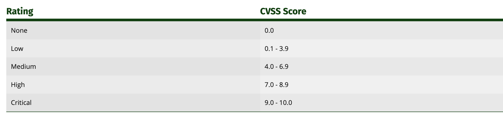
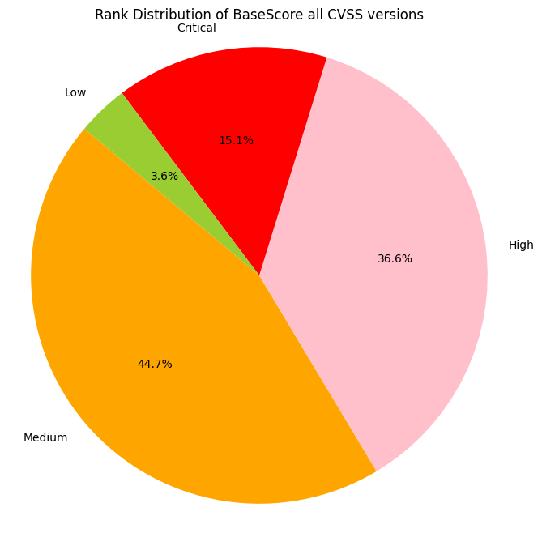
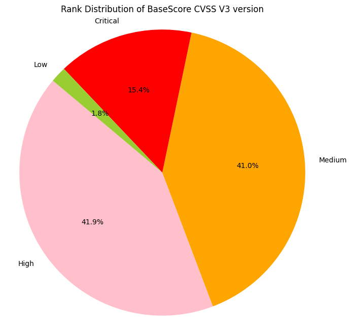
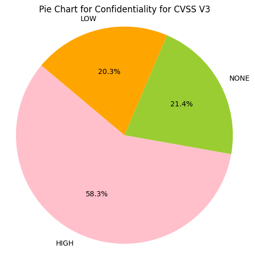
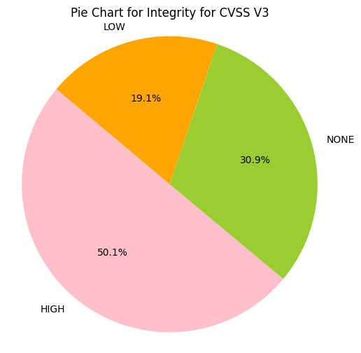
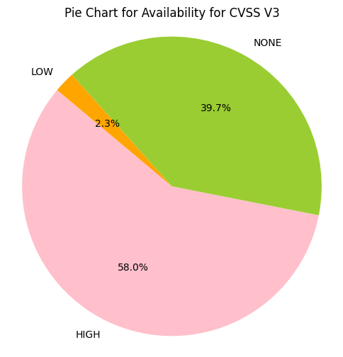
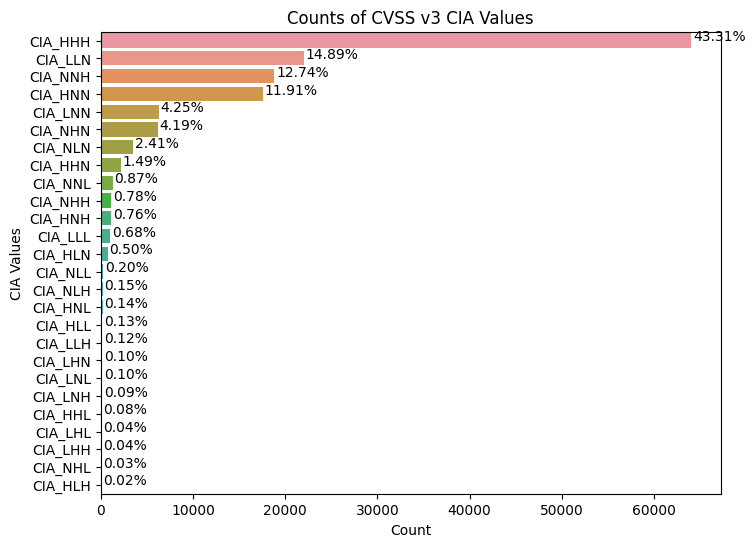
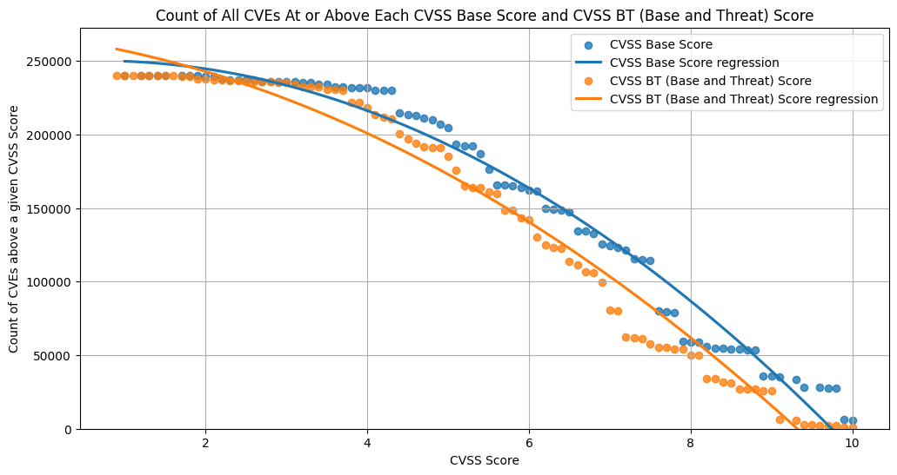

# Common Vulnerability Scoring System (CVSS)

!!! abstract "Overview"

    The [Common Vulnerability Scoring System (CVSS)](https://first.org/cvss) is widely used in the 
    cybersecurity industry as a standard method for assessing the "severity" of security vulnerabilities.

    In this section, we analyze CVE CVSS values to understand opportunities
    for prioritization based on these values:

    -   CVSS Severity Rating
    -   CVSS Confidentiality, Integrity, Availability Impacts

    :technologist: [Source Code](https://github.com/RiskBasedPrioritization/RiskBasedPrioritizationAnalysis/blob/main/analysis/cisa_kev_epss_cvss.ipynb) and [CVSS Base vs CVSS Base & Threat Source Code](https://github.com/RiskBasedPrioritization/RiskBasedPrioritizationAnalysis/blob/main/analysis/cvss-bt.ipynb)

## CVSS Severity Rating Scale

!!! quote
    "The use of these qualitative severity ratings is optional, and there
    is no requirement to include them when publishing CVSS scores. They are
    intended to help organizations properly assess and prioritize their
    vulnerability management processes."

    <figure markdown>
    
    <figcaption>CVSS Rating for all CVEs</figcaption>
    </figure>

    *https://www.first.org/cvss/v3.1/specification-document#Qualitative-Severity-Rating-Scale*

<figure markdown>
  { width="500" }
  <figcaption>CVSS Rating for all CVEs</figcaption>
</figure>

<figure markdown>
  { width="500" }
  <figcaption>CVSS Rating for all CVSS v3 CVEs</figcaption>
</figure>

!!! observations

    1.  ~~15% of CVEs are ranked Critical (9+)
    2.  ~~40% of CVEs are ranked High (7.0 - 8.9)
    3.  ~~60% of CVSS v3 CVEs are ranked Critical or High (7+)
    4.  \>96% of CVEs are ranked Medium or higher (4+)

!!! tip "Don't use CVSS Scores alone to assess risk."

    Many organizations use CVSS Scores alone to assess risk despite repeated guidance against this.  

    **A Critical or High CVSS Severity is not the same as a Critical or High Risk.**
    
    **There's a ~10x difference in counts of CVEs** for these 2 groups:

    * **\>50% of CVEs are ranked Critical or High CVSS rating (CVSS score 7+)**
    * **~~5% of CVEs are exploited in the wild**

    !!! quote
        CVSS Base (CVSS-B) scores are designed to measure the severity of a vulnerability and should not be used alone to assess risk. 
        
        https://www.first.org/cvss/v4.0/user-guide#CVSS-Base-Score-CVSS-B-Measures-Severity-not-Risk

    !!! quote
        PCI DSS 4.0 11.3.2.1 “External vulnerability scans are performed after any significant change as follows: Vulnerabilities that are scored **4.0 or higher by the CVSS** are resolved.”

        https://docs-prv.pcisecuritystandards.org/PCI%20DSS/Standard/PCI-DSS-v4_0.pdf

## CVSS Confidentiality, Integrity, Availability Impacts

!!! quote
    -   **The Confidentiality and Integrity metrics refer to impacts that
        affect the data used by the service.** For example, web content
        that has been maliciously altered, or system files that have been
        stolen.
    -   **The Availability impact metric refers to the operation of the
        service**. That is, the Availability metric speaks to the
        performance and operation of the service itself – not the
        availability of the data.”

    https://www.first.org/cvss/v3.1/user-guide#3-2-Confidentiality-and-Integrity-Versus-Availability-Impacts

<figure markdown>
  { width="500" }
  <figcaption>Confidentiality Values for CVSS v3 CVEs (HIGH, LOW, NONE)</figcaption>
</figure>

<figure markdown>
  { width="500" }
  <figcaption>Integrity Values for CVSS v3 CVEs</figcaption>
</figure>

<figure markdown>
  { width="500" }
  <figcaption>Availability Values for CVSS v3 CVEs (HIGH, LOW, NONE)</figcaption>
</figure>

<figure markdown>
  { width="500" }
  <figcaption>Counts of Combinations of CIA for CVSS v3 CVEs  e.g. CIA_HHH means that Confidentiality Impact is HIGH, Integrity Impact
is HIGH, Availability Impact is HIGH</figcaption>
</figure>

!!! observations

    1.  Greater than 50% of CVE Confidentiality Impact, Integrity Impact,
        Availability Impact values are HIGH.
    2.  There are 27 (3x3x3) possible combinations of Confidentiality Impact,
        Integrity Impact, Availability Impact and possible HIGH, LOW, NONE
        values
        1.  ~43% of CVSS v3 CVEs have Confidentiality Impact, Integrity
            Impact, Availability Impact value of HIGH
        2.  The top 4 account for 83% of CVSS v3 CVEs
    3.  **So there isn't much granularity for prioritization based on**
        1.  **CVSS Base Score or Rating**
        2.  **CVSS Impact values**

## CVSS Exploit Maturity

In addition to the CVSS Base Metrics which are commonly used, CVSS supports other Metrics, including Threat Metrics.

!!! quote
    It is the responsibility of the CVSS consumer to populate the values of Exploit Maturity (E) based on information regarding the availability of exploitation code/processes and the state of exploitation techniques. This information will be referred to as “threat intelligence” throughout this document.

    Operational Recommendation: Threat intelligence sources that provide Exploit Maturity information for all vulnerabilities should be preferred over those with only partial coverage. Also, it is recommended to use multiple sources of threat intelligence as many are not comprehensive. This information should be updated as frequently as possible and its application to CVSS assessment should be automated.

    https://www.first.org/cvss/v4.0/specification-document#Threat-Metrics

### CVSS v3.1
The "[Temporal Metrics - Exploit Code Maturity (E)](https://www.first.org/cvss/v3.1/specification-document#3-1-Exploit-Code-Maturity-E)" causes the CVSS v3.1 Score to vary slightly.

* [High (H): 9.8](https://www.first.org/cvss/calculator/3.1#CVSS:3.1/AV:N/AC:L/PR:N/UI:N/S:U/C:H/I:H/A:H/E:H)
* [Functional (F): 9.6](https://www.first.org/cvss/calculator/3.1#CVSS:3.1/AV:N/AC:L/PR:N/UI:N/S:U/C:H/I:H/A:H/E:F)
* [Proof-Of-Concept (P): 9.3](https://www.first.org/cvss/calculator/3.1#CVSS:3.1/AV:N/AC:L/PR:N/UI:N/S:U/C:H/I:H/A:H/E:P)
* [Unproven (U): 9.0](https://www.first.org/cvss/calculator/3.1#CVSS:3.1/AV:N/AC:L/PR:N/UI:N/S:U/C:H/I:H/A:H/E:U) 
* [Not Defined (X): 9.8](https://www.first.org/cvss/calculator/3.1#CVSS:3.1/AV:N/AC:L/PR:N/UI:N/S:U/C:H/I:H/A:H) results in the same score as [High (H): 9.8](https://www.first.org/cvss/calculator/3.1#CVSS:3.1/AV:N/AC:L/PR:N/UI:N/S:U/C:H/I:H/A:H/E:H)

!!! tip "An example project that enriches NVD CVSS scores to include Temporal & Threat Metrics"
    "[Enriching the NVD CVSS scores to include Temporal & Threat Metrics](https://github.com/t0sche/cvss-bt)" is an example project
    where the CVSS Exploit Code Maturity/Exploitability (E) Temporal Metric
    is continuously updated.

    -   Fetches EPSS scores every morning
    -   Fetches CVSS scores from NVD if there are new EPSS scores.
    -   Calculates the Exploit Code Maturity/Exploitability (E) Metric when
        new data is found.
    -   Provides a resulting CVSS-BT score for each CVE

    It uses an EPSS threshold of 36% as the threshold for High for Exploit Code Maturity/Exploitability (E).
### Count of CVEs at or above CVSS Base Score and CVSS Base and Threat Score 

The data from "[Enriching the NVD CVSS scores to include Temporal & Threat Metrics](https://github.com/t0sche/cvss-bt)" is used.

:technologist: [CVSS Base vs CVSS Base & Threat Source Code](https://github.com/RiskBasedPrioritization/RiskBasedPrioritizationAnalysis/blob/main/analysis/cvss-bt.ipynb)

<figure markdown>
  
  <figcaption> How many CVEs are at/above a given CVSS score?  
  The continuous line is a polynomial regression of order 2.
</figcaption>
</figure>

!!! observations

    1. There is a significant difference in the count of CVEs above CVSS Score ~9 for CVSS Base, and CVSS Base and Threat. In other words, for CVSS Base and Threat there's a lot less CVEs above a score of ~9.

### CVSS v4.0 

The Threat Metrics - Exploit Maturity (E) value causes the CVSS v4.0 Score to vary slightly

* [Unreported: 8.1: High](https://www.first.org/cvss/calculator/4.0#CVSS:4.0/AV:N/AC:L/AT:N/PR:N/UI:N/VC:H/VI:H/VA:H/SC:N/SI:N/SA:N/E:U) 
* [POC (P): 8.9: High](https://www.first.org/cvss/calculator/4.0#CVSS:4.0/AV:N/AC:L/AT:N/PR:N/UI:N/VC:H/VI:H/VA:H/SC:N/SI:N/SA:N/E:P)
* [Attacked (A): 9.3: Critical](https://www.first.org/cvss/calculator/4.0#CVSS:4.0/AV:N/AC:L/AT:N/PR:N/UI:N/VC:H/VI:H/VA:H/SC:N/SI:N/SA:N/E:A).
* [Not Defined (X)](https://www.first.org/cvss/calculator/4.0#CVSS:4.0/AV:N/AC:L/AT:N/PR:N/UI:N/VC:H/VI:H/VA:H/SC:N/SI:N/SA:N) results in the same score as [Attacked (A)](https://www.first.org/cvss/calculator/4.0#CVSS:4.0/AV:N/AC:L/AT:N/PR:N/UI:N/VC:H/VI:H/VA:H/SC:N/SI:N/SA:N/E:A)

!!! quote
    The Threat Metric Group adjusts the “reasonable worst case” Base score by using threat intelligence to reduce the CVSS-BTE score, addressing concerns that many CVSS (Base) scores are too high.

    https://www.first.org/cvss/v4.0/user-guide

There's a big difference in likelihood of exploitation, and associated populations of CVEs, in Attacked vs POC.

However, the CVSS Score changes only slightly between these - and that slight variation in score does not significantly change the counts of CVEs above the score per [Count of CVEs at or above CVSS Base Score](#count-of-cves-at-or-above-cvss-base-score).

**The convenience of a single CVSS score comes with the cost of not being able to understand or differentiate between the risk factors from the score, and not being able to prioritize effectively using the score.**

!!! success "Takeaways"
    1. Don't use CVSS Base (CVSS-B) scores alone to assess risk - you will waste a LOT of time/effort/$ if you do!
    2. CVSS Base (CVSS-B) scores and ratings don't allow for useful prioritization (because there's too many CVEs at the high end)
    3. CVSS Confidentiality, Integrity, Availability Impacts don't allow for useful prioritization (because there's too many CVEs with HIGH values)
    4. CVSS Threat Metrics - Exploit Maturity values don't allow for useful prioritization (because they change the overall score only slightly and there's too many CVEs with HIGH values)
    5. The convenience of a single CVSS score comes with the cost of not being able to understand or differentiate between the risk factors from the score, and not being able to prioritize effectively.

  

  

  

