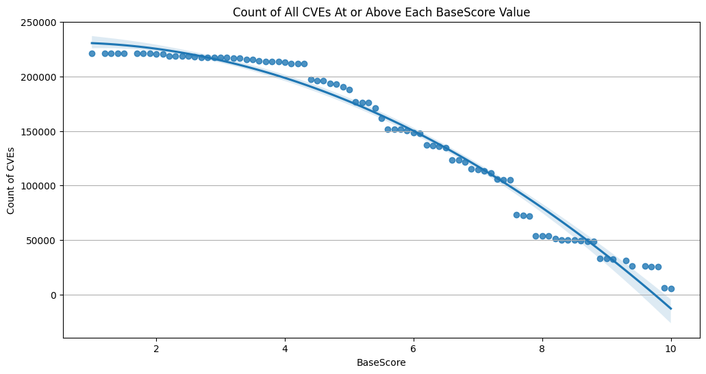

# Common Vulnerability Scoring System (CVSS)

!!! abstract "Overview"

    The [Common Vulnerability Scoring System (CVSS)](https://first.org/cvss) is widely used in the 
    cybersecurity industry as a standard method for assessing the "severity" of security vulnerabilities.

    In this section, we analyze CVE CVSS values to understand opportunities
    for prioritization based on these values:

    -   CVSS Severity Rating
    -   CVSS Confidentiality, Integrity, Availability Impacts

    :technologist: [Source Code](https://github.com/epss-sig/epss-interoperability/blob/main/analysis/cisa_kev_epss_cvss.ipynb) 

## CVSS Severity Rating Scale

!!! quote
    "The use of these qualitative severity ratings is optional, and there
    is no requirement to include them when publishing CVSS scores. They are
    intended to help organizations properly assess and prioritize their
    vulnerability management processes."

    <figure markdown>
    
    <figcaption>CVSS Rating for all CVEs</figcaption>
    </figure>

    *https://www.first.org/cvss/v3.1/specification-document#Qualitative-Severity-Rating-Scale*

<figure markdown>
  { width="500" }
  <figcaption>CVSS Rating for all CVEs</figcaption>
</figure>

<figure markdown>
  { width="500" }
  <figcaption>CVSS Rating for all CVSS v3 CVEs</figcaption>
</figure>

!!! observations

    1.  ~~15% of CVEs are ranked Critical (9+)
    2.  ~~40% of CVEs are ranked High (7.0 - 8.9)
    3.  ~~60% of CVSS v3 CVEs are ranked Critical or High (7+)
    4.  \>96% of CVEs are ranked Medium or higher (4+)

!!! tip
    Many organizations use CVSS Scores alone to assess risk despite repeated guidance against this.  
    **A Critical or High CVSS Severity is not the same as a Critical or High Risk. There's a >10x difference in counts of CVEs** for these 2 groups:

    * **\>50% of CVEs are ranked Critical or High CVSS rating (CVSS score 7+)**
    * **~~5% of CVEs are exploited in the wild**

    !!! quote
        CVSS Base (CVSS-B) scores are designed to measure the severity of a vulnerability and should not be used alone to assess risk. 
        
        https://www.first.org/cvss/v4.0/user-guide#CVSS-Base-Score-CVSS-B-Measures-Severity-not-Risk

    !!! quote
        PCI DSS 4.0 11.3.2.1 “External vulnerability scans are performed after any significant change as follows: Vulnerabilities that are scored **4.0 or higher by the CVSS** are resolved.”

        https://docs-prv.pcisecuritystandards.org/PCI%20DSS/Standard/PCI-DSS-v4_0.pdf

## CVSS Confidentiality, Integrity, Availability Impacts

!!! quote
    -   **The Confidentiality and Integrity metrics refer to impacts that
        affect the data used by the service.** For example, web content
        that has been maliciously altered, or system files that have been
        stolen.
    -   **The Availability impact metric refers to the operation of the
        service**. That is, the Availability metric speaks to the
        performance and operation of the service itself – not the
        availability of the data.”

    https://www.first.org/cvss/v3.1/user-guide#3-2-Confidentiality-and-Integrity-Versus-Availability-Impacts

<figure markdown>
  { width="500" }
  <figcaption>Confidentiality Values for CVSS v3 CVEs (HIGH, LOW, NONE)</figcaption>
</figure>

<figure markdown>
  { width="500" }
  <figcaption>Integrity Values for CVSS v3 CVEs</figcaption>
</figure>

<figure markdown>
  { width="500" }
  <figcaption>Availability Values for CVSS v3 CVEs (HIGH, LOW, NONE)</figcaption>
</figure>

<figure markdown>
  { width="500" }
  <figcaption>Counts of Combinations of CIA for CVSS v3 CVEs  e.g. CIA_HHH means that Confidentiality Impact is HIGH, Integrity Impact
is HIGH, Availability Impact is HIGH</figcaption>
</figure>

!!! observations

    1.  Greater than 50% of CVE Confidentiality Impact, Integrity Impact,
        Availability Impact values are HIGH.
    2.  There are 27 (3x3x3) possible combinations of Confidentiality Impact,
        Integrity Impact, Availability Impact and possible HIGH, LOW, NONE
        values
        1.  ~43% of CVSS v3 CVEs have Confidentiality Impact, Integrity
            Impact, Availability Impact value of HIGH
        2.  The top 4 account for 83% of CVSS v3 CVEs
    3.  **So there isn't much granularity for prioritization based on**
        1.  **CVSS Base Score or Rating**
        2.  **CVSS Impact values**

## Count of CVEs at or above CVSS Base Score

<figure markdown>
  
  <figcaption> How many CVEs are at/above a given CVSS score?  
  The continuous line is a polynomial regression of order 2.
</figcaption>
</figure>

!!! success "Takeaways"
    1. Don't use CVSS Base (CVSS-B) scores alone to assess risk - you will waste a LOT of time/effort/$ if you do!
    2. CVSS Base (CVSS-B) scores and ratings don't allow for useful prioritization (because there's too many CVEs at the high end)
    3. CVSS Confidentiality, Integrity, Availability Impacts don't allow for useful prioritization (because there's too many CVEs with HIGH values)

  

  

  

