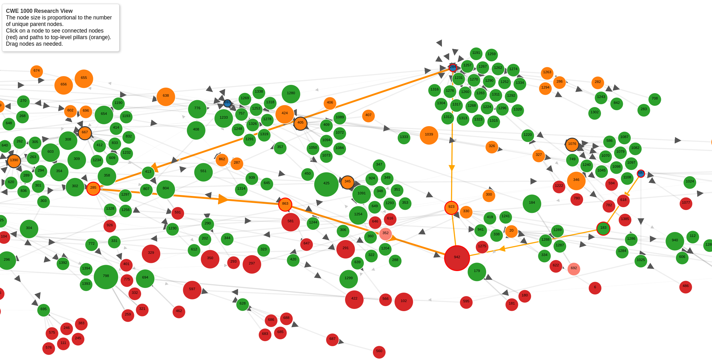

# CWE 1000 

!!! abstract "Overview"

    Two hands-on interactive diagrams are given here to help better understand CWE-1000:

    1. :technologist: [Sunburst](./sunburst.md) that illustrates the CWE 1000 abstraction hierarchy and depths 
    2. :technologist: [CWE 1000 Paths to Pillars](https://codesandbox.io/p/sandbox/d3-js-forked-6c6g9v) that illustrates the interconnectedness of CWEs
    
    These can help to

    1. Navigate CWE-1000
    2. Quickly identify relationships and hierarchy depth.
    3. Reveal hidden complexity or simple pathways in the CWE taxonomy that aren't immediately apparent in standard textual representation.

CWE 1000 Overview

!!! Tip interactive hover-over diagram

     - See [interactive hover-over diagram](./sunburst.md)

    
    Some things that become visible:

    - The max depth of CWEs is 6 i.e. 6 concentric circles, the min depth is 4 (for CWE-682)
    - The depth varies per pillar.
    - The CWE Abstractions (Pillar, Class,...) are clear (Color-Coded)
    - Some Pillars are deeper and broader than others i.e. have more CWEs
        - Pillar CWE-682 has the least descendants and least depth

## Research View ([View-1000](https://cwe.mitre.org/data/definitions/1000.html))

The Research Concepts view (CWE-1000) organizes all weakness CWEs by the method through which an exploitation can occur.

Research View ([View-1000](https://cwe.mitre.org/data/definitions/1000.html)) contains all CWEs and uses a deep hierarchical organization, with **more levels of abstraction than other classification schemes.**

- While Software Assurance Trends View ([View-1400](https://cwe.mitre.org/data/definitions/1400.html)) contains all CWEs, it is only 2 levels deep.

The Research view was built to maximize mutual exclusivity, repeatability and clarity — it’s the canonical, theory-driven taxonomy.

!!! quote

    The Research view is mainly organized according to abstractions of software behaviors and the resources that are manipulated by those behaviors, which aligns with MITRE's research into vulnerability theory. In addition to classification, the Research view explicitly models the inter-dependencies between weaknesses, which have not been a formal part of past classification efforts. The main examples are chains and composites.

    The view uses multiple deep hierarchies as its organization structure, with more levels of abstraction than other classification schemes. 

    https://cwe.mitre.org/documents/views/view-evolution.html

### Repeatability

!!! quote

    the Research view seeks to achieve repeatability, although strong technical knowledge and an understanding of chains is required. Repeatability has been informally verified in many situations in which two separate CWE team members classified issues the same way. However, there are limits - ambiguous classification can still happen because of perspective issues or incomplete parts of the hierarchy.

    In the case of the Development view, it is hoped that the large number of navigation categories will make it easier for people to reach the desired weakness ID. However, with so many categories, there is a risk of incomplete or incorrect mappings if one user follows one path of the tree, and another mapper follows a different path.

    https://cwe.mitre.org/documents/views/view-comparison.html#Repeatable

### Visualization 

MITRE CWE provides visualizations on https://cwe.mitre.org/data/pdfs.html.

- [The Research View with varying levels of weakness abstractions and entry types colored as specified below](https://cwe.mitre.org/data/pdf/1000_abstraction_colors.pdf)

- However, these are not interactive.

The Research View ([View-1000](https://cwe.mitre.org/data/definitions/1000.html)) is very detailed.
To get a visual overview of it, a sunburst diagram is created.

### Pillars

The children of CWE-1000 are 10 pillars that organize the weakness CWEs:

1. Improper Access Control (CWE-284) 
2. Improper Adherence to Coding Standards (CWE-710) 
3. Improper Check or Handling of Exceptional Conditions (CWE-703) 
4. Improper Control of a Resource Through its Lifetime (CWE-664) 
5. Improper Interaction Between Multiple Correctly-Behaving Entities (CWE-435)
6. Improper Neutralization (CWE-707)
7. Incorrect Calculation (CWE-682)
8. Incorrect Comparison (CWE-697)
9. Insufficient Control Flow Management (CWE-691)
10. Protection Mechanism Failure (CWE-693) 

### DAGs and CWE Research

!!! Info

    The Research View ([View-1000](https://cwe.mitre.org/data/definitions/1000.html)) forms a DAG (Directed Acyclic Graph). 

      - It's not a tree as some nodes, e.g. CWE-121, have multiple parents.

    A tree is actually a special type of DAG with additional constraints. 

    - Both structures share the property of being acyclic, meaning they don't contain any cycles or loops.

    Key differences between DAG (Directed Acyclic Graph) and a tree:
   
    1. **Structure**: A tree is a hierarchical structure where each node has exactly one parent (except the root node, which has no parent). A DAG is more flexible, allowing nodes to have multiple parents.

    2. **Paths**: In a tree, there is exactly one path from the root to any node. In a DAG, there can be multiple paths to reach a node from another node.

    3. **Connectivity**: All nodes in a tree are connected. A DAG may consist of multiple disconnected components.

    4. **Root**: A tree has a single root node. A DAG may have multiple source nodes (nodes with no incoming edges).

    5. Branching: In a tree, a parent can have multiple children, but a child can only have one parent. In a DAG, a node can have multiple parents and multiple children.

!!! Info

    Some research on CWE and DAGs and diagrams:

    1. [NIST Internal Report NIST IR 8517 Hardware Security Failure Scenarios Potential Hardware Weaknesses](https://doi.org/10.6028/NIST.IR.8517), November 2024, Peter Mell and Irena Bojanova
    2. [A Suite of Metrics for Calculating the Most Signifcant Security Relevant Software Flaw Types](https://tsapps.nist.gov/publication/get_pdf.cfm?pub_id=929586), Peter Mell and Assane Gueye
    3. [Representativeness in the Benchmark for Vulnerability Analysis Tools (B-VAT)](https://www.usenix.org/system/files/cset20-paper-afanador_0.pdf#:~:text=number%20of%20views%20to%20support,a%20Resource%20Through%20its%20Life%02time)
       
        1. note that per above, this statement is technically incorrect "The weakness hierarchy presented by view CWE-1000 can be organized into ten rooted **trees**"
   

## Paths, Pillars, Primary

!!! tip

    Each CWE can have zero or more ChildOf relationships.

    **Each CWE can have one and only one ChildOf relationship that’s labeled “Primary” for each CWE View.** 

    **This means that for any CWE, for a given View e.g. View 1000, there may be one or more paths from the CWE to the top (Pillar), but only one
    primary path from that CWE to the top (Pillar).**

### OrdinalEnumeration
- The Primary ChildOf is defined by the **[OrdinalEnumeration](https://cwe.mitre.org/documents/schema/#OrdinalEnumeration)** for the CWE for the View.

!!! quote

    The [OrdinalEnumeration](https://cwe.mitre.org/documents/schema/#OrdinalEnumeration) simple type contains a list of values used to determine if a relationship is the primary relationship for a given weakness entry within a given view. Currently, this attribute can only have the value "Primary".

### Primary Path
!!! Tip interactive hover-over diagram
    Click image for an interactive view of CWE 1000 Nodes 

    <figure markdown>
    
    [CWE 1000 Nodes Visualization and Source Code](https://codesandbox.io/p/sandbox/d3-js-forked-6c6g9v)
    </figure>

#### Example CWE-798 

1. [CWE-798](https://cwe.mitre.org/data/definitions/798.html) has 3 Parents for View-1000:
    1.  Path 1: CWE-284 > CWE-923 > CWE-942
    2.  Path 2: CWE-697 > CWE-183 > CWE-942
    3.  **Path 3 (Primary): CWE-284 > CWE-285 > CWE-863 > CWE-942**
2. It links to 2 Pillars (Navy) as shown by the orange Paths to Pillars
3. There are 2 paths from CWE-942 to CWE-284:
   1. The heavy orange line is the Primary Path to CWE-284.
   
#### Example CWE-79 

Per https://github.com/CWE-CAPEC/REST-API-wg/blob/main/json_repo/cwe.json:

> "RelatedWeaknesses":[{"Nature":"ChildOf","CweID":"1391","ViewID":"1000","Ordinal":"Primary"},{"Nature":"ChildOf","CweID":"287","ViewID":"1003","Ordinal":"Primary"},{"Nature":"ChildOf","CweID":"344","ViewID":"1000"},{"Nature":"ChildOf","CweID":"671","ViewID":"1000"},{"Nature":"PeerOf","CweID":"257","ViewID":"1000"}]
 
CWE-79 is a ChildOf CWE-74 in View 1000 and 1003:

> "RelatedWeaknesses":[{"Nature":"ChildOf","CweID":"74","ViewID":"1000","Ordinal":"Primary"},{"Nature":"ChildOf","CweID":"74","ViewID":"1003","Ordinal":"Primary"},{"Nature":"CanPrecede","CweID":"494","ViewID":"1000"},{"Nature":"PeerOf","CweID":"352","ViewID":"1000"}],

#### Example CWE-778

There are some changes between CWE version 4.16 and 4.17 according to the CWE json file https://github.com/CWE-CAPEC/REST-API-wg/blob/main/json_repo/cwe.json related to Research view CWE-1000.

- 4.16 release
  - CWE-778 is a ChildOf CWE-223 and CWE-693 in View 1000, and CWE-223 is the Primary ChildOf Relationship.
  
    > [{"Nature":"ChildOf","CweID":"223","ViewID":"1000","Ordinal":"Primary"},? 

    > {"Nature":"ChildOf","CweID":"693","ViewID":"1000"}],

- 4.17 release
  - CWE-778 is a ChildOf CWE-223 and CWE-693 in View 1000, and CWE-223 is the Primary ChildOf Relationship (and the only Relationship)

    > [{"Nature":"ChildOf","CweID":"223","ViewID":"1000","Ordinal":"Primary"}]

### Chains and Composites

CWE explicitly identifies relationships that form chains and composites.

- Chains highlight sequences or cause-effect relationships.
- Composites identify situations where multiple weaknesses combine to form a more complex scenario.

This makes CWE-1000 unique among taxonomies as it illustrates compound vulnerabilities clearly.

See https://cwe.mitre.org/data/reports/chains_and_composites.html.

!!! success "Takeaways"        
    
    1. For any CWE, for a given View e.g. View 1000, there may be one or more paths from the CWE to the top (Pillar), but only one
    primary path from that CWE to the top (Pillar).
    2. Each CWE can connect through multiple paths to pillars, but a single Primary path clearly establishes the primary theoretical relationship.
    3. The complexity of CWE-1000’s structure (multiple parents, chains, composites) offers valuable insights into real-world vulnerabilities.
    4. CWE-1000 is currently undergoing changes e.g. CWE 4.16 to 4.17 release. This was touched on in [Hard Problems in CWE, and What it Tells us about Hard Problems in the Industry](https://www.first.org/conference/vulncon2025/program#pHard-Problems-in-CWE-and-What-it-Tells-us-about-Hard-Problems-in-the-Industry), Steve Christey Coley (The MITRE Corporation, US)