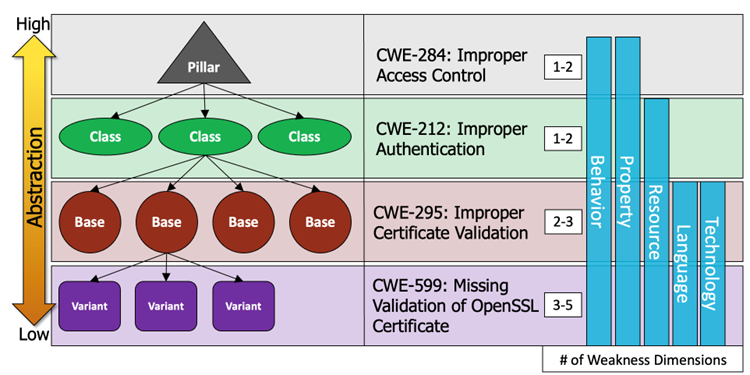

# CWE Abstraction

!!! abstract "Overview"

    This section covers "The MITRE CWE “Abstractions” 

    There are four types of weakness abstractions: [Pillar](https://cwe.mitre.org/documents/glossary/index.html#Pillar%20Weakness), [Class](https://cwe.mitre.org/documents/glossary/index.html#Class%20Weakness), [Base](https://cwe.mitre.org/documents/glossary/index.html#Base%20Weakness), and [Variant](https://cwe.mitre.org/documents/glossary/index.html#Variant%20Weakness).

# CWE Abstraction Types

## Overview

<figure markdown>
  {width="600"}
  <figcaption> <figcaption>
</figure>

MITRE's CWE framework categorizes weaknesses into four abstraction levels: **Pillar**, **Class**, **Base**, and **Variant**. Each level provides a different degree of specificity, aiding different practical purposes from research to vulnerability remediation.

Pillar: Highest abstraction (broad vulnerability concepts).

Class: Group related vulnerabilities around common behaviors.

Base: Specific weaknesses directly used in practical mappings.

Variant: More specific instances of Base weaknesses (context-specific or subtle distinctions).

Compound

## Pillar ⚠️

* **Highest abstraction**; very broad themes.
* Examples:

    * **CWE-284:** Improper Access Control
    * **CWE-682:** Incorrect Calculation

!!! warning

    **Do not map vulnerabilities directly to Pillar-level CWEs.** These are theoretical groupings, too general for actionable use.

## Class 🗂️

* **General categories** describing broad vulnerability concepts.
* Examples:

    * **CWE-20:** Improper Input Validation
    * **CWE-200:** Exposure of Sensitive Information

!!! caution

    **Avoid direct mapping to Class-level CWEs if possible.** Prefer using more specific Base-level weaknesses for practical remediation.

## Base 🎯

* **Preferred abstraction for mapping vulnerabilities.**
* Balances specificity with generality; actionable by developers and security tools.
* Examples:

    * **CWE-79:** Cross-Site Scripting (XSS)
    * **CWE-89:** SQL Injection
    * **CWE-787:** Out-of-Bounds Write

!!! tip

    **Use Base CWEs whenever possible.** Base-level CWEs provide sufficient detail for practical detection, remediation, and vulnerability management.

## Variant 🔬

* **Most specific weaknesses**, usually tied to particular technologies, languages, or functions.
* Examples:

  * **CWE-599:** Missing Validation of OpenSSL Certificate
  * **CWE-467:** Use of `sizeof()` on a Pointer Type (C/C++)

!!! tip

    **Use Variant CWEs for maximum precision.** Particularly useful for tool developers or when precise root-cause identification is essential.

---

## Practical Insights ✅

* **Vulnerability Management:**

  * Always **map to Base or Variant CWEs** to enable precise, actionable remediation.
* **Tool Development (SAST/DAST):**

  * Tools typically report at the **Base or Variant level** to clearly pinpoint issues and facilitate effective developer response.
* **Security Research:**

  * Standardizing on Base CWEs ensures consistent, reproducible research outcomes and clearer trend analysis.

!!! success
**Key takeaway:** Prioritize mapping to **Base and Variant CWEs** for effective vulnerability management, clearer reporting, and robust security research.

 Overall, the abstraction levels add a layer of **semantic rigor** that makes large-scale security data analysis more systematic and reproducible.

!!! success "Takeaways"        
    
In summary, CWE’s abstraction types (Pillar, Class, Base, Variant) are fundamental to how CWE is used in practice. Pillars and Classes provide the conceptual scaffolding and help with organizing knowledge (and are useful if broad groupings are needed), while Bases and Variants provide the actionable detail needed for day-to-day vulnerability management and tool integration. As one NIST report put it, the CWE model’s layered abstraction reflects the trade-off between *“adequate specificity \[and] root cause information”* versus broad coverage. By judiciously using the appropriate CWE abstraction, security professionals can effectively classify weaknesses in a way that is both insightful and practical, enabling better communication, tooling, and defensive strategies.
