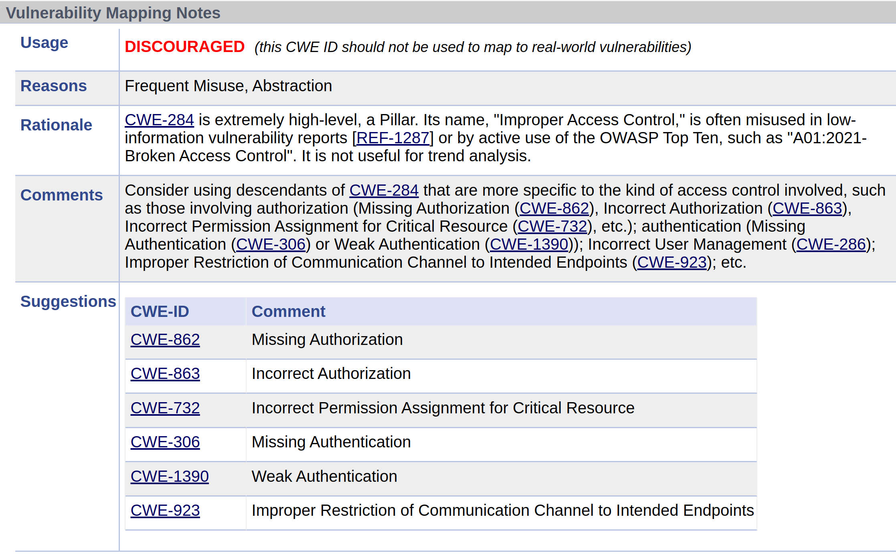

# CWE Relationships

!!! abstract "Overview"

    MITRE's CWE framework categorizes weaknesses into four abstraction levels:  

    - [Pillar](https://cwe.mitre.org/documents/glossary/index.html#Pillar%20Weakness): Highest abstraction (broad vulnerability concepts).
    - [Class](https://cwe.mitre.org/documents/glossary/index.html#Class%20Weakness): Group related vulnerabilities around common behaviors.
    - [Base](https://cwe.mitre.org/documents/glossary/index.html#Base%20Weakness): Specific weaknesses directly used in practical mappings.
    - [Variant](https://cwe.mitre.org/documents/glossary/index.html#Variant%20Weakness): More specific instances of Base weaknesses (context-specific or subtle distinctions).
    
    Each level provides a different degree of specificity, aiding different practical purposes from research to vulnerability remediation.

    Refer to the official schema: [AbstractionEnumeration](https://cwe.mitre.org/documents/schema/#AbstractionEnumeration).

## Overview

<figure markdown>
  {width="600"}
  <figcaption> <figcaption>
</figure>

## Pillar ⚠️

* **Highest abstraction**; very broad themes.
* Examples:

    * **[CWE-284](https://cwe.mitre.org/data/definitions/284.html):** Improper Access Control
    * **[CWE-682](https://cwe.mitre.org/data/definitions/682.html):** Incorrect Calculation

!!! warning

    **Do not map vulnerabilities directly to Pillar-level CWEs.** These are theoretical groupings, too general for actionable use.

## Class 🗂️

* **General categories** describing broad vulnerability concepts.
* Examples:

    * **[CWE-20](https://cwe.mitre.org/data/definitions/20.html):** Improper Input Validation
    * **[CWE-200](https://cwe.mitre.org/data/definitions/200.html):** Exposure of Sensitive Information

!!! caution

    **Avoid direct mapping to Class-level CWEs if possible.** Prefer using more specific Base-level weaknesses for practical remediation.

## Base 🎯

* **Preferred abstraction for mapping vulnerabilities.**
* Balances specificity with generality; actionable by developers and security tools.
* Examples:

    * **[CWE-79](https://cwe.mitre.org/data/definitions/79.html):** Cross-Site Scripting (XSS)
    * **[CWE-89](https://cwe.mitre.org/data/definitions/89.html):** SQL Injection
    * **[CWE-787](https://cwe.mitre.org/data/definitions/787.html):** Out-of-Bounds Write

!!! tip

    **Use Base CWEs whenever possible.** Base-level CWEs provide sufficient detail for practical detection, remediation, and vulnerability management.

## Variant 🔬

* **Most specific weaknesses**, usually tied to particular technologies, languages, or functions.
* Examples:

    * **[CWE-599](https://cwe.mitre.org/data/definitions/599.html):** Missing Validation of OpenSSL Certificate
    * **[CWE-467](https://cwe.mitre.org/data/definitions/467.html):** Use of `sizeof()` on a Pointer Type (C/C++)

!!! tip

    **Use Variant CWEs for maximum precision.** Particularly useful for tool developers or when precise root-cause identification is essential.

## Compound 🔗

* **Aggregation of multiple weaknesses** forming either a Chain (sequence of weaknesses) or a Composite (multiple weaknesses occurring simultaneously).
* Compound weaknesses highlight scenarios where individual weaknesses combine to create a more complex vulnerability.

!!! note

    **Compound CWEs** help analyze complex vulnerability scenarios, providing insights into how weaknesses interrelate.

---

## [Vulnerability Mapping Label and Notes](https://cwe.mitre.org/documents/schema/#MappingNotesType)

Vulnerability Mapping Label:

- ALLOWED (this CWE ID could be used to map to real-world vulnerabilities)
- ALLOWED (with careful review of mapping notes)
- DISCOURAGED (this CWE ID should not be used to map to real-world vulnerabilities)
- PROHIBITED (this CWE ID must not be used to map to real-world vulnerabilities)

See https://cwe.mitre.org/documents/cwe_usage/guidance.html#relationships.

<figure markdown>
  {width="600"}
  <figcaption> <figcaption>
</figure>

!!! Info

    CWEs assigned to CVEs may change their Mapping Label over time. 

    Alternative CWEs may be suggested for the CWE per example above.

!!! success "Takeaways"   

    * Always **map to Base or Variant CWEs** to enable precise, actionable remediation.
    * **Tool Development (SAST/DAST):** Tools typically report at the **Base or Variant level** to clearly pinpoint issues and facilitate effective developer response.
    * **Security Research:** Standardizing on Base CWEs ensures consistent, reproducible research outcomes and clearer trend analysis.
    * Prioritize mapping to **Base and Variant CWEs** for effective vulnerability management, clearer reporting, and robust security research.
    * Overall, the abstraction levels add a layer of **semantic rigor** that makes large-scale security data analysis more systematic and reproducible.
    * In summary, CWE’s abstraction types (Pillar, Class, Base, Variant) are fundamental to how CWE is used in practice. 
        * Pillars and Classes provide the conceptual scaffolding and help with organizing knowledge (and are useful if broad groupings are needed), while Bases and Variants provide the actionable detail needed for day-to-day vulnerability management and tool integration. 
        * The CWE model’s layered abstraction reflects the trade-off between *“adequate specificity root cause information”* versus broad coverage. By judiciously using the appropriate CWE abstraction, security professionals can effectively classify weaknesses in a way that is both insightful and practical, enabling better communication, tooling, and defensive strategies.

