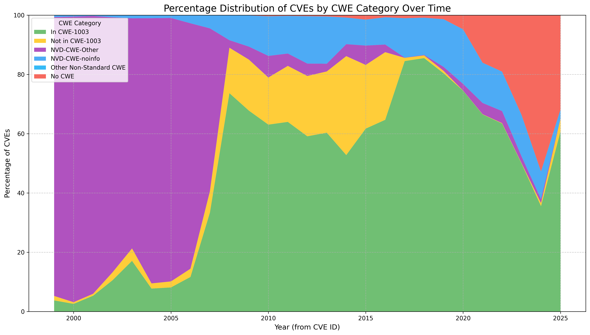
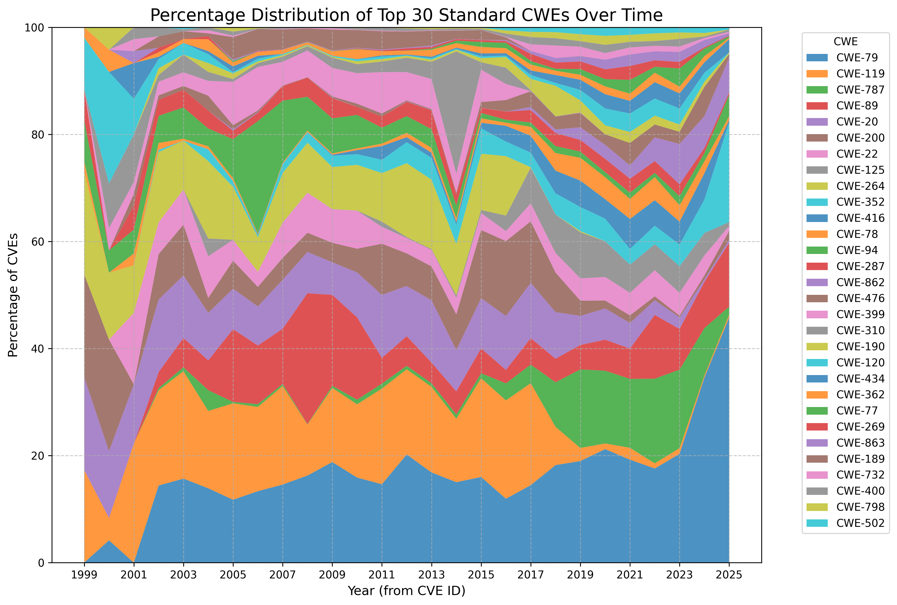

# CWE Counts 

!!! abstract "Overview"

    This section shows CWE counts per CVE over time for all published CVEs and associated CWEs.

    :technologist: [Source Code](https://github.com/CWE-CVE-Benchmark/CWE_analysis)

## How many CWEs are in CWE-1003 View

!!! quote

    The NVD uses the CWE-1003 view when associating CWEs to vulnerabilities. Known as “Weaknesses for Simplified Mapping of Published Vulnerabilities”, this subset of CWEs was selected through coordination between the NVD and the CWE team. If the CNA of the CVE record has provided CWE information via the CVE List it will be displayed in this section along with the CWE[s] associated through NVD enrichment.
    https://nvd.nist.gov/vuln/vulnerability-detail-pages

A percentage plot is used to normalize the increase of published CVEs over time.

!!! Observations

    The mast majority of CWEs are in CWE-1003.
    
    The count of non numeric CWE values (NVD-CWE-*) have reduced significantly in recent years.

    The count of "No CWE" value has increased significantly in 2024.

A percentage plot is used to normalize the increase of published CVEs over time.

- So Observations are relative to other CWEs i.e. "increasing" means "increasing relative to other CWEs over time"

- Non numeric CWE values (NVD-CWE-*) are not shown

!!! Observations

    [CWE-79: Improper Neutralization of Input During Web Page Generation ('Cross-site Scripting')](https://cwe.mitre.org/data/definitions/79.html) is the top CWE by count and is increasing over time.
    
    [CWE-119: Improper Restriction of Operations within the Bounds of a Memory Buffer](https://cwe.mitre.org/data/definitions/119.html) has significantly reduced in recent years but[CWE-787: Out-of-bounds Write](https://cwe.mitre.org/data/definitions/787.html) has increased in tandem.

    [CWE-89: Improper Neutralization of Special Elements used in an SQL Command ('SQL Injection')](https://cwe.mitre.org/data/definitions/89.html) remains persistent over time.