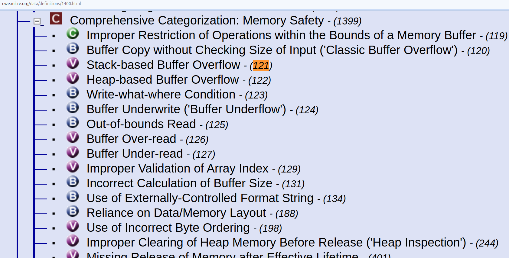
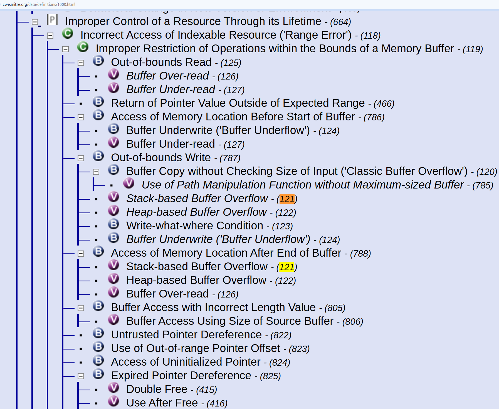

# CWE Views

!!! abstract "Overview"

    This section covers "The MITRE CWE “View” Methods" listed on the [MITRE CVE → CWE "Root Cause Mapping" Guidance](https://cwe.mitre.org/documents/cwe_usage/guidance.html) page.

    A "View allows easier navigation of the CWE list according to a specific point of view."

    There are many [other additional views](https://cwe.mitre.org/data/index.html) e.g.

    1. [Weaknesses in the 2024 CWE Top 25 Most Dangerous Software Weaknesses](https://cwe.mitre.org/data/definitions/1430.html)
    2. [Seven Pernicious Kingdoms](https://cwe.mitre.org/data/definitions/700.html) per Katrina Tsipenyuk, Brian Chess and Gary McGraw. "[Seven Pernicious Kingdoms: A Taxonomy of Software Security Errors](https://samate.nist.gov/SSATTM_Content/papers/Seven%20Pernicious%20Kingdoms%20-%20Taxonomy%20of%20Sw%20Security%20Errors%20-%20Tsipenyuk%20-%20Chess%20-%20McGraw.pdf)". NIST Workshop on Software Security Assurance Tools Techniques and Metrics. NIST. 2005-11-07
    3. [Quality Weaknesses with Indirect Security Impacts](https://cwe.mitre.org/data/definitions/1040.html)

## [CWE Views](https://cwe.mitre.org/data/index.html)

### Developer View ([View-699](https://cwe.mitre.org/data/definitions/699.html))

>This View organizes a **subset of ~400 CWEs** around concepts that are frequently used or encountered in software development. By design, this view is only **2 levels deep**. The top level has categories of developer-friendly concepts to facilitate easier navigation (remember: never map a vulnerability to a CWE Category). The second level contains Base level weaknesses.

### Software Assurance Trends View ([View-1400](https://cwe.mitre.org/data/definitions/1400.html))

> CWE Software Assurance Trends View (View-1400) view **contains every CWE**. CWEs are organized into 22 high-level categories of interest to large-scale software assurance research to support the elimination of weaknesses using tactics such as secure language development. This view is structured with **categories at the top level, with a second level of only weaknesses**. 

### Research View ([View-1000](https://cwe.mitre.org/data/definitions/1000.html))

> This View also **contains every CWE**. It has a **deep tree structure**, beginning with **10 high-level Pillars**. It might be especially useful when you are looking for unusual weaknesses, as you could perform a top-down search.

> This view is intended to facilitate research into weaknesses, including their inter-dependencies, and can be leveraged to systematically identify theoretical gaps within CWE. It is mainly **organized according to abstractions of behaviors**...
https://cwe.mitre.org/data/definitions/1000.html

> This view **uses a deep hierarchical organization, with more levels of abstraction than other classification schemes.** The top-level entries are called Pillars. Where possible, this view uses abstractions that do not consider particular languages, frameworks, technologies, life cycle development phases, frequency of occurrence, or types of resources. It explicitly identifies relationships that form chains and composites, which have not been a formal part of past classification efforts. Chains and composites might help explain why mutual exclusivity is difficult to achieve within security error taxonomies. This view is roughly aligned with MITRE's research into vulnerability theory, especially with respect to behaviors and resources. Ideally, this view will only cover weakness-to-weakness relationships, with minimal overlap and zero categories. It is expected to include at least one parent/child relationship for every weakness within CWE.
https://cwe.mitre.org/data/definitions/1000.html

### NVD View ([View-1003](https://cwe.mitre.org/data/definitions/1003.html))

> This View organizes a subset of **~130 CWEs most commonly seen in the National Vulnerability Database (NVD)**.

## Example using [CWE-121 Stack-based Buffer Overflow ](https://cwe.mitre.org/data/definitions/121.html)

### Developer View ([View-699](https://cwe.mitre.org/data/definitions/699.html))
[CWE-121 Stack-based Buffer Overflow ](https://cwe.mitre.org/data/definitions/121.html) is not part of Developer View ([View-699](https://cwe.mitre.org/data/definitions/699.html)).

### Software Assurance Trends View ([View-1400](https://cwe.mitre.org/data/definitions/1400.html))

[CWE-121 Stack-based Buffer Overflow ](https://cwe.mitre.org/data/definitions/121.html) is part of Software Assurance Trends View ([View-1400](https://cwe.mitre.org/data/definitions/1400.html)).

### Research View ([View-1000](https://cwe.mitre.org/data/definitions/1000.html))
[CWE-121 Stack-based Buffer Overflow ](https://cwe.mitre.org/data/definitions/121.html) is part of Research View ([View-1000](https://cwe.mitre.org/data/definitions/1000.html)).

!!! note

    Some CWEs appear more than once i.e. the same CWE may have different parents e.g. CWE-121, CWE-122 both appear twice in the diagram above.

### NVD View ([View-1003](https://cwe.mitre.org/data/definitions/1003.html))
[CWE-121 Stack-based Buffer Overflow ](https://cwe.mitre.org/data/definitions/121.html) is not part of NVD View ([View-1003](https://cwe.mitre.org/data/definitions/1003.html)).

