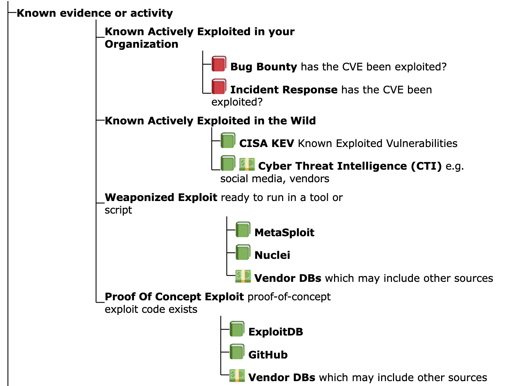

# EPSS Thresholds
!!! abstract "Overview"

    As we saw from the Risk section, (and we'll see later in the Vendor and
    Organizations section), focusing on known exploited, known weaponized
    exploits, or a significant probability of exploit, is an effective
    approach to risk mitigation and prevention.

    - We start by looking at the [EPSS Coverage, Efficiency, Effort figure](../epss/Introduction_to_EPSS.md#what-does-epss-provide) to understand the tradeoffs between three key parameters that you may use when determining your optimal remediation strategy: coverage, efficiency, and level of effort.

    - We then define an example Remediation Policy for an organization, and see what the impact is of picking an EPSS threshold using 2 data sets
        - EdgeScan Detected CVEs
        - Monte Carlo Random Sample
  
    !!! warning "The guidance here is highly opinionated and prescriptive and applied to a user context - not official EPSS guidance as FIRST EPSS can't be prescriptive for your context"
        At the beginning of the guide it was stated that [the "writing style" in this guide is "succinct and opinionated"](../introduction/Introduction.md#alternative-or-additional-guidance).
        
        This section "leads with an opinion", and associated rationale.

    :technologist: [Source Code](TODO) 

## EPSS Model 
### Remediation Prioritization for your Environment

Per [What Does EPSS Provide?](Introduction_to_EPSS.md/#what-does-epss-provide), the EPSS group provides a Coverage, Efficiency, Effort figure showing the tradeoffs between alternative remediation strategies.
This is based on CVEs detected by the EPSS Environment (representative of an Enterprise environment).

<figure markdown>
  
  <figcaption>Picking Thresholds for EPSS (A log scale for EPSS Probability makes it easier to see the detail in the lower range of EPSS Probability)</figcaption>
</figure>
This [plot](https://www.linkedin.com/posts/jayjacobs1_epss-vulnerabilitymanagement-activity-7154173473106395136-Dikp) will be superseded by a blog post on first.org/epss when published. TODO

<figure markdown>
  
  <figcaption>Picking Thresholds for EPSS Linear Scale (linear scale for EPSS Probability)(a plot from first.org/epss overlayed with grey annotations by authors of this guide)</figcaption>
</figure>

!!! note
    A Linear scale is used here because, while a log scale shows more detail at the lower EPSS Probability range, people not used to thinking in log scales [may not be able to see the forest for the trees](https://idioms.thefreedictionary.com/can%27t+see+the+wood+for+the+trees) i.e. not see the bigger picture because of the detailed log view.

    The linear and log scale plots represent the same data.

{!includes/epss_threshold.md!}

## Remediation Policy for an Enterprise

For this analysis, our policy will be (for our first pass triage
independent of business and runtime context per the [Scope of this guide](../introduction/Scope.md)):

1.  Remediate vulnerabilities that have weaponized exploits or evidence
    of exploitation in the wild or in our organization i.e. Weaponized
    Exploitation and above { width="600" }
    1.  independent of EPSS score
2.  Remediate CVEs with EPSS score above some threshold
    1.  **we need to understand the effect of picking a threshold, so we do some analysis...**
    2.  This is the same policy used in our back of the napkin Model Remediation Policy, but here we additionally "remediate CVEs with EPSS score above some threshold".

!!! note "Weaponized Exploits and EPSS"
    
    One could make the argument for not using "Weaponized Exploits" as part of our policy: EPSS has all those other variables in the model, basically it's extracted all the information out of those, so trying to do something with those next to EPSS doesn't make sense.

    But this could also be said of CISA KEV. 

    Throughout this guide, it's been shown that in some cases EPSS scores will be persistently low even when there is evidence of exploitation, (and EPSS should be used in conjunction with evidence of exploitation) e.g. 

    * [Microsoft Exploitability Index](../vendors/Microsoft_Exploitability_Index.md)
    * [Qualys](../vendors/Qualys.md)
    * [CISA KEV](../cisa_kev/cisa_kev.md)
    * [Applying EPSS to your environment](Applying_EPSS_to_your_environment.md)

    In this case, we're taking the same approach; overall [the population for weaponized is small](../introduction/code_and_data.md) - and an org will have a subset of these - so the extra effort is generally low.
    Also, mature risk based prioritization schemes may be using weaponized exploits as an input already - and want to add EPSS as pre-threat intel e.g.

    * [Qualys](../vendors/Qualys.md)
    *  https://github.com/theparanoids/PrioritizedRiskRemediation?tab=readme-ov-file#risk-based-decision-tree-decision-node-inputs

Let's assume we'll use the different groups for Likelihood of
Exploitation that we defined earlier - and used the data sources we have
available to determine the CVEs in each group

1.  **Active Exploitation:**
    1.  CISA KEV
2.  **Active Exploitation + Weaponized Exploits**:
    1.  CISA KEV + Metasploit + Nuclei
3.  **Active Exploitation + Weaponized Exploits: + Exploits with Proof of Concepts**:
    1.  CISA KEV + Metasploit + Nuclei + ExploitDB
4.  **All CVEs**

!!! note "ExploitDB contains a subset of CVEs with PoC"
    A Commercial CTI as used by the author has ~100K CVEs
    with Exploit PoC (versus the ~25K in the ExploitDB data
    source we used) so this number is not representative of
    reality. Users can repeat the analysis with additional data.

## Count of CVEs above EPSS value for All CVEs

| Plot Type       | Plot                                        | 
|--------------|---------------------------------------------|
| **Count of CVEs above EPSS value (Linear scale Y-axis)** |     |
| **Count of CVEs above EPSS value (Log scale Y-axis)**    |  |
| **Count of CVEs above EPSS value (Graph range EPSS 0.01 to 1.0 Linear Scale Y-Axis)**   |  |

Here we're showing the counts of CVEs **above** EPSS values for the groups
(because we want to pick an EPSS threshold **above** which we would remediate the
CVEs)

Per the policy we defined, we're going to remediate CVEs in CISA KEV and
Weaponized (independent of EPSS score). 

* So later we'll remove these from our counts of CVEs above EPSS values. In other words, subtract the pink line from the blue line in the graphs above

!!! observations

    1.  For All CVEs, and Exploit Proof Of Concept, the vast majority of
        CVEs are below some low EPSS score
    2.  For EPSS < 0.01, the count of CVEs increases significantly so it
        makes it harder to see the details for EPSS \>= 0.01. So we can
        either:
        1.  use a Log scale on the Y axis 
        2.  plot only for EPSS \>= 0.01, and use a linear y-axis 
    3.  The plot shows 
        1.  the count of CVEs above the EPSS value for the given thresholds - because we will remediate CVEs **above** an EPSS value, and we want to see **how many we would need to remediate based on the EPSS value**
        2.  All CVEs ~220K (our enterprise environment will contain a subset of these)
    4.  We can see that below EPSS score of approximately 0.1, there's a
        significant increase in the count of CVEs for All CVEs, and Exploit
        PoC
        1.  in other words, **below EPSS score of approximately 0.1, for a small change in EPSS score, there's a very large change in count of CVEs we would need to fix**
    5.  We can see that between EPSS score of approximately 0.9 and 0.1,
        there's a relatively small increase in the count of CVEs as we
        decrease EPSS score
        1.  in other words, **for a large change in EPSS score in the range 0.1 to 0.9, there's a relatively small change in count of CVEs we would need to remediate - so picking an EPSS value at or near EPSS 0.1 means we cover a very large range of probability of exploitation for a relatively small increase in the count of CVEs**

  

## Policy Applied to an Enterprise

!!! info
    We know what the shape of the graph looks like for the count of CVEs above
    EPSS values for **All CVEs** (~220K) as above.

    **An organization is only concerned with the CVEs in its environment -
    not all CVEs.**

    -   A typical enterprise will have 10K's of CVEs (depending on their
        tech stacks and ability to detect CVEs).
    -   Here we will look at all the CVEs detected by EdgeScan scans of many enterprises.

### EdgeScan Data 

Here we use [EdgeScan](../vendors/EdgeScan.md) detected CVEs as the representative data set for our Enterprise.

<figure markdown>
  
  <figcaption></figcaption>
</figure>

!!! note
    * The plot only shows EPSS > 0.01, so we can see the detail in the higher EPSS scores (rather than using a log y scale).
    * The blue line represents the count of CVEs above an EPSS Value for all CVEs detected by EdgeScan.
    * The red line is when the CISA KEV, and Weaponized (Metasploit, Nuclei) CVEs are removed per the Remediation Policy we defined above i.e. the actual effect of choosing an EPSS threshold for our Remediation Policy.

!!! observations
    
    We can see that, for both lines, the percentage of CVEs above EPSS Score 0.1 (10%) is 5% and 7%.
    
    The difference in % of CVEs between 0.9 and 0.1 EPSS score 
    
    * for red (actual) is ~3% 
    * for blue (all) is ~5%

    The takeaways are the same as per the [EPSS Model - Remediation Prioritization for your Environment](#remediation-prioritization-for-your-environment):

{!includes/epss_threshold.md!}

### Enterprise Data 

Looking at real CVE data from different enterprises, there is a significant variation in the graphs of counts of CVEs above an EPSS score, and associated "inflection point".

In other words, the general guidance to "Start by picking an EPSS Threshold around 10%" stands, but picking the EPSS value from the plot for your data will give you better coverage/efficiency/effort.

We can generalize as follows:

<figure markdown>
  
  <figcaption></figcaption>
</figure>

### Monte Carlo Simulation for a Typical Enterprise

**Monte Carlo Analysis**

CVEs in an Organization vs All CVEs

-   We're more interested in a sample of CVEs (not all CVEs) e.g. the
    sample in our organization which will likely be a much smaller
    subset of all CVEs.
-   Each organization will have a different subset of CVEs, and this
    data is private, so we can't do an analysis of that.
-   A typical enterprise will have ~10K's of CVEs i.e. **we know the
    counts of CVEs - but not the CVEs themselves.**
    -   So we can plot a random sample of that count of CVEs, and repeat
        many times to see what the overall plot looks like and if it is
        useful.
    -   And we can do this for different counts of CVEs e.g. 1K, 11K
        (5%) CVEs, or 44K (20%) CVEs

We need to understand the count of CVEs with EPSS score above some
threshold

1.  So we pick a sample of ~40K CVEs
2.  But we don't know which ~40K subset of CVEs are relevant for a
    typical Enterprise
3.  Instead of picking an exact ~40K subset of CVEs, we can pick lots
    of ~40K subsets of CVEs randomly, and plot them all.
    1.  **We would know that any Enterprise with the number of CVEs would be
        represented in those plots**
    2.  In other words, Monte Carlo Simulation for a Typical Enterprise

!!! warning

    - Random sampling is used here to create the samples.
    - The distribution of counts of EPSS values for a typical enterprise won't be a random distribution i.e. the counts of CVEs with high EPSS values will be higher.
    - But the % change in EPSS scores between EPSS score 0.9 and 0.1 is consistent with the examples above.

!!! abstract "Recipe" 

    1.  Take random % sample of CVEs 
        1.  where, e.g. 20%, corresponds to ~44K CVEs of ~220K CVEs
            1.  where this number is chosen to be close to (but greater than
                to give a worst case scenario) the ~40K CVEs observed in
                the Cisco data set across 1000 enterprises
    2.  Plot the result
    3.  Repeat steps 1,2, e.g. 10,000, times
        1.  It turns out that the result (shape) i pretty much the same if we repeat
            100,000 times
    4.  With a large number of iterations (e.g. 10,000), the result is a thick band (composed of 10,000 individual lines)
        1.   The gray band represents any and all possible outcomes for the sample.
    5.  We apply this recipe to
        1.  CVEs: CVEs of different population sizes (# CVEs)
        2.  CISA KEV and Weaponized CVEs removed (EPSS > 0.01): The same populations 
            1.  with CISA KEV and Weaponized CVEs removed because we want to see the effect of picking an EPSS threshold and our example policy says we need to remediate CISA KEV and Weaponized CVEs anyway
            2.  with EPSS > 0.01 to zoom in on the detail.

| # CVEs       | CVEs                                        | CISA KEV and Weaponized CVEs removed (EPSS > 0.01)                   |  
|--------------|---------------------------------------------|--------------------------------------------------------|
| **0.5% (~1.1K)** |     |     |   
| **5% (~11K)**    |  |  |   
| **20% (~44K)**   |  |  |   

!!! info
    This analysis is independent of the counts of each CVE
    in the organization i.e. how many occurrences of each CVE, e.g.
    CVE-2021-44228, are there in the organization. 

  

!!! observations

    1.  We can see that below EPSS score of approximately 0.1, there's a
        significant increase in the count of CVEs for All CVEs
        1.  in other words, for a small decrease in EPSS score, there's a
            very large increase in count of CVEs we would need to fix
    2.  We can see that between EPSS score of approximately 0.9 and 0.1,
        there's a relatively small increase in the count of CVEs as we
        decrease EPSS score
        1.  in other words, for a large change in EPSS score in the range
            0.1 to 0.9, there's a relatively small change in count of CVEs
            we would need to remediate - so picking an EPSS value at or near EPSS
            0.1 means we cover a very large range of probability of exploit
        2.  in other words, if we're going to remediate CVEs with EPSS \>= 0.9,
            then it doesn't cost us much to remediate CVEs with EPSS \> 0.1 (while
            covering a relatively large range of probability of exploit)
    3.  For 0.5% (~1.1K) of CVEs plot, the width of the band for EPSS 0.2 is ~250 and for EPSS 0.9 is ~200 CVEs
        1.  For much bigger populations, e.g. 20% (~44K), the width of the band is not much wider (as we'd expect given only a small percentage of CVEs have an EPSS score above 0.1)
  
{!includes/epss_threshold.md!}

!!! success "Takeaways"        
    
    1. For any organization, a large change in EPSS score in the range 0.1 to 0.9 results in a relatively small change in count of CVEs we would need to remediate - for a very large range of probability of exploitation (10%-100%).

