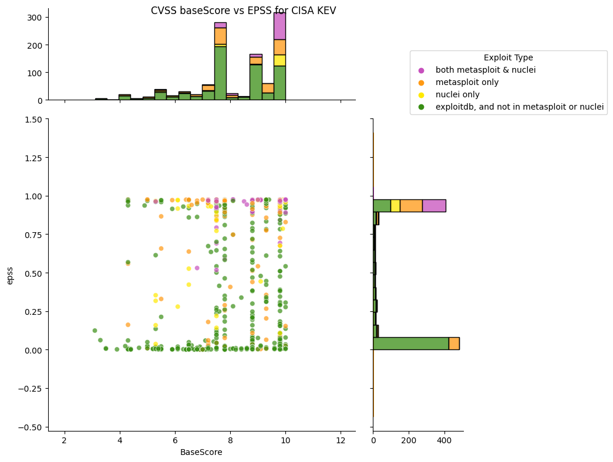
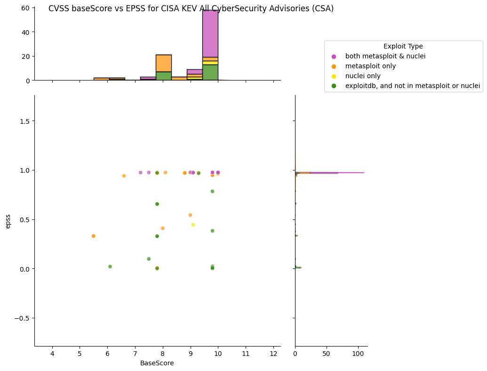
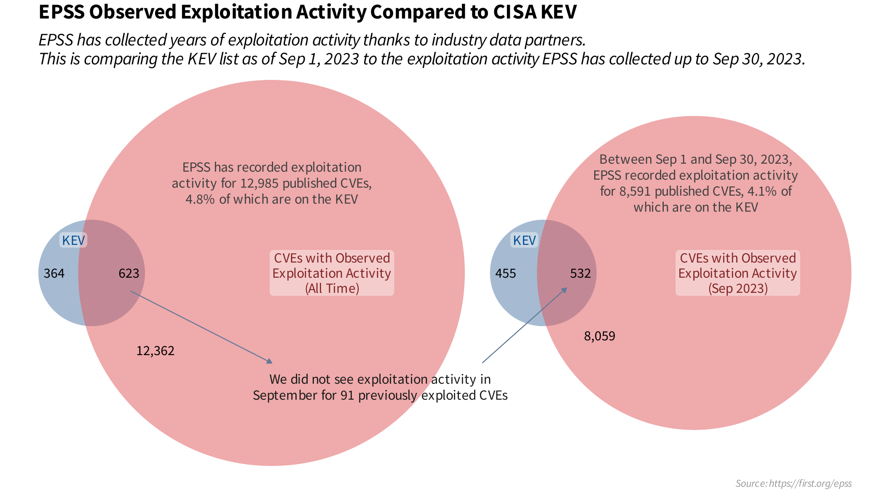
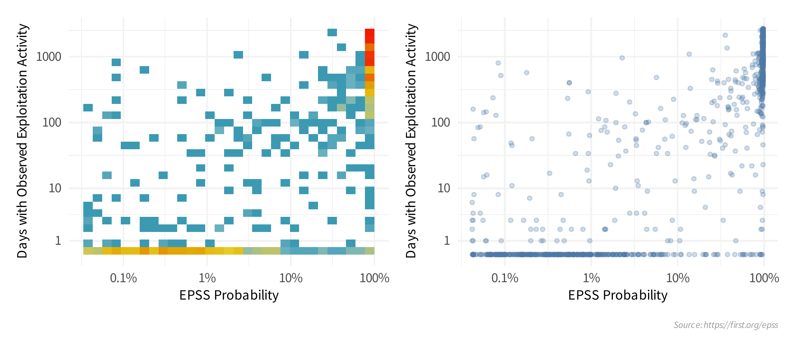
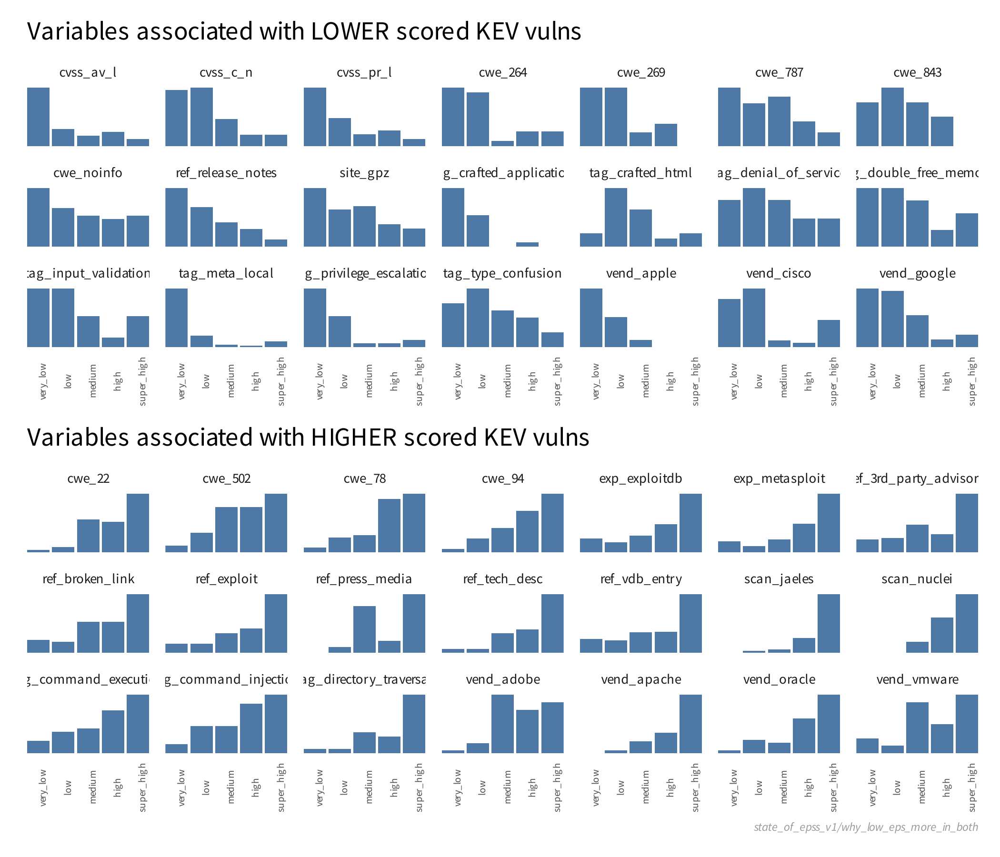
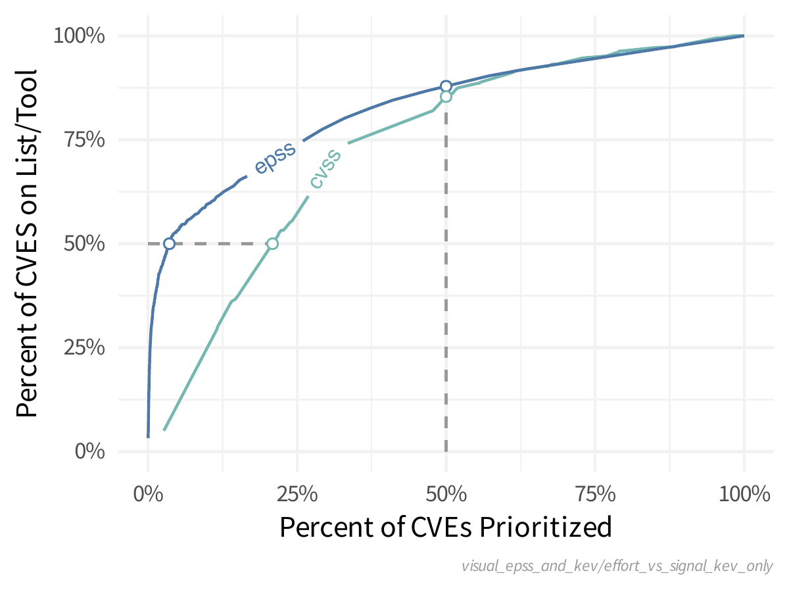
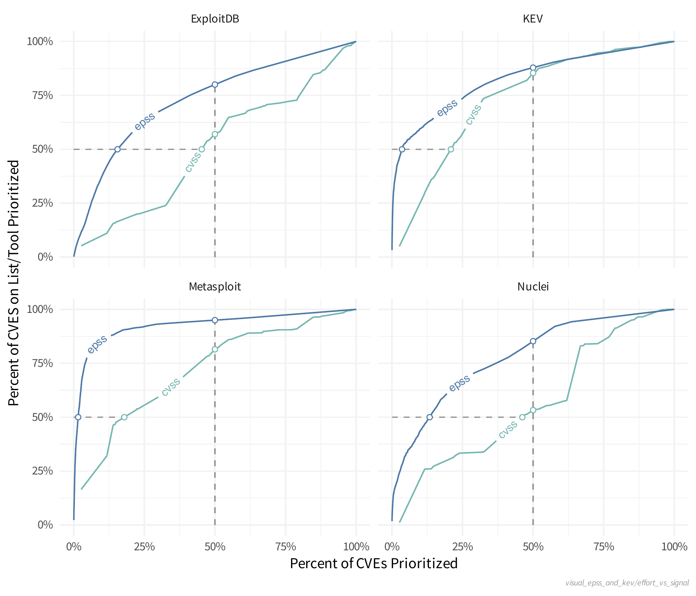

# EPSS and CISA KEV

!!! abstract "Overview"

    In this section, we apply interpretation and guidance of EPSS to CISA KEV:
 
    - CISA KEV will be used as the reference (source of
    truth) for active exploitation.
    -   CISA KEV is the most known and used catalog of CVEs actively
        exploited in the wild, and is publicly available.

    We start with analysis via plots and interpretation and code
   
    - Analyze the Data Sources relative to CISA KEV
    - Analyze EPSS relative to CISA KEV (and these Data Sources)

    Then Jay Jacobs (EPSS) presents analysis and interpretation based on data internal to the EPSS model.

!!! example "User Story"

    As a user, I want to know what CVEs

    1.  are actively exploited or likely to be
    2.  are not actively exploited or not likely to be

    So I can focus on what to remediate first in my environment.

!!! info "CISA KEV contains a subset of known exploited CVEs"

    1.  All CVEs in CISA KEV are actively exploited (see [criteria for inclusion in CISA KEV](https://www.cisa.gov/known-exploited-vulnerabilities))
    3.  Only ~~5% of CVEs are known exploited
    2.  CISA KEV contains a subset of known exploited CVEs

## What does EPSS look like for CISA KEV?

<figure markdown>

</figure>
TODO: redo colors for other

### What does EPSS look like for CISA KEV CyberSecurity Advisories (CSA)?

!!! info "CISA Cybersecurity Advisories (CSA) represent the Top Routinely Exploited Vulnerabilities from the CISA KEV Catalog"
    CISA (Cybersecurity and Infrastructure Security Agency) co authors (with
    several international cybersecurity agencies) separate Cybersecurity
    Advisories (CSA) on the Top Routinely Exploited Vulnerabilities from the
    CISA KEV Catalog e.g.

    1.  <a
        href="https://www.cisa.gov/sites/default/files/2023-08/aa23-215a_joint_csa_2022_top_routinely_exploited_vulnerabilities.pdf"
        rel="nofollow">AA23-215A Joint CSA 2022 Top Routinely Exploited
        Vulnerabilities August 2023</a>
    2.  <a
        href="https://www.cisa.gov/sites/default/files/publications/AA21-209A_Joint_CSA%20Top%20Routinely%20Exploited%20Vulnerabilities.pdf"
        rel="nofollow">AA21-209A Joint CSA Top Routinely Exploited
        Vulnerabilities</a> July 2021
    3.  <a
        href="https://www.cisa.gov/news-events/cybersecurity-advisories/aa22-279a"
        rel="nofollow">AA22-279A</a> 2022 covering CVEs from 2022, 2021
    4.  <a href="https://www.cisa.gov/uscert/ncas/alerts/aa22-117a"
        rel="nofollow">AA22-117A</a> 2022 covering CVEs from 2021
    5.  <a href="https://www.cisa.gov/uscert/ncas/alerts/aa20-133a"
        rel="nofollow" style="letter-spacing: 0.0px;">AA20-133A</a> 2020
        covering CVEs from 2016 to 2019

### All CISA KEV CyberSecurity Advisories (CSA) Top Routinely Exploited Vulnerabilities

<figure markdown>

</figure>

!!! observations

    1. Approximately half of CISA KEV CVEs have an EPSS score near 0.
    2. For CyberSecurity Advisories (CSA) Top Routinely Exploited Vulnerabilities CVEs:
          1. Most, but not all, of the CVEs have EPSS scores near 1.0, but some have an EPSS score near 0.
          2. 13 CVEs of 98 CVEs have EPSS scores <= 0.1
          3. Most of the CVEs are weaponized i.e. in metasploit and/or nuclei.

  

## EPSS Observed Exploitation Activity Compared to CISA KEV

EPSS probabilities are the direct result of the automated data we
receive and collect *about* a vulnerability. KEV is based on (to the
best of our knowledge) a list of human curated CVEs with historical
exploitation activity. And so given the different data generating
processes, it is entirely reasonable that a given CVE would appear on
KEV, while also receiving a low EPSS score. Or alternatively, that a CVE
would have a high EPSS score, but not appear on KEV.  
    
The EPSS probability is the result of a predictive model trained on
previous daily exploitation activity. A higher score indicates the
vulnerability is presenting itself (in data) similar to previously and
routinely exploited vulnerabilities and conversely a lower score
indicates the vulnerability is presenting itself like the
vulnerabilities where we, or our data partners, observed less or no
exploitation activity. We can see this in the plots below:

<figure markdown>

</figure>

<figure markdown>

</figure>

In order to understand what we said above, "A higher score indicates the
vulnerability is presenting itself (in data) similar to previously and
routinely exploited vulnerabilities and conversely a lower score
indicates the vulnerability is presenting itself like the
vulnerabilities where we, or our data partners, observed less or no
exploitation activity." I filtered CVEs down to those just on the KEV
and split them into 5 categories based on EPSS score (shown here with
the counts in each category):

      epss_range          count
    1 [0.00042,0.00328]   206
    2 (0.00328,0.0279]    203
    3 (0.0279,0.896]      205
    4 (0.896,0.972]       204
    5 (0.972,0.976]       205

We can then look at the proportion of CVEs in each category with
specific attributes EPSS derived from data about those vulnerabilities:

<figure markdown>

</figure>

## Comparison of Prioritizing Remediation of CISA KEV CVEs using EPSS and CVSS

Now let's assume that KEV is perfect. Only the CVEs on the KEV List will
be exploited this month and those are the only ones you want to
prioritize.  How would EPSS and CVSS compare in that case?  If you start
at the top of each scoring system and remediate everything going down
the scoring range, how many do you have to prioritize before you close
all or even "most" of the CVEs? 

<figure markdown>

</figure>

Left to right represents the amount of effort (percent of all published
CVEs) that is prioritized as you move down the scoring system.

Bottom to top represents the amount of "coverage" for the KEV list.

As we put in more effort (prioritize more CVEs) we will cover more and
more of the KEV CVEs, so as the lines move from left to right, we (the
defenders) are prioritizing more and more CVEs and getting better
coverage of CVEs on the KEV. The dashed lines represent 50% effort (the
vertical dashed line) and 50% KEV coverage (horizontal dashed line). 

We can create the same type of plot as the last one with some other
variables to see what kind of separation EPSS offers over a straight CVSS
base score.

<figure markdown>

</figure>

!!! observations

    1. Closest to the top left is best i.e. the CVEs on the List/Tool are prioritized more than all published CVEs. 
       1. e.g Using EPSS, Metasploit CVEs (weaponized exploits) are prioritized much better than all published CVEs (much better than using CVSS).

!!! success "Takeaways"

    1.  EPSS does better at prioritizing exploited CVEs (those on CISA KEV) than CVSS, which is what we'd expect as the CVSS Base Score is not a good predictor of exploitation per the [Understanding Risk](../risk/Understanding_Risk.md) chapter.
    2.  Some CVEs on CISA KEV have a low EPSS score. 
    3.  Some CVEs with a high EPSS score are not on CISA KEV.
    !!! quote

        If there is evidence that a vulnerability is being exploited, then that information should supersede anything EPSS has to say, because again, EPSS is pre-threat intel. If there is an absence of exploitation evidence, then EPSS can be used to estimate the probability it will be exploited." https://www.first.org/epss/faq

