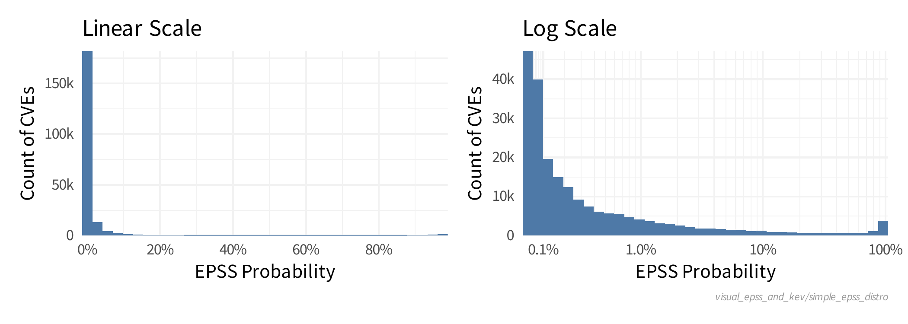
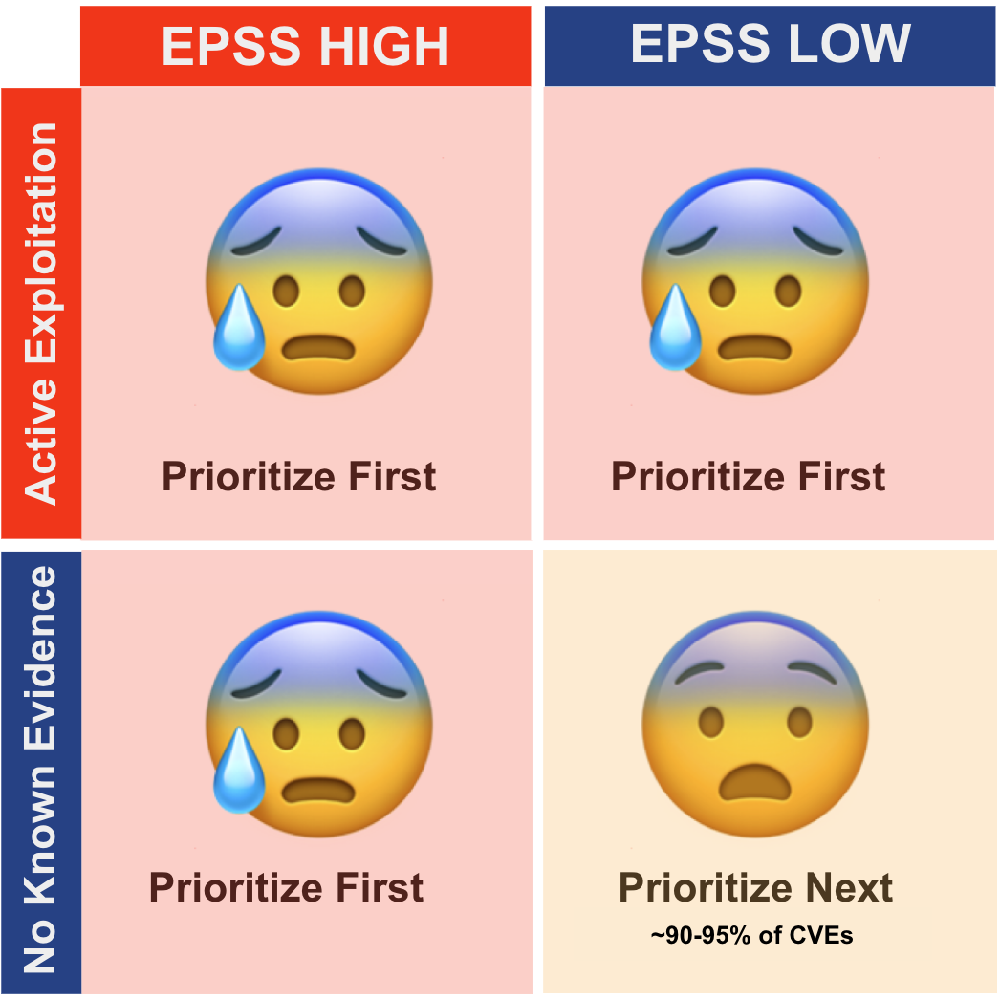

# Introduction to EPSS

!!! abstract "Overview"

    In this section we introduce EPSS

    -   what it is and what it gives us
    -   why we should care 
    -   a plot of EPSS scores for all CVEs

## What is EPSS?

Exploit Prediction Scoring System (EPSS) is a data-driven effort for
**estimating the likelihood (probability) that a software vulnerability
will be exploited in the wild**. The Special Interest Group (SIG) consists
of over 400 researchers, practitioners, government officials, and users
who volunteer their time to improve this industry standard. EPSS is
managed under
<u><a href="https://www.first.org/" rel="nofollow">FIRST</a></u>
(<a href="https://www.first.org/epss" rel="nofollow"
style="letter-spacing: 0.0px;">https://www.first.org/epss</a>), the same
international non-profit organization that manages the Common
Vulnerability Scoring System (CVSS),
<a href="https://www.first.org/cvss/" rel="nofollow"
style="letter-spacing: 0.0px;">https://www.first.org/cvss/</a>.

-   EPSS produces probability scores for **all known published CVEs** based on current
    exploitation ability, and updates these scores daily
-   The scores are **free** for anyone to use  
-   EPSS should be used:
    -   as a measure of the **threat** aspect of risk
    -   when there is no other evidence of current exploitation
    -   together with other measures of risk
-   EPSS is best suited to vulnerabilities that are remotely exploitable
    in enterprise environments.

{!includes/vulns_exploited.md!}
## What Can EPSS Do For Me?

-   EPSS allows network defenders to better (de)prioritize remediation
    of published CVEs for your organization based on likelihood of
    exploitation, while providing you the information you need to inform
    the prioritization trade-offs.
-   EPSS is useful for product security (PSIRT) teams when prioritizing
    vulnerabilities found within their own products when there is a
    known CVE.
-   EPSS data and trends are useful for researchers looking to better
    understand and explain vulnerability exploitation specifically, and
    malicious cyber activity more generally.
-   EPSS can be used by regulators and policy makers when defining patch
    management requirements.
-   (More detailed User Scenarios for different Personas (written by
    real users in that role) are provided in AnnexRequirements.)

## What Does EPSS Provide?

1.  **EPSS Score**
    1.  Probability scores for all known CVEs. Specifically, the
        probability that each vulnerability will be exploited in the
        next 30 days.
    2.  **Percentile**
        1.  The percentile scores represent a rank ordered list **of all CVEs** from most
            likely to be exploited, to least likely to be exploited
2.  **Coverage, Efficiency, Effort figure** showing the tradeoffs
    between alternative remediation strategies.
    1.  Specifically, this figure illustrates the tradeoffs between
        three key parameters that you may use when determining your
        optimal remediation strategy: coverage, efficiency, and level of
        effort 

## Count of CVEs at or above EPSS Score

In stark contrast to CVSS Base Scores and Ratings, (which are top heavy - most CVEs at the upper end of Severity), EPSS is bottom heavy (the vast majority of CVEs have a low EPSS score).

<figure markdown>
  
  <figcaption> How many CVEs at a given EPSS score? 
</figcaption>
</figure>

<figure markdown>
  
  <figcaption> How many CVEs above an EPSS score (substract the Percentile Rank from 100% to get the answer in % terms) Image from https://www.first.org/epss/articles/prob_percentile_bins
</figcaption> 
</figure>

## Using EPSS with Known Exploitation 

!!! quote

    If there is evidence that a vulnerability is being exploited, then that information should supersede anything EPSS has to say, because again, EPSS is pre-threat intel. If there is an absence of exploitation evidence, then EPSS can be used to estimate the probability it will be exploited." https://www.first.org/epss/faq

<figure markdown>
  {width="600"}
  <figcaption> Using EPSS with Known Exploitation
</figcaption>
</figure>

!!! success "Takeaways"

    1. Prioritizing vulnerabilities that are being exploited in the wild, or are more likely to be exploited, reduces the
          1. cost of vulnerability management
          2. risk by focusing on the vulnerabilities that need to be fixed first
    2. EPSS provides 
          1. a score for all published CVEs on how likely they are to be exploited (in the next 30 days)
          2. information on tradeoffs on coverage, efficiency, and level of
           effort

    !!! quote

        If there is evidence that a vulnerability is being exploited, then that information should supersede anything EPSS has to say, because again, EPSS is pre-threat intel. If there is an absence of exploitation evidence, then EPSS can be used to estimate the probability it will be exploited." https://www.first.org/epss/faq