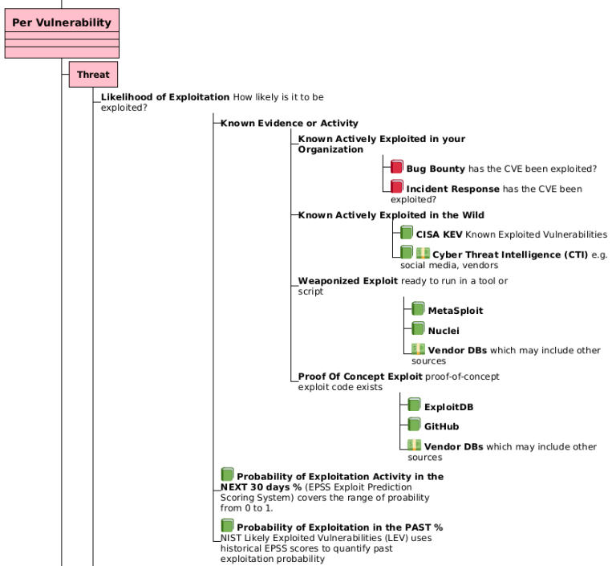
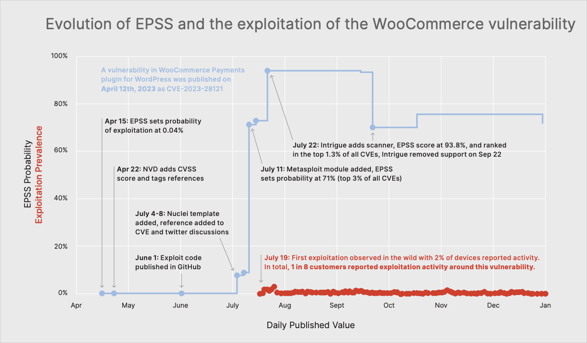
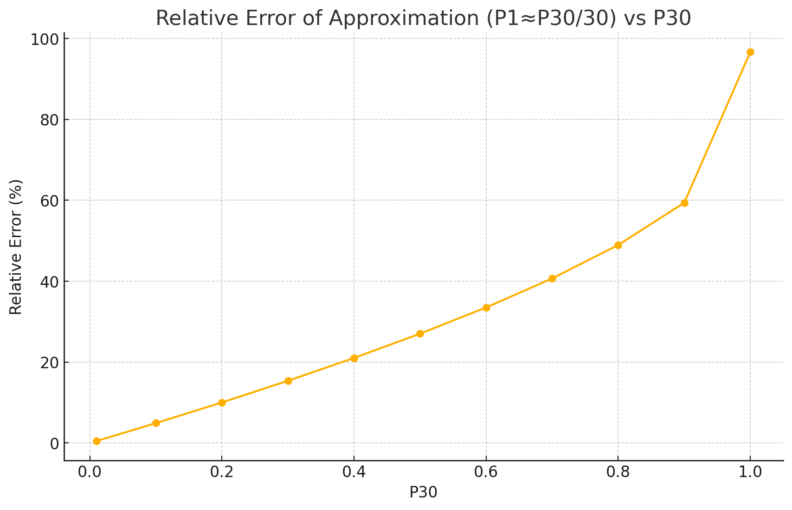

# Introduction to LEV

!!! abstract "Overview"

    In this section we introduce NIST Likely Exploited Vulnerabilities (LEV) 

    -   what it is and what it adds to vulnerability management  
    -   why it matters for day-to-day prioritization  
    -   how to apply it alongside EPSS and KEV  

    :technologist: [LEV source code](https://github.com/RiskBasedPrioritization/LEV/) is a cleanroom implementation based on the whitepaper (not associated with the paper authors)

    - Uses compute optimizations (multi core, vector multiplication) to avoid the mathematical P30 probability optimization in the paper (which does not hold for high EPSS scores) to achieve a runtime of ~30 minutes for the first run
        - Subsequent runs on new day data can be optimized as a delta of the first run and would complete in ~~1 minute.
    - Generated LEV data: https://github.com/RiskBasedPrioritization/LEV/tree/main/data_out
    - Analysis of resulting LEV data: [LEVAnalyzer](https://github.com/RiskBasedPrioritization/LEV/blob/main/lev_analyzer_README.md)
        - [Core Analysis Report](https://github.com/RiskBasedPrioritization/LEV/blob/main/analysis/lev_analysis_plots/analysis_report.md)
        - [Advanced Analysis Report](https://github.com/RiskBasedPrioritization/LEV/blob/main/analysis/advanced_lev_analysis_plots/advanced_analysis_report.md)
## What is LEV?

**Likely Exploited Vulnerabilities (LEV) is a probabilistic score proposed by NIST to estimate the chance that a published vulnerability (CVE) has already been exploited in the wild**. 

A high-performance Python implementation of: 
Mell P, Spring J (2025) [NIST CSWP 41: "Likely Exploited Vulnerabilities: A Proposed Metric for Vulnerability Exploitation Probability"](https://nvlpubs.nist.gov/nistpubs/CSWP/NIST.CSWP.41.pdf).
(National Institute of Standards and Technology, Gaithersburg, MD), NIST Cybersecurity White Paper (CSWP) NIST
CSWP 41. https://doi.org/10.6028/NIST.CSWP.41 

## Why LEV Matters

!!! tip "**KEY INSIGHT: LEV gives an additional View of Vulnerability Risk**"

    LEV fills a gap by looking backward in time, complementing forward-looking and current exploitation data:

    |                             | **Past**                                    | **Future**                                     |
    |-----------------------------|---------------------------------------------|------------------------------------------------|
    | **Exploited**               | [CISA KEV](../cisa_kev/cisa_kev.md) (Known Exploited)         |               -                         |
    | **Probability of Exploitation** | **LEV (past probability)**                    | [EPSS](./Introduction_to_EPSS.md) (next 30 days) |

### Where LEV fits

<figure markdown>
  { width="800px" }
  <figcaption></figcaption>
</figure>

*The diagram above is an extract from [Risk Remediation Taxonomy Detailed](../risk/Understanding_Risk.md#risk-remediation-taxonomy-detailed).*

[CISA KEV](../cisa_kev/cisa_kev.md) is a list of vulnerabilities that have been **exploited** in the wild (**past**).

- It contains a subset of known exploited CVEs (i.e has False Negatives)
- Typically, once a vulnerability is added to a KEV list, it stays on the list permanently
 
[EPSS](./Introduction_to_EPSS.md) is the **probability of exploitation** in the next 30 days (**future**). 

 - It is suited to network environments and may have [False Negatives](./Applying_EPSS_to_your_environment.md#false-positives-and-negatives)

LEV gives a **probability of exploitation** in the **past** 

- LEV can be used to augment CISA KEV i.e., shortlist candidates for addition to KEV (with other qualifying factors e.g., industry evidence)
- LEV works backwards—compounding historical EPSS scores—to quantify past exploitation probability
    - The longer and more consistently a CVE has high EPSS scores, the higher its LEV, reflecting real-world attacker behavior
- In **practice**:
    - It needs to be validated against real evidence of exploitation data to understand it, validate it, and calibrate it
    - The LEV list should be made available directly - or used to augment the KEV list

!!! tip "As a general user, how do I use LEV?"

    You don't, for now...
    
    - The LEV list is not officially published as of June 1, 2025. And even if it were, the LEV list by itself is not that useful for a general user i.e., there isn't a user guide, there isn't validation of the data
    - General users who use CISA KEV may benefit from LEV by additional validated entries being added to KEV per use case "augment KEV based vulnerability remediation prioritization by identifying higher-probability vulnerabilities that may be missing" 

!!! tip "LEV inherits some characteristics of EPSS"

    Because LEV is based on EPSS only, the same points about [Applying EPSS to your environment](Applying_EPSS_to_your_environment.md#applying-epss-to-your-environment) apply to LEV also.

!!! quote "LEV use cases"

    The LEV probabilities have at least four use cases:
    
    1. measure the expected number and proportion of vulnerabilities, as identified by Common Vulnerability and Exposures (CVE) identifiers, that actors have exploited,
    2. estimate the comprehensiveness of KEV lists,
    3. augment KEV based vulnerability remediation prioritization by identifying higher-probability vulnerabilities that may be missing, and
    4. augment EPSS based vulnerability remediation prioritization by identifying vulnerabilities that may be underscored. 
    
    [NIST CSWP 41: "Likely Exploited Vulnerabilities: A Proposed Metric for Vulnerability Exploitation Probability"](https://nvlpubs.nist.gov/nistpubs/CSWP/NIST.CSWP.41.pdf)

## How LEV Works

!!! success "**KEY TAKEAWAY: LEV's Backward-Looking Algorithm**"

    LEV essentially asks: "Given all the historical EPSS scores, what's the probability this vulnerability was exploited at some point in the past?"

    Because an EPSS score is a probability (of exploitation in the next 30 days), and there is daily historical EPSS scores available, standard probability theory can be used to determine other probabilities e.g. 

    - the probability for a different number of days - in the future or past

1. **Windowing EPSS**
      * EPSS(v, dᵢ) gives the probability of exploitation in the 30-day window starting at date dᵢ

2. **Non-Exploitation Probability**
      * For each window, compute (1 − EPSS × window-fraction)

3. **Compound Across Time**
      * Multiply all "no-exploit" probabilities from first EPSS release (d₀) to today (dₙ)

4. **Flip to Get LEV**
      * LEV = 1 − ∏₍windows₎(no-exploitProbability)

This approach treats each EPSS window as evidence that exploitation may already have occurred, with longer exposure driving LEV toward 1.0.

## Applying LEV in Vulnerability Management

LEV outputs a daily, per-CVE probability of past exploitation along with supporting history, enabling:

1. **Measuring Exploited Proportion**
    * Estimate how many CVEs have likely been weaponized to date

2. **Assessing KEV Coverage**
    * Compute a lower bound on how many CVEs a KEV list should include, revealing gaps

3. **Augmenting KEV-Driven Remediation**
    * Flag high-LEV CVEs missing from KEV for review or urgent patching

4. **Strengthening EPSS-Driven Prioritization**
    * Combine LEV with EPSS (and KEV overrides) in a Composite Probability:
        `max(EPSS, KEV_flag, LEV)`
    * Ensures previously exploited CVEs receive top attention

---

## Concerns

### Misunderstanding of EPSS?

!!! tip "How EPSS works"

    This information on how EPSS works is provided for context for the concerns below.
    
    See [State of EPSS and What to Expect from Version 4](https://youtu.be/o1XKTgX1JeE?feature=shared&t=1827), Jay Jacobs, April 2025 for how the model is **created** with  historic exploitation activity data.

    - where a new version of the model is created ~~ [every year so far](https://www.first.org/epss/) e.g. EPSS v1 to today's EPSS v4.

    Once created, the EPSS model when **running**

    - does not know or care **directly** about previous exploitation activity i.e. it does not have an explicit variable for this.
    - does know and care **indirectly** about previous exploitation activity because the approach will boost and weight the variables/features it does have based on their relationship to historic exploitation activity. 
        - An example of this from [Fortinet 2H 2023 Global Threat Landscape Report](https://www.fortinet.com/content/dam/fortinet/assets/threat-reports/threat-landscape-report-2h-2023.pdf) where some of the features that EPSS includes (Exploit code published in GitHub, Nuclei template added, reference added to CVE and twitter discussions, Metasploit module added, Intrigue adds scanner) went active, causing the EPSS score to rise, in advance of the exploitation activity detected by the sensor. (This example that illustrates the predictive (probability in next 30 days) nature of EPSS is given to clarify the above point - not to imply that this is how it always plays out.)
        <figure markdown>
        { width="800px" }
        <figcaption></figcaption>
        </figure>
  
  

!!! warning "**CRITICAL INSIGHT: Past vs. Future Exploitation**"

    [NIST CSWP 41](https://nvlpubs.nist.gov/nistpubs/CSWP/NIST.CSWP.41.pdf) suggests that EPSS provides inaccurate scores for previously exploited vulnerabilities, and recommends changing the EPSS scores to be 1.0 for all vulnerabilities on a KEV list.

    **This logic is fundamentally flawed** because [EPSS](./Introduction_to_EPSS.md) is the **probability of exploitation** in the next 30 days, and EPSS analysis data shows that past exploitation does not guarantee exploitation in the next 30 days.

[EPSS](./Introduction_to_EPSS.md) is the **probability of exploitation** in the next 30 days (**future**).

[CISA KEV](../cisa_kev/cisa_kev.md) is a subset of vulnerabilities that have been **exploited** in the wild (**past**) and the vulnerability typically stays on the list regardless of exploitation thereafter.

**Just because a vulnerability was known exploited, does not mean it will be exploited in the next 30 days.**

Jay Jacobs (EPSS) has shown [detailed analysis of exploitation patterns over time](https://www.cyentia.com/epss-study/) to validate this. See sections:

- "What's The Typical Pattern Of Exploitation Activity?"
    - Don't treat "Exploited" as a binary variable; intensity and duration matter for prioritization
- "What's The Ratio Of New Vs. Old Exploitation?"
    - Newly exploited vulns get the most attention, but the older ones get the most action
- "How Long Since Exploitation Was Last Observed?"
    - Just because a vulnerability is known to have exploitation activity, doesn't mean it always will

This Risk Based Prioritization guide has already covered the misunderstanding where users requested to "set the EPSS score to 1 if there are already published exploits" per [EPSS as the Single Score for Exploitation](../epss/What_users_ask_for.md#epss-as-the-single-score-for-exploitation).

!!! quote "NIST CSWP 41 May 19, 2025"

    However, as discussed in Sec. 2.2 and more thoroughly in Sec. 5.1, **EPSS provides inaccurate scores for previously exploited vulnerabilities. It is also not currently possible to fix inaccurate scores in EPSS.** 

    A mathematically defensible solution is obtainable if the goal is changed to include remediation of previously exploited vulnerabilities and a comprehensive KEV list is available. To do this, **change the EPSS scores to be 1.0 for all vulnerabilities on a KEV list.**

    **The addition of LEV probabilities is a practical solution that can overwrite remaining inaccurate EPSS scores.** It DOES NOT guarantee to remove all EPSS errors (only a comprehensive KEV list does that, which is a property that can be measured using LEV). 

###  EPSS Scores as Lower Bounds Rationale 

!!! warning "**Rationale for EPSS Scores as Lower Bounds**"

    The "EPSS Scores as Lower Bounds" rationale from the NIST CSWP 41 paper is basically saying:

    *"If the EPSS IDS data sees an actual attack attempt (so true positive in the validation data), the EPSS score is not set to 1 for that day. So the EPSS score on that day is an under-estimate."*

See [Misunderstanding of EPSS? 👆](#misunderstanding-of-epss).

### LEV2 Approximation

!!! warning "**Invalid Probability Division**"
    
    The "Small Probability" approximation is not valid for higher EPSS scores (the scores of interest), and is not necessary if the computation is optimized per the [Source Code](https://github.com/RiskBasedPrioritization/LEV/) provided here.

    - Rigorous vs NIST approximation time ratio: 2.23x
    
LEV handles EPSS scores as covering only a single day by dividing them by 30: $P_1 \approx P_{30}/30$

Dividing a 30-day probability by 30 to get a 1-day probability generally **does not make sense** in a rigorous probabilistic context.

An example run of the code from EPSS to 2023-3-7 ([EPSS v3 release](https://www.first.org/epss/)) to 2025-5-31 showed that this approximation resulted in +674 vulnerabilities (+1.57%) less than the rigorous approach.

<figure markdown>
  { width="800px" }
  <figcaption></figcaption>
</figure>

**P30** is the EPSS Score (**Probability** of exploitation for the next **30** days)

**Probabilities are not linear over time in this way.** If you have a probability $P_{30}$ of an event occurring over 30 days, it doesn't mean the probability on any single day is $P_{30}/30$.

**The "Small Probability" approximation:** The approach (dividing by 30) only makes sense as a rough approximation when the EPSS scores (which represent 30-day likelihoods) are very small (which is true for most but not all scores, where the ones we care about are high scores):

* If $P_1$ is very small, then $(1 - P_1)^{30} \approx 1 - 30P_1$ (using the binomial approximation or first-order Taylor expansion for $(1-x)^n \approx 1-nx$ when $x$ is small)
* In this case, $P_{30} = 1 - (1 - P_1)^{30} \approx 1 - (1 - 30P_1) = 30P_1$
* So, if $P_{30} \approx 30P_1$, then $P_1 \approx P_{30}/30$

This appears to be the underlying assumption for the deliberate simplification made in the NIST formula - likely for computational efficiency.

!!! quote

    The LEV2 equation requires significantly more computational resources. It handles EPSS scores
    as covering only a single day by dividing them by 30 (instead of each score covering a 30-day
    window). This enables the equation to incorporate far more EPSS scores within the
    computation and increases the equation's responsiveness to changing scores (especially for
    newly released vulnerabilities).

!!! tip

    Using standard concurrent processing per the source code, the approximation is not required on a standard computer.

    The code to calculate LEV (both approximation and rigorous), and the composite probability (both approximation and rigorous) completes in less than 30 minutes on a standard computer. 
    
    - The approximation calculations are not required but in the code for comparison.
    - See example log file: https://github.com/RiskBasedPrioritization/LEV/blob/main/logs/20250531_180156.log

    Calculations for new days (new runs) can be very fast if the code is optimized to use existing calculations from previous runs (it isn't currently).

### Independent Events Assumption

!!! warning "**Caution: Independent Events Assumption introduces potential inaccuracies**"

    Assuming vulnerability exploitation events occur independently each day simplifies calculations but likely introduces inaccuracies, as real-world exploitation patterns are not random.

Under this assumption:

* Daily probability of exploitation is denoted by $P_1$.
* Probability of not being exploited on any given day is $(1 - P_1)$.
* Probability of not being exploited over 30 days is $(1 - P_1)^{30}$.
* Thus, probability of being exploited within 30 days is $1 - (1 - P_1)^{30}$.
* Given the 30-day exploitation likelihood $P_{30}$, the daily probability $P_1$ is calculated by solving: $P_{30} = 1 - (1 - P_1)^{30}$.

However, the Independent Events Assumption is problematic because:

* Actual exploitation events, and the events that precede them that are features in EPSS (e.g. exploit being weaponized in Nuclei, Metasploit etc.., increase in related social media activity) display patterns and dependencies, not random occurrences, as shown in EPSS exploitation analyses.

!!! quote

    Probability error – the LEV equation (10) makes some mistake or invalid assumption. For example, since (10) takes in multiple scores per probability calculation, it could amplify small dependent errors if the equation incorrectly assumes independence. 

    Page 20 [NIST CSWP 41: "Likely Exploited Vulnerabilities: A Proposed Metric for Vulnerability Exploitation Probability"](https://nvlpubs.nist.gov/nistpubs/CSWP/NIST.CSWP.41.pdf)

## Takeaways

!!! success "**KEY TAKEAWAYS**"

    **What LEV Gets Right:**

    1. LEV estimates the likelihood a CVE has already been exploited in the wild
    2. It leverages and compounds historical EPSS data for evidence-based prioritization using probability theory
    3. Use LEV to measure exploited CVE proportions, evaluate KEV comprehensiveness, and enhance both KEV- and EPSS-driven workflows
    4. Combined with continuous validation (e.g., breach-and-attack simulations), LEV helps close the gap between theoretical risk and real-world exploitation

    **What to Watch Out For:**

    1. **Mathematical approximations** may not hold for high EPSS scores (the ones you care about most) - but these are not necessary if compute optimizations are used instead. 
          1. The source code provides both the mathematical and compute optimization versions.
    2. **Independent events assumption** doesn't reflect real attack patterns, so this will introduce some error.
    3. **Past vs. future confusion** - don't assume past exploitation guarantees future exploitation
    4. **Limited validation** - LEV needs real-world calibration before widespread adoption