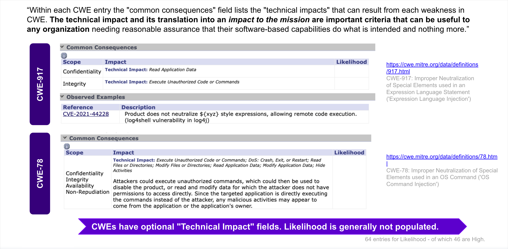
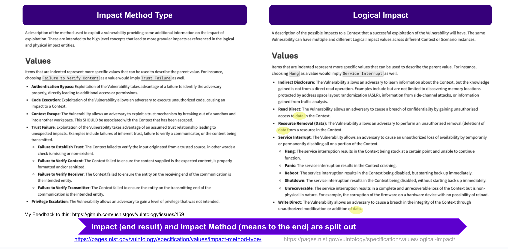
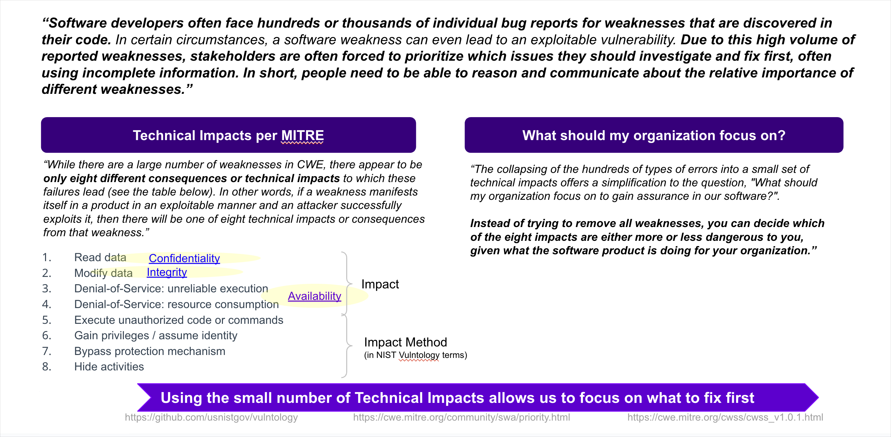
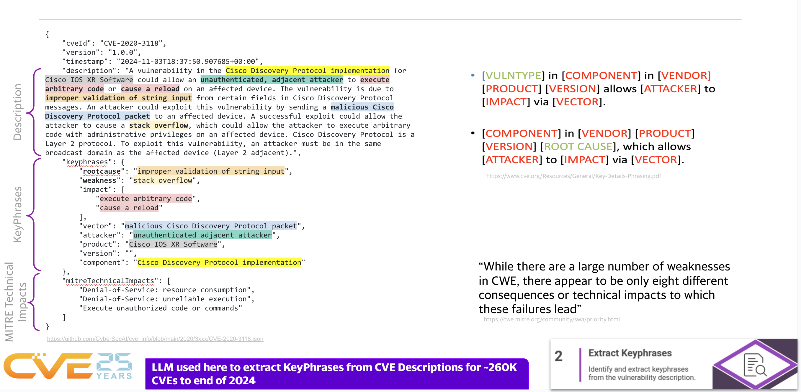

# Impact


!!! abstract "Overview"


    !!! quote

        Is there any machine readable version of the "technical" impact of a vulnerability that is standardized and grouped?

        For example:

        - Allows for privilege escalation
        - Allows for application data manipulation
        - Allows to run shell code at the user level

        [LinkedIn Thread, Oct 2023](https://www.linkedin.com/feed/update/urn:li:activity:7115732049100976128?commentUrn=urn%3Ali%3Acomment%3A%28activity%3A7115732049100976128%2C7115790097953775616%29&dashCommentUrn=urn%3Ali%3Afsd_comment%3A%287115790097953775616%2Curn%3Ali%3Aactivity%3A7115732049100976128%29)

    !!! quote
        No is the short answer AFAIK...

    !!! tip

        See BSidesDub talk [Understanding and Using Impact so you know what Vulnerabilities to fix first](https://www.youtube.com/watch?v=AtN_tav_5Mc) and associated [Slides](https://riskbasedprioritization.github.io/talks/docs/BSides2024_CVEClassifier_v100.pdf)


## Technical Impact


!!! tip "Technical Impact is different than Attack Pattern!"

    [“CWE](https://cwe.mitre.org/) is the root mistake, which can lead to a vulnerability (tracked by [CVE](https://cve.mitre.org/) in some cases when known), which can be exploited by an attacker **(using techniques covered by [CAPEC](https://capec.mitre.org/))**”, which can lead to a **Technical Impact** (or consequence), which can result in a Business Impact

    https://riskbasedprioritization.github.io/risk/Vulnerability_Landscape/#key-risk-factor-standards
    

## Impact in CVE Schema

The CVE Schema contains a [field for **impacts**](https://github.com/CVELab/cve-schema/blob/3fc0cf8d284da1494a0db0ca0615bec6dfbad7b6/schema/v5.0/CVE_JSON_5.0_schema.json#L812) and it uses the "**CAPEC ID that best relates to this impact.**" and a "description" for **"impact type information"**.


```json
        "impacts": {
            "type": "array",
            "description": "Collection of impacts of this vulnerability.",
            "minItems": 1,
            "uniqueItems": true,
            "items": {
                "type": "object",
                "description": "This is impact type information (e.g. a text description.",
                "required": ["descriptions"],
                "properties": {
                    "capecId": {
                        "type": "string",
                        "description": "CAPEC ID that best relates to this impact.",
                        "minLength": 7,
                        "maxLength": 11,
                        "pattern": "^CAPEC-[1-9][0-9]{0,4}$"
                    },
                    "descriptions": {
                        "description": "Prose description of the impact scenario. At a minimum provide the description given by CAPEC.",
                        "$ref": "#/definitions/descriptions"
                    }
                }
            }
        },
```


## MITRE CWE Common Consequences
<figure markdown>

</figure>


## NIST Vulntology

[NIST Vulntology](https://pages.nist.gov/vulntology/) defines:

- [Impact](https://pages.nist.gov/vulntology/specification/values/logical-impact/)
- [Impact Methods](https://pages.nist.gov/vulntology/specification/values/impact-method-type/)
  
<figure markdown>

</figure>


## MITRE Technical Impacts 

MITRE CAPEC (Common Attack Pattern Enumerations and Classifications) lists 8 [Technical Impacts](https://capec.mitre.org/custom/view.html?id=1000), in addition to the many CAPEC attack patterns.

- These can be mapped to NIST Vulntology Impact and Impact Method.


<figure markdown>

</figure>


## Impact Text and MITRE Technical Impact Extraction from a CVE

Per [Vulnerability Root Cause Mapping with CWE: Challenges, Solutions, and Insights from Grounded LLM-based Analysis](https://www.first.org/conference/vulncon2025/program#pVulnerability-Root-Cause-Mapping-with-CWE-Challenges-Solutions-and-Insights-from-Grounded-LLM-based-Analysis), FIRST Vulncon 2025, it is possible to

- extract the impact keyphrases from the CVE Info (Description and reference content)
- map the impacts to the MITRE Technical Impacts


!!! tip "Put the impact in the impact field 💡"

    💡 The impact keyphrases, and the MITRE Technical Impacts that they map to, could be placed in the CVE schema impacts field.


<figure markdown>

</figure>


   
---

!!! success "Takeaways"

    * The Technical impact is useful for end users (beyond the CVSS Confidentiality, Integrity, Availability impact) which is not so useful as it is not granular.
    * Technical impact is not well represented in published CVEs today, even though there is an "impacts" field in the CVE schema.
    * People may want to know the Impact more than the CAPEC (where CAPEC lives under Impact in the schema - and is often used as the only representation of Impact in a CVE, if at all)
    * The CVE Description (and reference content) impact keyphrases, and the MITRE Technical Impacts that they map to, could be placed in the CVE schema impacts field.