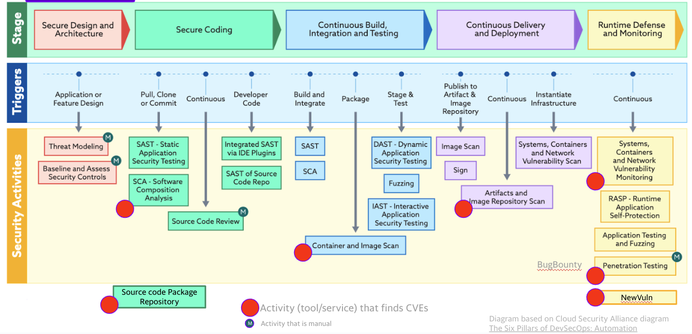
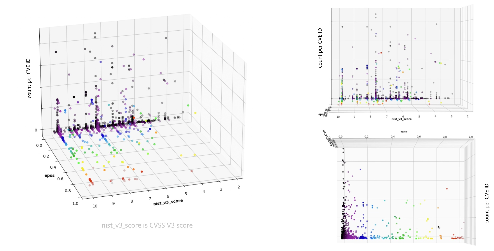
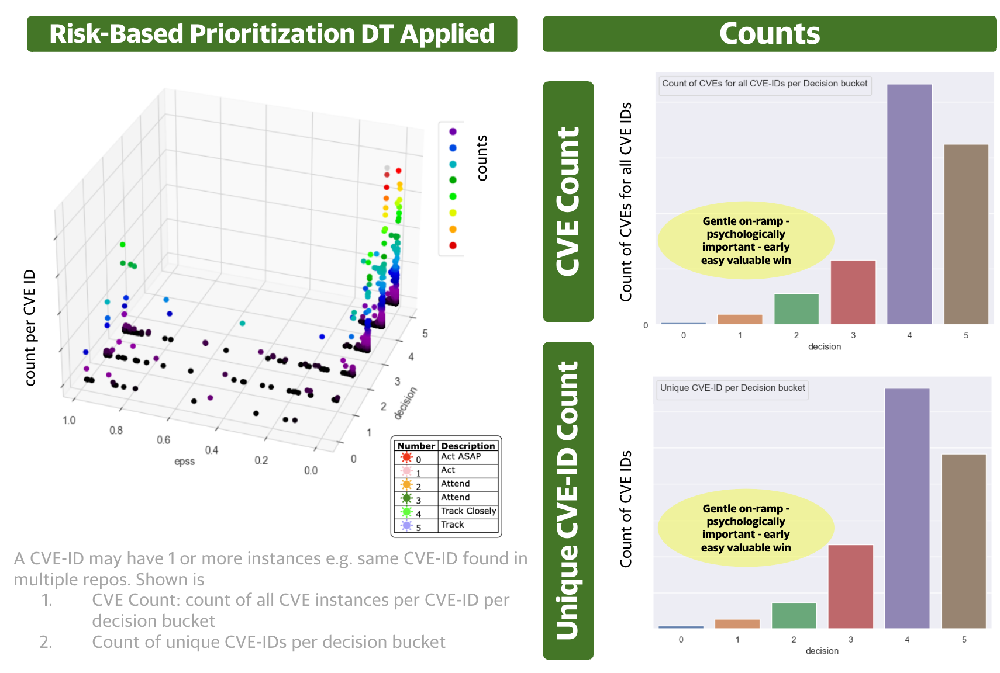

# Yahoo

!!! abstract "Overview"

    Yahoo is a large Media, Social, Internet enterprise.

    It has a mature DevOps and data analysis capability.

    Simplified representative views are presented below.

    The content is based on what was presented at BSidesDublin 2023:

    <iframe width="560" height="315" src="https://www.youtube.com/embed/oMZN810xfck?si=YrfvLHVi-JhSS-18" title="YouTube video player" frameborder="0" allow="accelerometer; autoplay; clipboard-write; encrypted-media; gyroscope; picture-in-picture; web-share" allowfullscreen></iframe>

<figure markdown>
  
  <figcaption>Ref https://cloudsecurityalliance.org/artifacts/devsecops-automation/ </figcaption>
</figure>
  

!!! tip "3 R's to address Risk Effectively"
    ### 3 R's to address Risk Effectively

    Rather than playing whack-a-mole with vulnerabilities, the following 3
    independent steps are applied to focus on what needs to be fixed first
    (where each step on its own gives a very significant reduction in CVEs
    to fix):

    1.  **Root Cause**
        1.  Do some initial easy Exploratory Data Analysis to understand the
            root causes of CVEs in the DevOps pipeline i.e. find the source
            of the moles and address them. 
            1.  One Programming Language in particular accounted for a very
                significant proportion of CVEs
                1.  This was due to the Open Source dependencies for this
                    programming language not being up to date
            2.  By updating dependencies (automatically), the number of CVEs
                reduced very significantly over time!
        2.  Addressing the root cause avoids playing whack-a-mole by
            eliminating the source of the moles
    2.  **Reachability**
        1.  Some (SCA (Software Composition Analysis) and image scan) tools
            support reachability analysis that indicate if a vulnerability
            in the vulnerable dependency is actually called by the App code
            or not
            1.  in general, a significant number of CVEs reported by
                SCA, image scanners are not reachable.
        2.  There are also tools that check Network reachability of vulnerabilites, 
            and some validate exploitability.
    3.  **Risk Based Prioritization**
        1.  As seen throughout this guide, focusing on CVEs that are, or are
            likely to be, exploited, gives a very significant reduction in
            CVEs to remediate and associated effort!

  

### **Risk Based Prioritization**

<a href="https://github.com/theparanoids/PrioritizedRiskRemediation"
rel="nofollow">https://github.com/theparanoids/PrioritizedRiskRemediation</a>
gives the background and detail to this section.

A Risk Remediation Taxonomy is defined here to support Risk Based
Prioritization of CVEs:

-   the constituent components of risk and remediation for a CVE
-   the associated data sources for these components

A Risk-based Decision Tree is defined with

-   inputs for the Decision Tree Decision Nodes
-   output Decisions

The Risk Remediation Taxonomy and Decision Tree are part of a conference
presentation by Yahoo Chris
Madden: <a href="https://www.bsidesdub.ie/" rel="nofollow"
style="text-decoration: underline;">https://www.bsidesdub.ie/</a> May 27
2023.

-   See the <a
    href="https://github.com/theparanoids/PrioritizedRiskRemediation/blob/main/BSidesVulnerabilityScoring_YahooParanoidsProdSec.pdf"
    rel="nofollow" style="text-decoration: underline;"><strong>slide
    deck</strong></a> and
    the <a href="https://www.youtube.com/watch?v=oMZN810xfck" rel="nofollow"
    style="text-decoration: underline;"><strong>recording</strong></a>.

  

  

### CVEs CVSS scores, counts of CVEs, EPSS scores

The counts of a specific CVE in an organization are a relevant part of
Risk Based Prioritization.

The data from different tools across the DevOps pipeline shows there are
paretos i.e. a relatively small number of unique CVEs account for a
large number of overall CVEs per
<a href="https://youtu.be/oMZN810xfck?t=896"
rel="nofollow">https://youtu.be/oMZN810xfck?t=896</a>.

  
<figure markdown>
  
  <figcaption> Plot of CVEs CVSS scores, counts of CVEs, EPSS scores  The plots are based on real data (the pattern is the same whether 1 or several tools in the DevOps pipeline are viewed, or an aggregate of CVEs across those tools).
</figcaption>
</figure>
  
  

  

### Decision Trees and Multiple Data Sources to get more Targeted Prioritization

The [Decision Tree From Scratch](../ssvc/decision_trees_from_scratch.md) section gives a simplified view of the Decision Tree used.

Using the same real data, using CVSS Base Parameters (not CVSS Score),
and combining EPSS with CISA KEV and other industry and internal threat
intelligence using Decision Trees based on CISA SSVC.

The Decision Tree is similar to the "Decision Tree from Scratch" example
code provided but

1.  additionally uses commercial CTI for Exploitation
2.  uses other sources of Impact (because CVSS Base Score Impact
    Confidentiality, Integrity, Availability do not offer enough
     granularity per [CVSS ratings](../cvss/CVSS.md).)

<figure markdown>
  
  <figcaption> 
</figcaption>
</figure>

!!! observations

    1.  There's a concentration of CVEs in the lower EPSS range below 0.1.
    2.  The CVSS score distribution is typical in industry
    3.  The EPSS score (temporal) can be used in conjunction with the static
    decisions to prioritize across a decision band.
