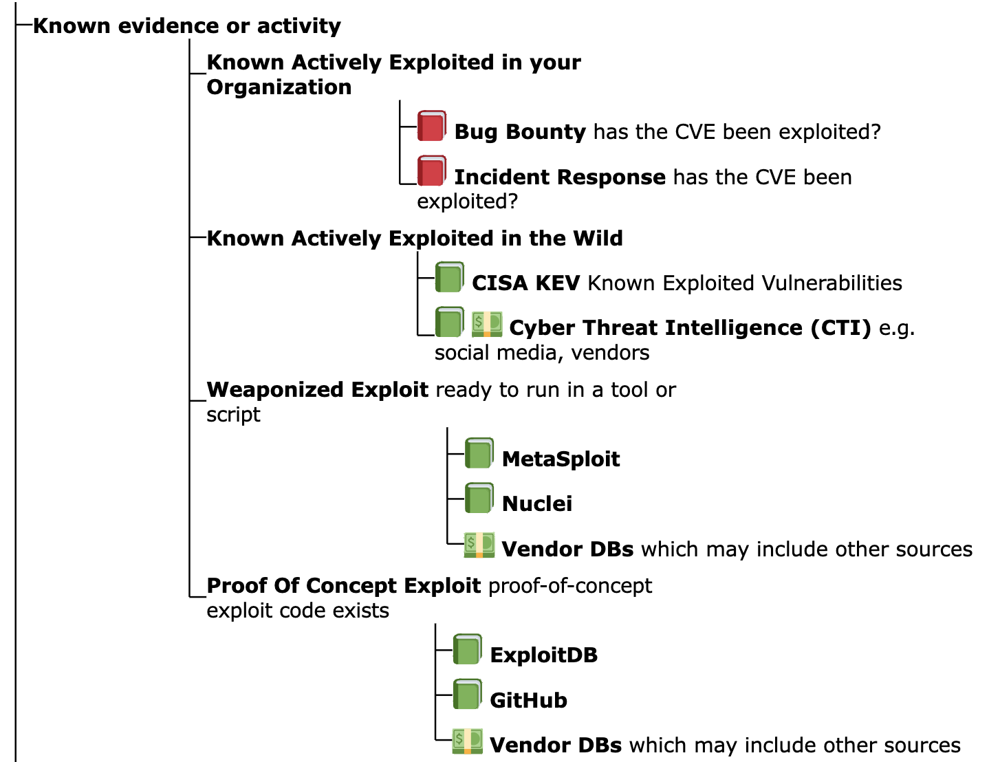
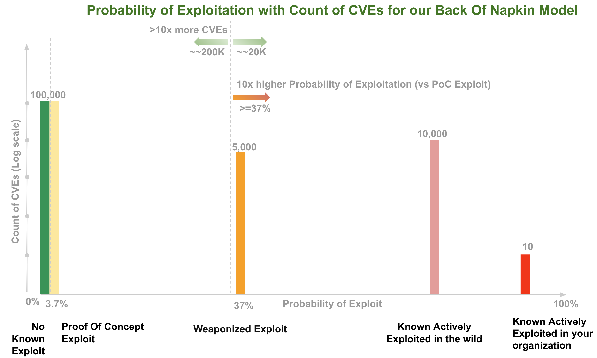

# Applied Back of the napkin Likelihood of Exploitation Model

!!! abstract "Overview"
    As users, we want to know which CVEs we need to remediate first based on our
    available resources/capacity to remediate them.

    To develop an understanding of Risk Based Prioritization, we'll build a** back of the napkin**
    Risk Based Prioritization model that focuses on Likelihood of
    Exploitation.

    We'll look at the tradeoff between Likelihood of Exploit vs how many
    CVEs we need to fix.

    When we look at Risk Based Prioritization models in products and 
    production later in this guide; you'll be able to recognize many
    of the elements in our back of the napkin model

## Back of the napkin Model

For this back of the napkin model:

1.  We use Threat Likelihood of Exploit per our Risk Taxonomy
2.  For this back of the napkin model, let's assume that
    1.  The odds of a vulnerability being exploited are in the order in
        the diagram (highest risk on top):
        1.  { width="600" }

    2.  The probabilities quoted in section "Threat Likelihood of
        Exploit" are correct (though exact figures don't matter on this
        back of the napkin - the point is there's a significant difference)
        1.  37.1% it the vulnerability is weaponized
        2.  3.7% if a Proof Of Concept exists
    3.  For counts of CVEs
        1.  the counts of CVEs are per "Likelihood of Exploit Populations" diagram
        2.  there's a relatively small number of vulnerabilities that
            have been Known Exploited in our organization i.e. 10 or
            less
        3.  We're looking at all published CVEs.
            1.  You could apply this back of the napkin model to the subset
                of CVEs in your environment.
        4.  We'll use a very exaggerated figure of ~~20K for CVEs that
            have weaponized exploits or evidence of exploitation in the
            wild (as it's a back of the napkin exercise and we want to
            understand if our model is still useful in a well beyond
            worst case scenario):
            1.  So that gives ~~10% of CVEs that have weaponized
                exploits or evidence of exploitation in the wild
            2.  In contrast, <a
                href="https://blog.qualys.com/qualys-insights/2022/10/10/in-depth-look-into-data-driven-science-behind-qualys-trurisk"
                rel="nofollow">Qualys</a> give a much smaller figure,
                “*Less than 3% of vulnerabilities have weaponized
                exploits or evidence of exploitation in the wild, two
                attributes posing the highest risk*”

  

A rough drawing on the back of our napkin of Probability of Exploitation vs
the Count of CVEs:

<figure markdown>
{ width="700" }
</figure>

!!! observations
    For this back of the napkin model:

    1.  Using the Weaponized Exploit Probability of Exploitation (37%) as a
        threshold gives two "10x's"  i.e. at this threshold there's
        1.  10x higher probability of exploitation or greater
        2.  there's 10% of CVEs (or \>10x more CVEs are below this
            threshold)
    2.  we can see that as we raise the threshold for Probability of
        Exploit, we have less CVEs to fix, (but we may miss some CVEs that
        we should have fixed).

    
    For our organization risk posture, maybe we want to use the lower
    Probability of Exploitation Threshold associated with a Proof Of Concept
    exploit being available (3.7%).

    -   In this case, there's ~~100K CVEs below this threshold in the back
        of napkin model, and ~~120K above it (to remediate based on our
        threshold). So we remediate a lot more CVEs (and a lot more than the
        ~~5% that are exploited), but we miss a lot less of the ones we
        should have fixed).

!!! tip "Probability of Exploitation and associated population counts informs Remediation"
    Having these Probability of Exploitation values vs associated count of CVEs
    allows us make an informed decision based on our

    -   risk posture - using Likelihood of Exploitation
    -   resources/capacity available to remediate CVEs

  

### Back of the napkin Model Remediation Policy

Per our Risk Remediation Taxonomy, Likelihood of Exploitation informs one part of
Risk per Vulnerability.

To complete our back of the napkin Model for Prioritization we can use e.g.
CVSS also.

So our Remediation Policy (for our first pass triage) could be:

-   for all CVEs that are at Weaponized Exploitation and above in our
    Likelihood of Exploitation diagram (~~10% using our beyond worst
    case figure)  
    -   remediate all CVEs that have a High or Critical CVSS score (~~65%)

This would require fixing 6.5% of CVEs (10% x 65%).

!!! success "Takeaways"
    **With this very simple back of the napkin model, and very exaggerated counts of weaponized exploitation, we see that by using Likelihood of Exploitation, we need to remediate 1/10 of CVEs versus using CVSS Base Score alone!!!**