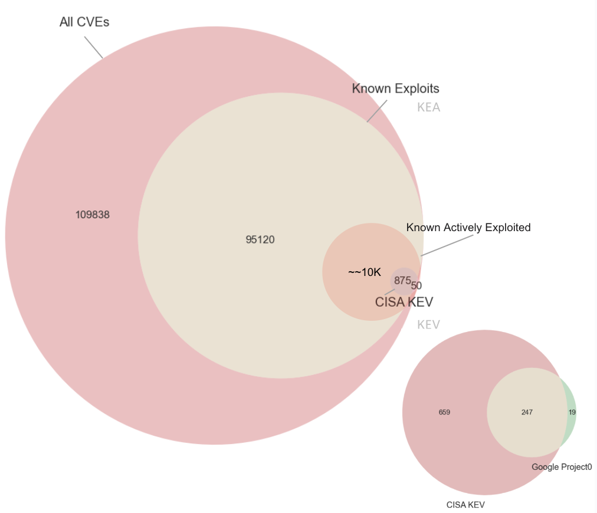

# Likelihood of Exploit Populations

!!! abstract "Overview"
    
    Our ability to remediate depends on 

    1. the priority (risk) of CVEs - the ones we want to fix based on our security posture
          1.  In the "Understanding Risk" chapter, we saw the ordered Likelihood of Exploit for different populations of CVEs in the Risk Remediation Taxonomy.
    2. the number of CVEs for that priority (risk) - that we have the capacity/resources to fix

   
    This section gives a

    3.  view of the sizes of those populations
    4.  the data sources for those populations

## Population Sizes

<figure markdown>
{ width="700" }
<figcaption>Population Sizes associated with the Risk Remediation Taxonomy - Likelihood of Exploit branch</figcaption>
</figure>
TODO update venn with latest data - and add weaponized exploits

1. ~~50% (~~100K) of all CVEs (~200K) have known exploits available (based on a commercial CTI product used by the author)
2. ~~5% (~10K) of all CVEs are actively exploited 
    1. **There isn't a single complete authoritative source for these CVEs**
3. ~~10% of CVEs with Known Exploits Available (KEA) are known exploited
4. ~~0.5% (~1K) of all CVEs (~200K) are in CISA Known Exploited Vulnerability 
5. ~~5% (50) of all CISA KEV CVEs (~1K) are not listed in Vendor DBs

!!! note
     1. Not all exploits are public/known.
     2. Not all [public exploits have CVEs](https://unit42.paloaltonetworks.com/state-of-exploit-development/).
     3. A typical enterprise will have a subset of exploits/CVEs: ~~10K order of magnitude unique CVE IDs.
         1. The counts of these unique CVE IDs may follow a Pareto type distribution i.e. there will be many instances of a small number of CVE IDs.

## Likelihood of Exploit Data Sources

This table shows the number of CVEs (from all published CVEs) that are listed in that data source:

| Data Source |    Detail     | ~~ CVE count K | 
|-------------|:-------------:|---------------:|
| [CISA KEV](https://www.cisa.gov/known-exploited-vulnerabilities-catalog)    |  **Active** Exploitation|              1 | 
| [Metasploit modules](https://github.com/rapid7/metasploit-framework)  | **Weaponized** Exploit |              3 | 
| [Nuclei templates](https://github.com/projectdiscovery/nuclei-templates)      |  **Weaponized** Exploit           |              2 | 
| [ExploitDB](https://gitlab.com/exploit-database/exploitdb)   |  **Published** Exploit Code             |            25 | 

[EPSS Scores](https://www.first.org/epss/api) are available for all published CVEs - and cover the range of Likelihood of Exploit  from 0 to 100%. 

!!! tip
    **The population sizes for higher Likelihood of Exploit (Active ~~5%, Weaponized ~~3%) are relatively small compared to Proof Of Concept (~~50%), and All CVEs (100%).**

This table lists the **main public** data sources.

### Other Vulnerability Data Sources
In addition, there are many more Vulnerability Data Sources: 

1. [Open Source vulnerability database](https://osv.dev/)
      1. "This infrastructure serves as an aggregator of vulnerability databases that have adopted the OSV schema, including GitHub Security Advisories, PyPA, RustSec, and Global Security Database, and more."
         1. [GitHub Advisory Database](https://github.com/advisories)
         2. [Global Security Database](https://gsd.id/) 
         3. [PyPA/PYSEC](https://github.com/pypa/advisory-database/tree/main)
         4. [RUSTSEC](https://rustsec.org/)
2. [Red Hat Security Advisories/RHSB](https://access.redhat.com/security/updates/advisory/)
3. [Go Vulnerability Database](https://vuln.go.dev/)
4. [Dell Security Advisory](https://www.dell.com/support/security/en-ie)
5. Qualys Vulnerability database
6. Tenable Vulnerability database
7. [Trickest](https://github.com/trickest/cve) "Almost every publicly available CVE PoC"

Cyber Threat Intelligence vendors may provide an aggregation of this data.

!!! success "Takeaways"
    1. There isn't a single complete authoritative source for all CVEs that are actively exploited - so we need to use multiple incomplete imperfect sources.
    2. The population sizes for higher Likelihood of Exploit (Active ~~5%, Weaponized ~~3%) are relatively small compared to Proof Of Concept (~~50%), and All CVEs (100%).
    3. Not all vulnerabilities are public/known, and for those that are known, not all of them have CVEs assigned.
    4. A typical enterprise will have a subset of exploits/CVEs: ~~10K order of magnitude unique CVE IDs.
          1. The counts of these unique CVE IDs may follow a Pareto type distribution i.e. for your environment, there will likely be many instances of a small number of CVE IDs.