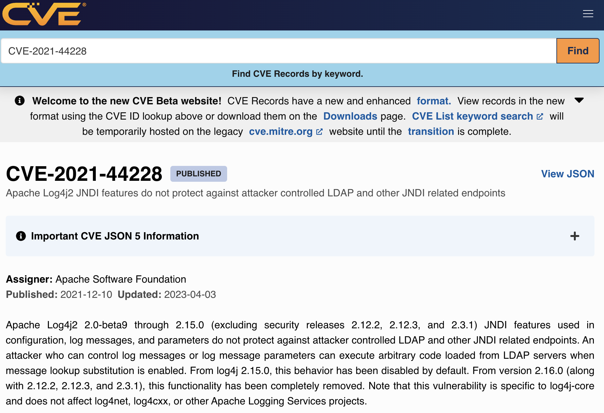
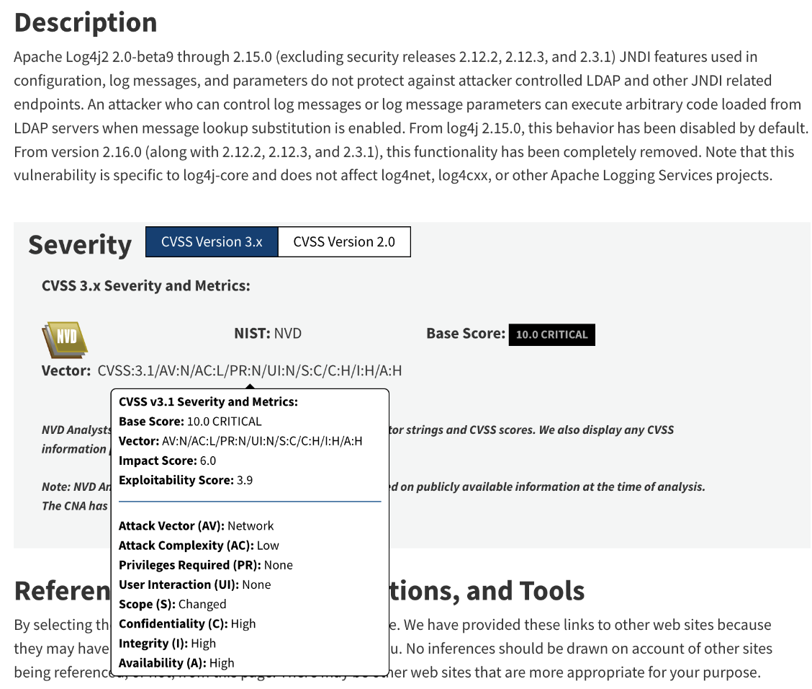
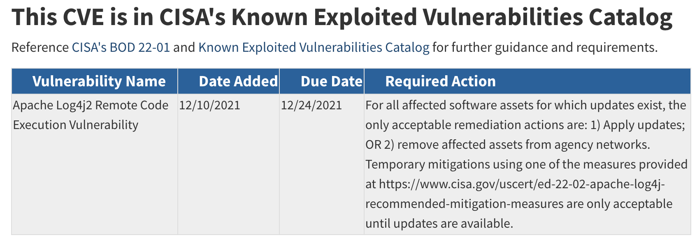
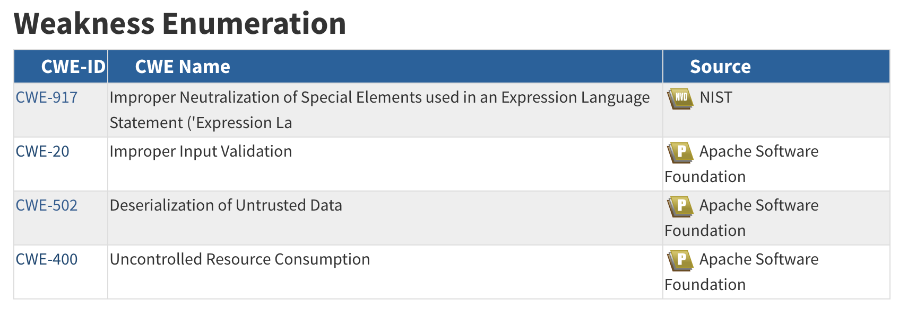
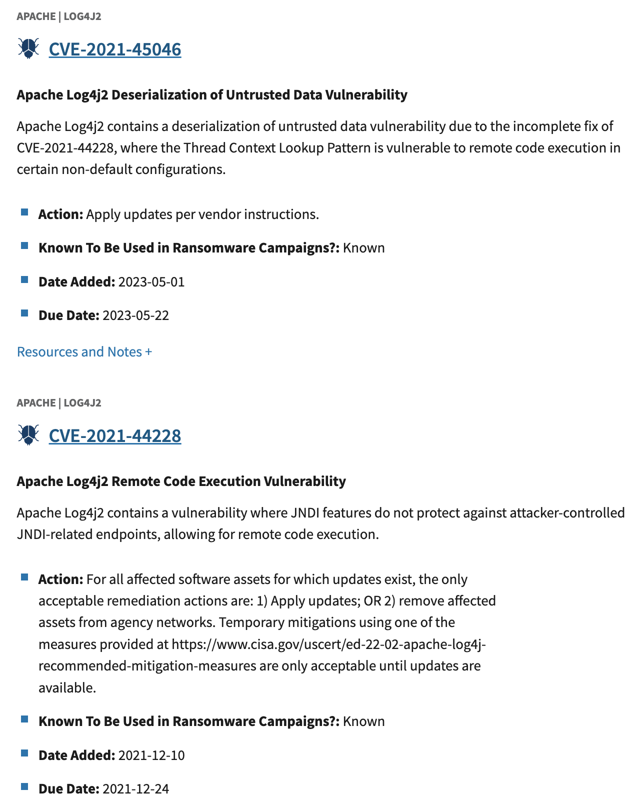
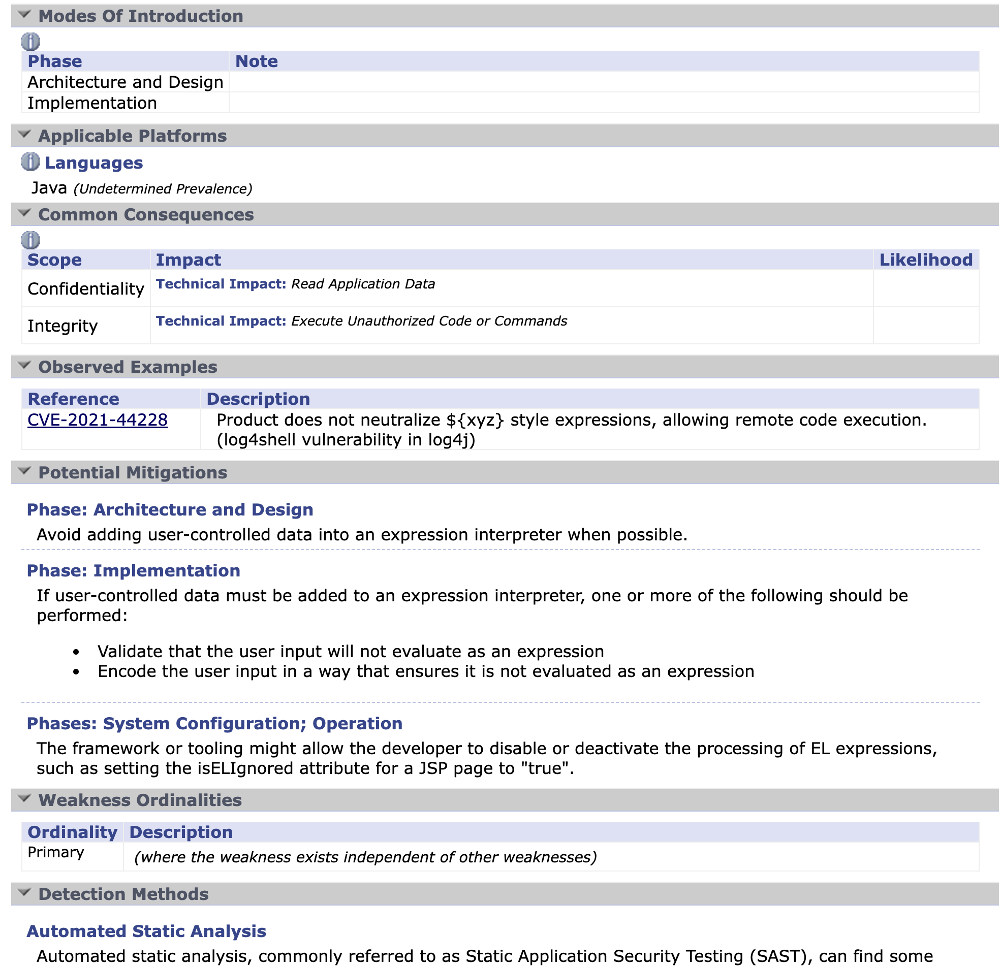

# Applied: Log4Shell Example

!!! abstract "Overview"
    In previous sections, we covered the standards and key risk factors and how they fit together.

    In this section, we walk through these using Log4Shell as the example.

## CVE Record

[https://cve.mitre.org/cgi-bin/cvename.cgi?name=CVE-2021-44228](https://cve.mitre.org/cgi-bin/cvename.cgi?name=CVE-2021-44228)

<figure markdown>
  { width="700" }
  <figcaption>The CVE record links to NVD for more information</figcaption>
</figure>

!!! quote 
    View additional information about [CVE-2021-44228](https://nvd.nist.gov/view/vuln/detail?vulnId=CVE-2021-44228) on NVD.
    (Note: The NVD is not operated by the CVE Program)


## National Vulnerability Database
[https://nvd.nist.gov/vuln/detail/CVE-2021-44228](https://nvd.nist.gov/vuln/detail/CVE-2021-44228) 

### CVSS Base Score

<figure markdown>
  { width="700" }
  <figcaption>The CVSS Base score is 10 and the rating is Critical. The parameters and values that make up the score are shown</figcaption>
</figure>

### CISA KEV Link
<figure markdown>
  { width="700" }
  <figcaption>CVE-2021-44228 contains a link to the CISA KEV catalog entry</figcaption>
</figure>

### CWEs

<figure markdown>
  { width="700" }
  <figcaption>There are 4 CWEs associated with CVE-2021-44228</figcaption>
</figure>

## CISA KEV
[https://www.cisa.gov/known-exploited-vulnerabilities-catalog?search_api_fulltext=**cve-2021-44228**&field_date_added_wrapper=all&sort_by=field_date_added&items_per_page=20](https://www.cisa.gov/known-exploited-vulnerabilities-catalog?search_api_fulltext=cve-2021-44228&field_date_added_wrapper=all&sort_by=field_date_added&items_per_page=20)

<figure markdown>
  { width="700" }
  <figcaption>CVE-2021-44228 shows up twice in a search: the initial vulnerability, and the vulnerability associated with the incomplete fix</figcaption>
</figure>


## MITRE CWE-917
[https://cwe.mitre.org/data/definitions/917.html](https://cwe.mitre.org/data/definitions/917.html)

<figure markdown>
  
  <figcaption>CWE-917 is the first CWE listed in the NVD entry https://nvd.nist.gov/vuln/detail/CVE-2021-44228</figcaption>
</figure>

See [Neutralizing Your Inputs: A Log4Shell Weakness Story](https://medium.com/@CWE_CAPEC/neutralizing-your-inputs-a-log4shell-weakness-story-89954c8b25c9) for an informative article by the CWE Program on assigning CWEs for this CVE.


## EPSS

https://www.first.org/epss/api details the EPSS API.
Some examples are given here.


### Score
[https://api.first.org/data/v1/epss?cve=CVE-2021-44228](https://api.first.org/data/v1/epss?cve=CVE-2021-44228)

````
{"cve":"CVE-2021-44228","epss":"0.975620000","percentile":"0.999980000","date":"2024-02-11"
````
The EPSS score on 2024-02-11 is 0.975620000, which is in the 0.999980000 percentile i.e. 99.998% of the EPSS scores for all published CVEs are less than this score.

### Time Series
The EPSS score has varied slightly over recent days.
````
curl https://api.first.org/data/v1/epss\?cve\=CVE-2021-44228\&scope\=time-series | jq


{
  "status": "OK",
  "status-code": 200,
  "version": "1.0",
  "access": "public",
  "total": 1,
  "offset": 0,
  "limit": 100,
  "data": [
    {
      "cve": "CVE-2021-44228",
      "epss": "0.975620000",
      "percentile": "0.999980000",
      "date": "2024-02-11",
      "time-series": [
        {
          "epss": "0.975620000",
          "percentile": "0.999980000",
          "date": "2024-02-10"
        },
        {
          "epss": "0.975620000",
          "percentile": "0.999980000",
          "date": "2024-02-09"
        },
        {
          "epss": "0.975620000",
          "percentile": "0.999980000",
          "date": "2024-02-08"
        },
        {
          "epss": "0.975620000",
          "percentile": "0.999980000",
          "date": "2024-02-07"
        },
        {
          "epss": "0.974660000",
          "percentile": "0.999570000",
          "date": "2024-02-06"
        },
        {
          "epss": "0.974660000",
          "percentile": "0.999580000",
          "date": "2024-02-05"
        },
````

### Higher Scores CVE

There are 5 CVEs with a higher EPSS score

````
curl https://api.first.org/data/v1/epss\?epss-gt\=0.97562 | jq

{
  "status": "OK",
  "status-code": 200,
  "version": "1.0",
  "access": "public",
  "total": 6,
  "offset": 0,
  "limit": 100,
  "data": [
    {
      "cve": "CVE-2021-44228",
      "epss": "0.975620000",
      "percentile": "0.999980000",
      "date": "2024-02-11"
    },
    {
      "cve": "CVE-2020-5902",
      "epss": "0.975630000",
      "percentile": "0.999980000",
      "date": "2024-02-11"
    },
    {
      "cve": "CVE-2019-2725",
      "epss": "0.975790000",
      "percentile": "1.000000000",
      "date": "2024-02-11"
    },
    {
      "cve": "CVE-2019-1653",
      "epss": "0.975650000",
      "percentile": "0.999990000",
      "date": "2024-02-11"
    },
    {
      "cve": "CVE-2018-7600",
      "epss": "0.975750000",
      "percentile": "1.000000000",
      "date": "2024-02-11"
    },
    {
      "cve": "CVE-2015-7297",
      "epss": "0.975640000",
      "percentile": "0.999990000",
      "date": "2024-02-11"
    }
  ]
}
````

## Weaponized Exploit

Log4Shell CVE-2021-44228 is weaponized. Templates exist in MetaSploit and Nuclei:

- **MetaSploit**: https://www.rapid7.com/db/modules/auxiliary/scanner/http/log4shell_scanner/ 
- **Nuclei**: https://github.com/projectdiscovery/nuclei-templates/blob/master/cves/2021/CVE-2021-44228.yaml


!!! success "Takeaways"
    1. The NVD record [https://nvd.nist.gov/vuln/detail/CVE-2021-44228](https://nvd.nist.gov/vuln/detail/CVE-2021-44228) 
          1. adds enhanced information to the CVE record [https://cve.mitre.org/cgi-bin/cvename.cgi?name=CVE-2021-44228](https://cve.mitre.org/cgi-bin/cvename.cgi?name=CVE-2021-44228).
          2. uses CVSS standard to assign scores to the CVE.
          3. does not list the [Exploit Maturity](#risk/Understanding_Risk/#cvss-exploit-maturity) because it is up to the user/consumer to provide that.
    2. CVE-2021-45046 (the vulnerability associated with the incomplete fix of CVE-2021-44228) was added to CISA KEV 16 months after CVE-2021-44228.
    3. The CWE associated with Log4Shell has more detailed Technical Impact than the CVE
         1. CVE-2021-44228: Impact
             1. Confidentiality: High
             2. Integrity: High
             3. Availability: High
         2. CWE-917: Common Consequences
             1. Confidentiality:  [Technical Impact](https://capec.mitre.org/custom/view.html?id=1000): Read Application Data
             2. Integrity: [Technical Impact](https://capec.mitre.org/custom/view.html?id=1000): Execute Unauthorized Code or Commands
             3. Note that the "Likelihood" field is blank (as it is for most CWEs)
    4. The CISA KEV gives additional context for Action/mitigation, and states that this CVE is used in Ransomware campaigns.


