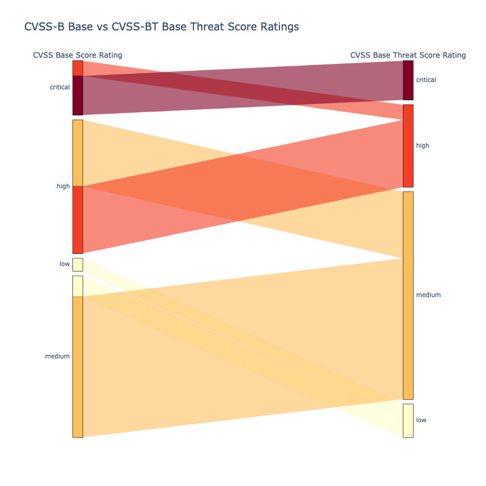
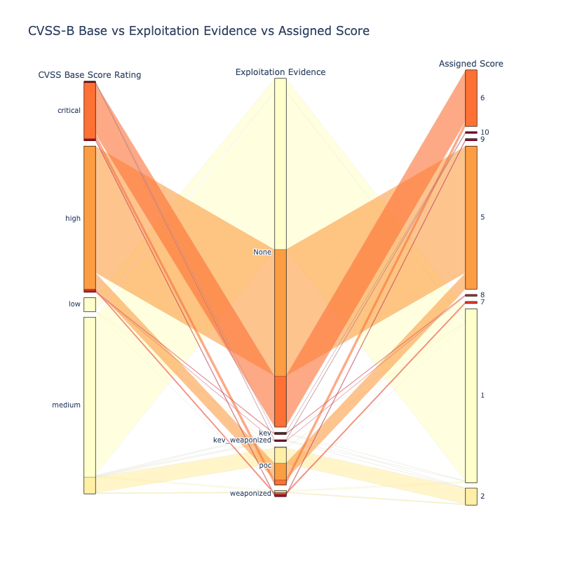
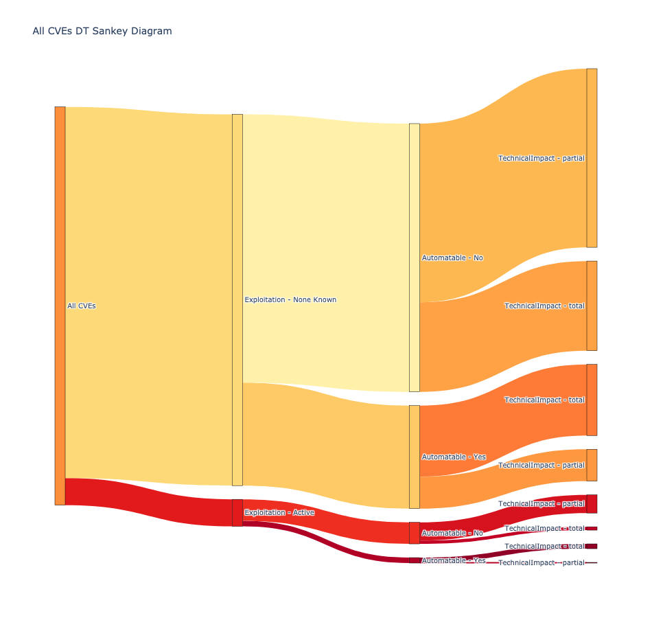

# Risk Based Prioritization Schemes

!!! abstract "Overview"
    
    Throughout this guide, the building blocks for Risk Based Prioritization have been detailed and analyzed.

    Code and analysis is provided for 3 Risk Based Prioritization schemes to allow comparison and refinement: 

    5. CVSS Temporal & Threat Metrics (adding Exploitation info per the CVSS standard)
          1. The data from "[Enriching the NVD CVSS scores to include Temporal & Threat Metrics](https://github.com/t0sche/cvss-bt)" is used here.
    6. CVSS Base Score Ratings with Exploitation Focus (adding Exploitation info but not per the CVSS standard)
          1. The data from "[Enriching the NVD CVSS scores to include Temporal & Threat Metrics](https://github.com/t0sche/cvss-bt)" is used here.
    7. SSVC Decision Trees (using CVSS Base Parameters as input, not CVSS scores or ratings)

    For each scheme:

    8. The population of CVEs used is All published CVEs
    9.  **Public data is used, but it can be easily augmented with commercial CTI.**
    10. **These schemes can be applied to your CVEs**

    !!! warning 

        "The guidance here is highly opinionated and prescriptive and applied to a user context.
        At the beginning of the guide it was stated that [the "writing style" in this guide is "succinct and opinionated"](../introduction/Introduction.md#writing-style).
        
        This section "leads with an opinion", and associated rationale.

    :technologist: [CVSS Base vs CVSS Base & Threat Source Code](https://github.com/RiskBasedPrioritization/RiskBasedPrioritizationAnalysis/blob/main/analysis/cvss-bt.ipynb)

    :technologist: [SSVC Source Code](https://github.com/RiskBasedPrioritization/RiskBasedPrioritizationAnalysis/blob/main/cisa_ssvc_dt/DT_analysis.ipynb) 
  

### CVSS Temporal & Threat Metrics

Exploitation data is added per the CVSS standard as described in [CVSS](../cvss/CVSS.md#cvss-exploit-maturity).

<figure markdown>

<figcaption>The effect of CVSS Base & Threat is to move some CVEs down a Rating e.g. some Critical CVEs move to High</figcaption>
</figure>

### CVSS Base Score Ratings with Exploitation Focus

A simple illustrative scheme that combines Base Score Ratings with Exploitation status is defined here.

* [Qualys TruRisk](../vendors/Qualys.md#in-depth-look-into-data-driven-science-behind-qualys-trurisk) is an example of this type of scheme.

|  Score | CVSS Base Score Rating | Exploitation           | 
|---|---------------------|------------------------|
| 10  | critical            | kev                    |    
|  9 | critical            | weaponized             |
|  8 | high                | kev | 8     |
|  7 | high                | weaponized  |
|  6 | critical            | poc | 6     |
|  5 | high                | poc                 |
|  4 | critical                | -                  | 
|  3 | high              | -                    | 
|  2 | medium               | -                  |
|  1 | -               | -                  | 

where a CVE is assigned to a group if it appears in the Data Source listed:

| Group                               | Data Source               |
|-------------------------------------|---------------------------|
| weaponized                          | metasploit or nuclei      |
| kev (Known Exploited Vulnerability) | cisa_kev or vulncheck_kev |
| poc (Proof Of Concept)              | poc_github or exploitdb   |

<figure markdown>
 
<figcaption>Combination of CVSS Base Score Rating and Exploitation Evidence to Assign a Score (10 is highest risk)</figcaption>
</figure>

### SSVC Decision Trees

The CVSS Base parameters are used instead of CVSS scores or ratings.

Per the [SSVC](../ssvc/decision_trees_from_scratch.md) Decision Tree example, the Exploitability and Impact Risk Factors that make up the CVSS Base Score are split out separately and used instead of the CVSS Base Score.

This gives more granularity than combining CVSS Ratings and Exploitation factors i.e. better Risk Based Prioritization.

<figure markdown>
 
<figcaption>SSVC Decision Tree (Dark Red is highest risk: Exploitation-Active, Automatable-Yes, Technical-Impact Total)</figcaption>
</figure>

!!! observations
    1. The standard CVSS Temporal & Threat Metrics as described in [CVSS](../cvss/CVSS.md#cvss-exploit-maturity) does not significantly (de)prioritize CVEs.
          1. While it uses Exploitation Evidence, it does not **focus on** Exploitation Evidence like the other 2 schemes presented
          2. is based on a standard, but exactly how to use the different types of Exploitation Evidence is not standard or defined
    2. The "CVSS Base Score Ratings with Exploitation Focus" does significantly (de)prioritize CVEs
          1. but it is not standard
    3. [SSVC](../ssvc/SSVC.md) Decision Trees can give more granularity than using CVSS Ratings by using CVSS Base Parameters i.e. better Risk Based Prioritization.
           1. but many tools and users use CVSS Base Scores and Ratings so there's an extra step required to use CVSS Base Parameters

!!! success "Takeaways"
    1. Prioritizing vulnerabilities that are being exploited in the wild, or are more likely to be exploited, reduces the
          1. cost of vulnerability management
          2. risk by reducing the time adversaries have access to vulnerable systems they are trying to exploit
    2. Either [CVSS Base Score Ratings with Exploitation Focus](#cvss-base-score-ratings-with-exploitation-focus) or  [SSVC Decision Trees](#ssvc-decision-trees), that [Focus on Exploitation](../risk/Understanding_Risk.md#where-cvss-epss-cisa-kev-fit), are good starting points or references for a Risk Based Prioritization scheme.
    3. Apply a Risk Based Prioritization scheme based on your environment, and refine it based on your data.

    |  CVSS Temporal & Threat Metrics |CVSS Base Score Ratings with Exploitation Focus | SSVC Decision Trees           | 
    |---|---------------------|------------------------|
    |   |             |                      |  
    | The effect of CVSS Base & Threat is to move some CVEs down a Rating e.g. some Critical CVEs move to High | Better prioritization - less red |Better prioritization - less red |

 

