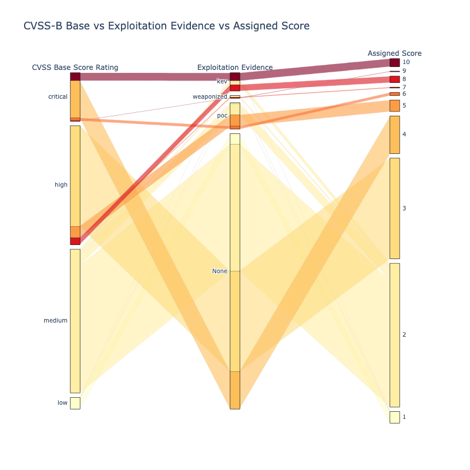

# Risk Based Prioritization Schemes

!!! abstract "Overview"
    
    Throughout this guide, the building blocks for Risk Based Prioritization have been detailed and analyzed.

    Code and analysis is provided for 3 Risk Based Prioritization schemes to allow comparison and refinement: 

    1. CVSS v3 Temporal Metric - Exploit Code Maturity (E) (adding Exploitation info per the CVSS standard)
          1. The data from "[Enriching the NVD CVSS scores to include Temporal & Threat Metrics](https://github.com/t0sche/cvss-bt)" is used here.
    2. CVSS Base Score Ratings with Exploitation Focus (adding Exploitation info but not per the CVSS standard)
          1. The data from "[Enriching the NVD CVSS scores to include Temporal & Threat Metrics](https://github.com/t0sche/cvss-bt)" is used here.
    3. SSVC Decision Trees (using CVSS Base Parameters as input, not CVSS scores or ratings)

    For each scheme:

    4. The population of CVEs used is All published CVEs
    5.  **Public data is used, but it can be easily augmented with commercial CTI.**
    6.  **These schemes can be applied to your CVEs**

    !!! warning 

        "The guidance here is highly opinionated and prescriptive and applied to a user context.
        At the beginning of the guide it was stated that [the "writing style" in this guide is "succinct and opinionated"](../introduction/Introduction.md#writing-style).
        
        This section "leads with an opinion", and associated rationale.

    :material-play-box-edit-outline: [Colab NoteBook CVSS Base vs CVSS Base & Temporal Metric - Exploit Code Maturity/Exploitability (E)](https://colab.research.google.com/drive/1ysQZK0M-DsB9Jkw4dUB39mgBmaZOJTnI?usp=sharing) 
    
    - See more info on [Running the Code](../introduction/code_and_data.md#running-the-code)

    :technologist: [CVSS Base vs CVSS v3 Base & Temporal Metric - Exploit Code Maturity/Exploitability (E) Source Code](https://github.com/RiskBasedPrioritization/RiskBasedPrioritizationAnalysis/blob/main/analysis/cvss-bt.ipynb)

    :technologist: [SSVC Source Code](https://github.com/RiskBasedPrioritization/RiskBasedPrioritizationAnalysis/blob/main/cisa_ssvc_dt/DT_from_scratch.ipynb) 
  

## Requirements for a Risk Based Prioritization Scheme for First Pass Triage

Here the requirements for a Risk Based Prioritization Scheme are listed as provided by users.

- Any solution should be informed by what the user wants, and the rationale behind the solution implementation. This allows understanding and validation of the solution against the requirements and rationale. 
- The broader set of users' requirements is expressed as [User Scenarios and User Stories](../requirements/Requirements.md).
    
**Requirements**

1. **Effective Prioritization**
      1. [Focus on Exploitation](../risk/Understanding_Risk.md#where-cvss-epss-cisa-kev-fit), and include the other Risk Factors
      2. The output (score/rating) should be wedge shaped with the sharp end representing the high risk end i.e. there should be a relatively small number of CVEs at the top end of risk.
2. **Understandable**
      1. The rationale, and preferably the requirements or problem statement, should be stated so it's clear what problem the solution is trying to solve, and the rationale for how it solves it.
      2. Given the output (score/rating), it should be possible to easily and uniquely identify the input parameters(s), and the contribution of the input parameters(s) values to the output.
      3. A non-technical person should be able to understand it
3. **Independent**
      1. Preferably uses Public information
      2. Not dependent on a specific Tool or Vendor or the data from it 
         1. Many CTI vendors provide aggregated curated CTI
4. **Extensible**
      1. Organizations may want to extend, customize, or optimize a Risk Based Prioritization Scheme for their environment e.g. change the prioritization associated with a data source or add a new data source.
      2. Some schemes do this by design e.g. *"[SSVC](https://github.com/CERTCC/SSVC) aims to avoid one-size-fits-all solutions in favor of a modular decision-making system with clearly defined and tested parts that vulnerability managers can select and use as appropriate to their context."*
5. **Industry Standard**
      1. As users using several solutions, we'd like the risk based prioritization scheme to be standard and interoperable and an industry standard so we have consistent ratings across solutions.

### CVSS and Temporal Metric - Exploit Code Maturity (E)

Exploitation data is added per the CVSS v3 standard as described in [CVSS](../cvss/CVSS.md#cvss-exploit-maturity).

See "[Enriching the NVD CVSS scores to include Temporal & Threat Metrics](https://github.com/t0sche/cvss-bt)" for how the data sources for Exploitation Evidence and Likelihood of Exploitation are used as input to the CVSS Temporal Metric - Exploit Code Maturity (E) field.

<figure markdown>

<figcaption>The effect of CVSS v3 Temporal Metric - Exploit Code Maturity (E) is to move some CVEs down a Rating e.g. some Critical CVEs move to High</figcaption>
</figure>

### CVSS Base Score Ratings with Exploitation Focus

A simple illustrative scheme that combines Base Score Ratings with Exploitation status is defined here.

* [Qualys TruRisk](../vendors/Qualys.md#in-depth-look-into-data-driven-science-behind-qualys-trurisk) is an example of this type of scheme.

|  Score | CVSS Base Score Rating | Exploitation           | 
|---|---------------------|------------------------|
| 10  | critical            | kev                    |    
|  9 | critical            | weaponized             |
|  8 | high                | kev | 8     |
|  7 | high                | weaponized  |
|  6 | critical            | poc | 6     |
|  5 | high                | poc                 |
|  4 | critical                | -                  | 
|  3 | high              | -                    | 
|  2 | medium               | -                  |
|  1 | -               | -                  | 

where a CVE is assigned to a group if it appears in the Data Source listed:

| Group                               | Data Source               |
|-------------------------------------|---------------------------|
| weaponized                          | metasploit or nuclei      |
| kev (Known Exploited Vulnerability) | cisa_kev or vulncheck_kev |
| poc (Proof Of Concept)              | poc_github or exploitdb   |

<figure markdown>
 
<figcaption>Combination of CVSS Base Score Rating and Exploitation Evidence to Assign a Score (10 is highest risk)</figcaption>
</figure>

### SSVC Decision Trees

The CVSS Base parameters are used instead of CVSS scores or ratings.

Per the [SSVC](../ssvc/decision_trees_from_scratch.md) Decision Tree example, the Exploitability and Impact Risk Factors that make up the CVSS Base Score are split out separately and used instead of the CVSS Base Score.

This gives more granularity than combining CVSS Ratings and Exploitation factors i.e. better Risk Based Prioritization.

Assigned Score is the main output - based on Exploitation, Automatable, TechnicalImpact Decision Node outputs.
- SSVC groups Decision Tree ouputs into Priorities - but for granular Risk Based Prioritization, the main output is most relevant.

<figure markdown>
 
<figcaption>SSVC Decision Tree (Dark Red is highest risk: Exploitation-Active, Automatable-Yes, Technical-Impact Total)</figcaption>
</figure>

## Risk Based Prioritization Summary against Requirements

| Requirement              | CVSS v3 Temporal Metric - Exploit Code Maturity (E)   | CVSS Base Score Ratings with Exploitation Focus | SSVC Decision Tree |
|--------------------------|--------|--------|--------------------|
| Effective Prioritization | :x:    | ✅ | ✅            |
| Understandable           | :x:    | ✅ | ✅            |
| Independent              | ✅ | ✅ | ✅             |
| Extensible               | :x: | ✅ | ✅             |
| Industry Standard        | ✅ | :x: | :x:              |

!!! observations
    1. The standard CVSS v3 Temporal Metric - Exploit Code Maturity (E) as described in [CVSS](../cvss/CVSS.md#cvss-exploit-maturity) does not significantly (de)prioritize CVEs.
          1. While it uses Exploitation Evidence, it does not **focus on** Exploitation Evidence like the other 2 schemes presented
          2. is based on a standard, but exactly how to use the different types of Exploitation Evidence is not standard or defined
    2. The "CVSS Base Score Ratings with Exploitation Focus" does significantly (de)prioritize CVEs
          1. but it is not standard
    3. [SSVC](../ssvc/SSVC.md) Decision Trees can give more granularity than using CVSS Ratings by using CVSS Base Parameters i.e. better Risk Based Prioritization.
           1. but many tools and users use CVSS Base Scores and Ratings so there's an extra step required to use CVSS Base Parameters

!!! success "Takeaways"
    1. Prioritizing vulnerabilities that are being exploited in the wild, or are more likely to be exploited, reduces the
          1. cost of vulnerability management
          2. risk by reducing the time adversaries have access to vulnerable systems they are trying to exploit
    2. There isn't a perfect off-the-shelf solution.
    2. The code, data and analysis for 3 Risk Based Prioritization schemes is provided.
          1. For those using CVSS Scores and Ratings, using CVSS v3 Temporal Metric - Exploit Code Maturity (E) that **supports Exploitation** evidence is a small step with a realitvely small (de)prioritizion of CVEs.
          2. Either [CVSS Base Score Ratings with Exploitation Focus](#cvss-base-score-ratings-with-exploitation-focus) or  [SSVC Decision Trees](#ssvc-decision-trees), that [**Focus on Exploitation**](../risk/Understanding_Risk.md#where-cvss-epss-cisa-kev-fit), are bigger steps, with a bigger  (de)prioritizion of CVEs.
    3. Apply a Risk Based Prioritization scheme based on your environment, and refine it based on your data - directly or via your solution provider.

    |  CVSS v3 Temporal Metric - Exploit Code Maturity (E) |CVSS Base Score Ratings with Exploitation Focus | SSVC Decision Trees           | 
    |---|---------------------|------------------------|
    |   |             |                      |  
    | The effect of CVSS v3 Temporal Metric - Exploit Code Maturity (E) is to move some CVEs down a Rating e.g. some Critical CVEs move to High | Better prioritization - less red |Better prioritization - less red |

 

