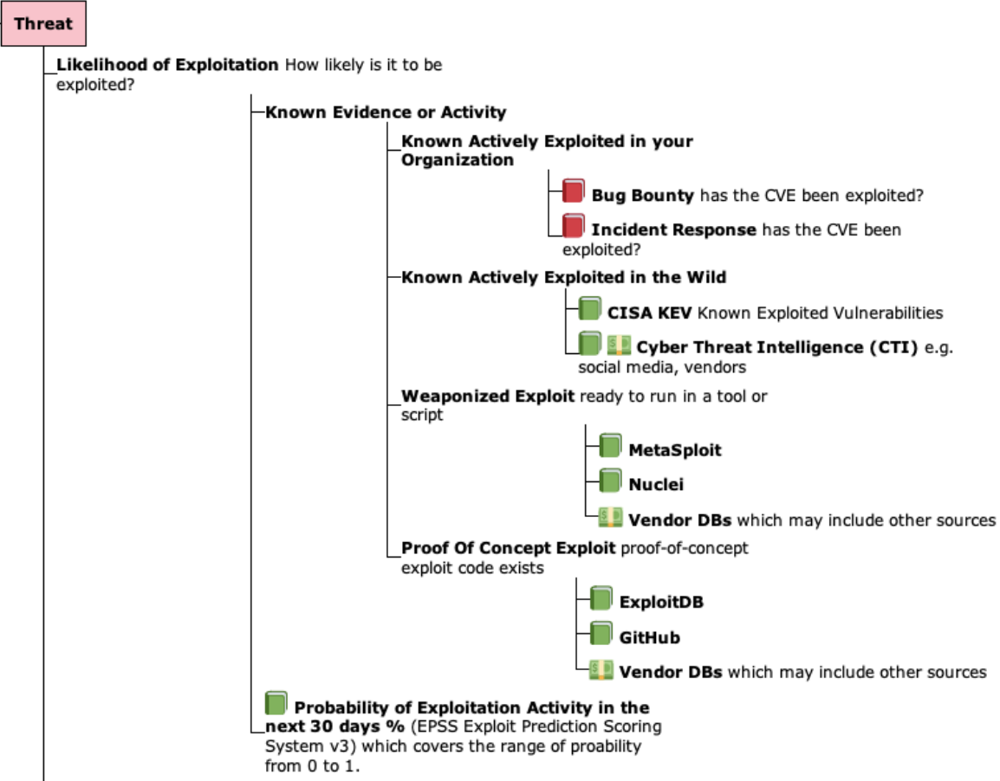
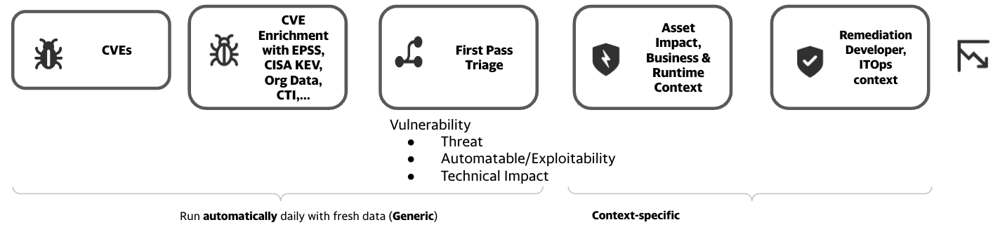

# Takeaway

<figure markdown>
{ width="500" }
<figcaption></figcaption>
</figure>

!!! abstract "Overview"
    
    Throughout this guide, the building blocks for Risk Based Prioritization have been detailed and analyzed.
    
    In this final section, we summarize the Takeaways and provide specific recommendations for Risk Based Prioritization.

    At this point, you should be able to

    1. Understand Risk 
          1. the main standards and how they fit together
          2. the key risk factors, especially known exploitation and likelihood of exploitation
    2. Apply this understanding, and code, data provided to Prioritize CVEs by Risk for your organization, resulting in
          1. a significant reduction in your security effort
          2. a significant improvement in your security posture by remediating the higher risk vulnerabilities first

    
!!! success "Takeaways"

    ### Use a Risk Based Prioritization Scheme that supports Exploitation Evidence and Likelihood Of Exploitation (EPSS)
    
    { width="400" }

    1. For those using CVSS Scores and Ratings, using CVSS v3 Temporal Metric - Exploit Code Maturity (E) that **supports Exploitation** evidence is a small step with a relatively small (de)prioritization of CVEs.
    2. Either [CVSS Base Score Ratings with Exploitation Focus](#cvss-base-score-ratings-with-exploitation-focus) or  [SSVC Decision Trees](#ssvc-decision-trees), that [**Focus on Exploitation**](../risk/Understanding_Risk.md#where-cvss-epss-cisa-kev-fit), are bigger steps, with a bigger (de)prioritization of CVEs.

    This can run automatically as a First Pass Triage, before additional business and runtime context is added.

    <figure markdown>
    
    </figure>

    ### Refine the Risk Based Prioritization scheme based on your environment and your data.
    3. Use CVEs detected in your Incident Response, Bug Bounty, PenTesting findings) to inform your Risk.
    4. Start by picking an EPSS Threshold around 10%, and adjust based on your CVE data and your capacity to remediate the CVEs above that Threshold (in conjunction with CVSS Severity or other Risk factors) per [Remediation Policy for an Enterprise](../epss/EPSS_Thresholds.md#remediation-policy-for-an-enterprise

    ### Be Careful with Proprietary Risk Based Prioritization Schemes
    If you **implement** a proprietary Risk Based Prioritization scheme, keep the following in mind:

    !!! quote

        Any person can invent a security system so clever that she or he can't think of how to break it.

        [Schneier's Law](https://en.wikipedia.org/wiki/Bruce_Schneier#:~:text=The%20law%20is%20phrased%20as,of%20how%20to%20break%20it.)

    If you **use** a proprietary third-party Risk Based Prioritization scheme, keep the [requirements](./Rbp_schemes.md#requirements-for-a-risk-based-prioritization-scheme-for-first-pass-triage) above, and the following, in mind:

    !!! warning

        Beware of claims of "secret sauce", "special Intellectual Property", "unique proprietary intel" as reasons to prevent you understanding the Risk Based Prioritization scheme.

    ### A Commercial CTI solution is Recommended
    While gathering vulnerability exploitation evidence can be done using public data (as shown in the code for this guide which used **some** data sources), there's a lot of effort in getting current, comprehensive CTI.

 

