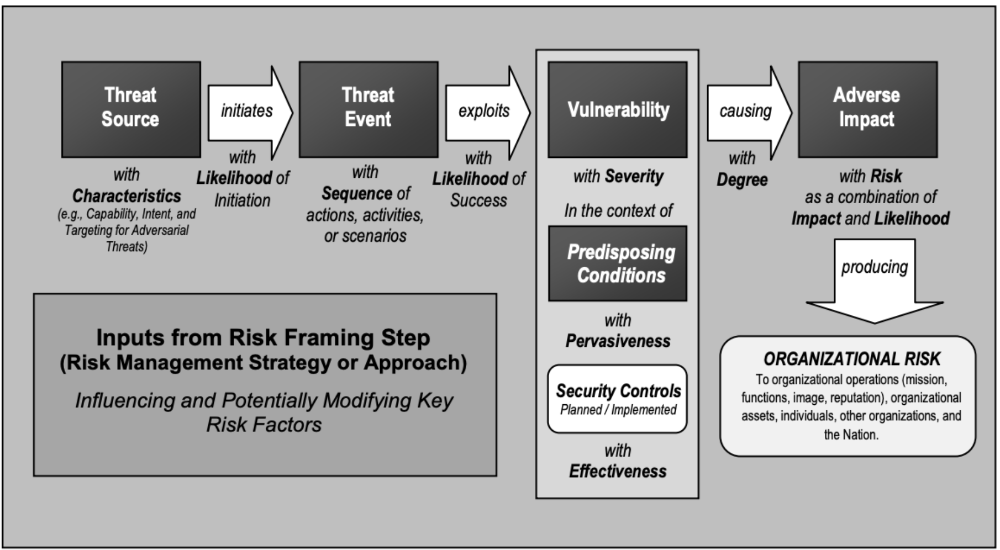
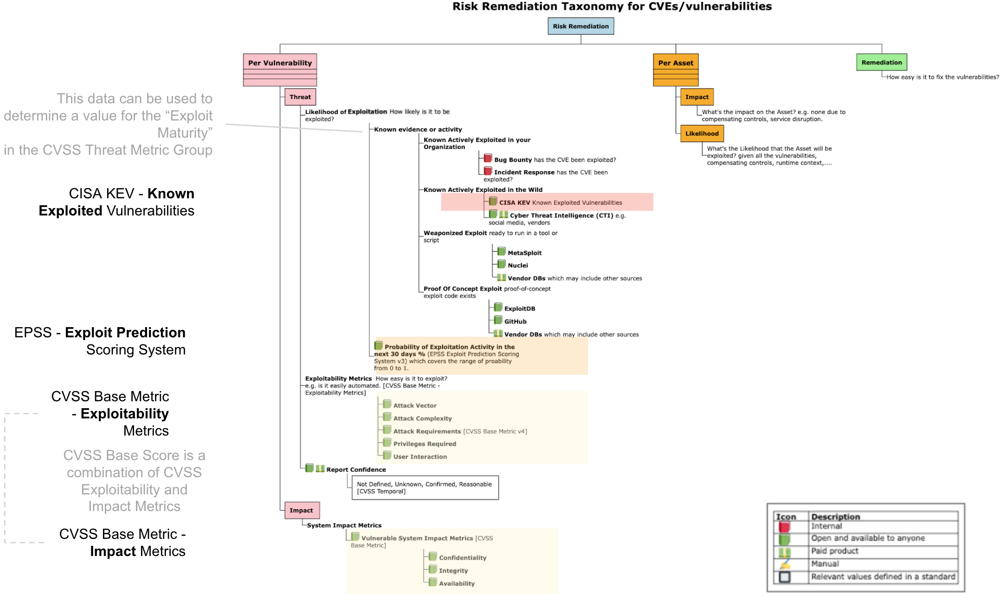

# Understanding Risk

!!! abstract "Overview"
    To understand how to Prioritize CVEs by Risk, we need to understand Risk, and how we can use the building blocks (standards, key risk factors) to inform risk.

    This section gives a

    1.  Definition of Risk and the key risk factors
    2.  Risk Taxonomy or orientation map, showing where CVSS, CISA KEV, EPSS fit
    3.  The different data sources that can be used to inform the key risk factors

    :technologist: [Source Code](https://github.com/RiskBasedPrioritization/RiskBasedPrioritizationAnalysis/blob/main/analysis/cisa_kev_epss_cvss.ipynb) 

  
## Risk Definition
!!! info "Risk Definition from [NIST Special Publication 800-30 r1 Guide for Conducting Risk Assessments](https://www.nist.gov/privacy-framework/nist-sp-800-30)"

    Risk is per Asset and depends on Impact of a Vulnerability being exploited by a Threat

    -   <u><a href="https://csrc.nist.gov/glossary/term/risk"
        rel="nofollow">RISK</a></u>  A measure of the extent to which an
        entity is threatened by a potential circumstance or event, and
        typically is a function of: 
        -  the adverse impact, or magnitude of harm, that would arise
            if the circumstance or event occurs; and 
        -   the likelihood of occurrence.
    -   <u><a href="https://csrc.nist.gov/glossary/term/threat"
        rel="nofollow">Threat</a></u> the potential for a threat-source to
        successfully exploit a particular information system vulnerability.
    -   <u><a href="https://csrc.nist.gov/glossary/term/vulnerability"
        rel="nofollow">Vulnerability</a></u>  Weakness in an information
        system, system security procedures, internal controls, or
        implementation that could be exploited by a threat source
    -   <u><a href="https://csrc.nist.gov/glossary/term/impact"
        rel="nofollow">Impact</a></u> The magnitude of harm that can be
        expected to result from the consequences of unauthorized disclosure
        of information, unauthorized modification of information,
        unauthorized destruction of information, or loss of information or
        information system availability.
    -   <u><a href="https://csrc.nist.gov/glossary/term/asset"
        rel="nofollow">Asset</a></u> The data, personnel, devices, systems,
        and facilities that enable the organization to achieve business
        purposes.

    <figure markdown>
    
    <figcaption>NIST Generic Risk Model with Key Risk Factors</figcaption>
    </figure>

## Risk Remediation Taxonomy

"Risk Remediation Taxonomy [based on a BSides Conference presentation](https://github.com/theparanoids/PrioritizedRiskRemediation)"

Risk is per Asset and depends on the Impact of a Vulnerability being
exploited by a Threat

1.  The Vulnerability branch indicates there can be multiple
    vulnerabilities for a given Asset
    1.  Each vulnerability can be considered separately with its
        associated Threat and Impact
        1.  The <u><a href="https://csrc.nist.gov/glossary/term/threat"
            rel="nofollow">Threat</a></u> ("the potential for a
            threat-source to successfully exploit a particular
            information system vulnerability") depends on
            1.  Evidence of Exploit activity, or Probability of Exploit
                activity
                1.  e.g. a vulnerability is known actively exploited in
                    the wild
                2.  e.g. a vulnerability has no known exploitation or
                    known proof of concept or any known implementation
            2.  The Exploitability of the Vulnerability
                1.  e.g. a vulnerability that can be exploited remotely
                    automatically via a generic tool/script with no
                    permissions or user interaction required has high
                    Exploitability.
                2.  e.g. a vulnerability that requires local access,
                    special permissions, bypass of a security feature,
                    and user interaction, has low Exploitability.
2.  The Asset branch is for one Asset
    1.  An Asset can be impacted by multiple Vulnerabilities and Threats
        (the Vulnerability and Threat red boxes include multiple
        sections to convey there are multiple)
    2.  Likelihood of Exploit can also be viewed from an Asset point of
        view also (i.e. for all Threats and Vulnerabilities that affect
        that asset)
3.  Remediation
    1.  Remediation is part of the overall Risk Remediation picture -
        but will not be covered here.

### Where CVSS, EPSS, CISA KEV Fit

Adding more detail to the Vulnerability branch, to show where CVSS,
EPSS, CISA KEV fit...

<figure markdown>

<figcaption> Where CVSS, EPSS, CISA KEV Fit with Risk</figcaption>
</figure>

### Threat Likelihood of Exploit Data Sources

The Threat "Likelihood of Exploit" branch items are arranged by most
likely on top  

1.  **Known Actively Exploited in your organization**
    1.  If a Vulnerability was previously exploited in your
        organization, then it's reasonable to think that Vulnerability
        is most likely to be exploited again in your organization in the
        future.
2.  **Known Actively Exploited in the wild**
    1.  CISA KEV lists **a subset** of known actively
        exploited Vulnerabilities in the wild.
    2.  **There isn't an authoritative common public list of ALL Vulnerabilities that are Known Actively Exploited in the wild.**
3.  **Weaponized Exploit**
    1.  A Vulnerability with a "Weaponized Exploit" (but not yet Known
        Exploited) is more likely to be exploited than a Vulnerability
        with "Proof Of Concept Exploit" available
        1.  "*vulnerabilities with published exploit code are as much as
            7 times as likely to be exploited in the wild*"
        2.  "If it’s ‘weaponized’ (think metasploit), the odds of a
            vulnerability being exploited in the wild really balloon
            from about 3.7% to 37.1%." [Per Jay Jacobs, Cyentia](https://www.cyentia.com/github-a-source-for-exploits/) 
4.  **Proof Of Concept Exploit**
    1.  ExploitDB is an example of where Vulnerability Proof Of Concept
        Exploits are available.
5. **EPSS Probability of Exploitation**
    1.   The EPSS score covers the range of Likelihood of Exploit from 0 to 100%.

{!includes/vulns_exploited.md!}

## CVSS

!!!info "CVSS Base Score should not be used alone to assess risk!"

    #### CVSS Base Score
    !!! quote 
        CVSS Base (CVSS-B) scores are designed to measure the severity of a vulnerability and should not be used alone to assess risk.
        https://www.first.org/cvss/v4.0/user-guide#CVSS-Base-Score-CVSS-B-Measures-Severity-not-Risk

    

    **The CVSS Base score is not a good indicator of likelihood of
    exploit** (it is not designed or intended to be)

    -   *"There’s no inherent correlation between the vulnerability and if
        threat actors are exploiting them in terms of those severity
        ratings"* <a
        href="https://www.cybersecuritydive.com/news/gartner-vulnerability-management-cisa-cve-patching/610253/"
        rel="nofollow">Gartner, Nov 2021</a>
    -   "CVSS score performs no better than randomly picking
        vulnerabilities to remediate and may lead to negligible risk reductions"
        <a href="https://lallodi.github.io/publications/allodi-tissec-14.pdf"
        rel="nofollow">Comparing Vulnerability Severity and Exploits Using
        Case-Control Studies</a>, 2014

    !!!quote 

        The [Base metric group](https://www.first.org/cvss/v4.0/specification-document#Metrics) represents the intrinsic characteristics of a vulnerability that are constant over time and across user environments. It is composed of two sets of metrics: the Exploitability metrics and the Impact metrics.

        - The Exploitability metrics reflect the ease and technical means by which the vulnerability can be exploited. That is, they represent characteristics of the “thing that is vulnerable”, which we refer to formally as the “vulnerable system”. 
        - The Impact metrics reflect the direct consequence of a successful exploit, and represent the consequence to the “things that suffer the impact”, which may include impact on the vulnerable system and/or the downstream impact on what is formally called the “subsequent system(s)”.

!!!info "The [CVSS Threat Metric Group](https://www.first.org/cvss/v4.0/specification-document#Metrics) contains an [Exploit Maturity](https://www.first.org/cvss/v4.0/specification-document#Exploit-Maturity-E) but it is the responsibility of the CVSS Consumer/user to populate the values"
    #### CVSS Exploit Maturity
    
    See section [CVSS Exploit Maturity](../cvss/CVSS.md#cvss-exploit-maturity) for more details.

    !!! quote
        **This metric measures the likelihood of the vulnerability being
        attacked, and is based on the current state of exploit techniques,
        exploit code availability, or active, “in-the-wild” exploitation.
        Public availability of easy-to-use exploit code or exploitation
        instructions increases the number of potential attackers by including
        those who are unskilled.** Initially, real-world exploitation may only
        be theoretical. Publication of proof-of-concept exploit code,
        functional exploit code, or sufficient technical details necessary to
        exploit the vulnerability may follow. Furthermore, the available
        exploit code or instructions may progress from a proof-of-concept
        demonstration to exploit code that is successful in exploiting the
        vulnerability consistently. In severe cases, it may be delivered as
        the payload of a network-based worm or virus or other automated attack
        tools.

    The Threat Likelihood of Exploit Data Sources can be used here.

!!!info "If there is an absence of exploitation evidence, then EPSS can be used to estimate the probability it will be exploited"
    #### EPSS and Exploitation Evidence
    "**If there is evidence that a vulnerability is being exploited,
        then that information should supersede anything EPSS has to say,
        because again, EPSS is pre-threat intel. If there is an absence of
        exploitation evidence, then EPSS can be used to estimate the
        probability it will be exploited.**" https://www.first.org/epss/faq

    The "Known Evidence or Activity branch" lists data sources where we can get that evidence of exploitation.

## Zero Days

!!! quote
    EPSS scores won’t be available for Zero Days (because EPSS depends on the CVE being published and it can take several days for the associated CVE to be published).
    
    "[The State of Exploit Development: 80% of Exploits Publish Faster than CVEs](https://unit42.paloaltonetworks.com/state-of-exploit-development/)".

!!! quote
    A zero-day vulnerability is a flaw in software or hardware that is unknown to a vendor prior to its public disclosure, or has been publicly disclosed prior to a patch being made available. As soon as a zero day is disclosed and a patch is made available it, of course, joins the pantheon of known vulnerabilities.  
    Don’t go chasing zero days, patch your known vulnerabilities instead….

    Vulnerabilities increase risk, whether or not they start as zero days. We advise organizations to operate with a defensive posture by applying available patches for known, exploited vulnerabilities sooner rather than later.

    [Tenable 2022 Threat Landscape Report](https://static.tenable.com/marketing/research-reports/Research-Report-2022_Threat_Landscape_Report.pdf)

!!! quote
    **Zero day vulnerabilities made up only approximately 0.4% of vulnerabilities during the past decade.** 
    The amount spent on trying to detect them is out of kilter with the actual risks they pose. This is compared with the massive numbers of breaches and infections that come from a small number of known vulnerabilities that are being repeatedly exploited.
    As a top priority, focus your efforts on patching the vulnerabilities that are being exploited in the wild or have competent compensating control(s) that can. This is an effective approach to risk mitigation and prevention, yet very few organizations do this. 

    [Focus on the Biggest Security Threats, Not the Most Publicized, Gartner, Nov 2017](https://www.gartner.com/smarterwithgartner/focus-on-the-biggest-security-threats-not-the-most-publicized)

!!! success "Takeaways"
    1. CVSS or EPSS should not be used alone to assess risk - they can be used together:
          1. CVSS Base Score is a combination of Exploitability and Impact
          2. Various data sources can be used as evidence of exploitation activity or likelihood of exploitation activity - but there isn't 
             1. a single authoritative source
             2. an industry standard on how to do this
    2. EPSS should be used with other exploitation evidence; if there is an absence of exploitation evidence, then EPSS can be used to estimate the probability it will be exploited.
    3. EPSS scores won't be available for Zero-Days
    4. "Don’t go chasing zero days, patch your known vulnerabilities instead"
    5. It is the responsibility of the CVSS Consumer/user to populate the CVSS Exploit Maturity values i.e. unlike the CVSS Base Score, these are not provided.
    6. Criteria for "Exploitation" are different for EPSS and CISA KEV.

