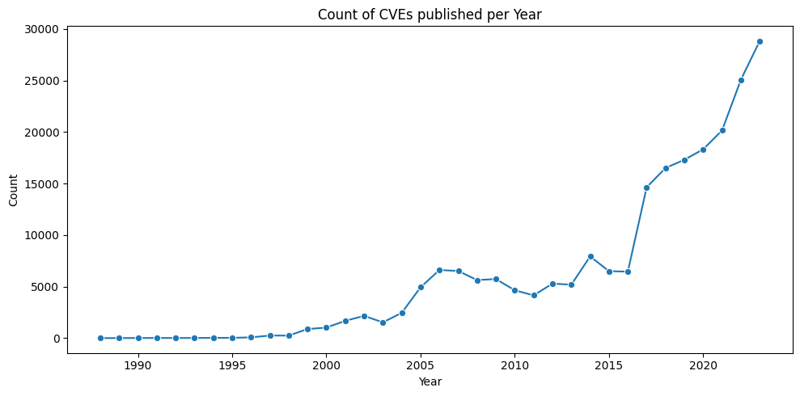
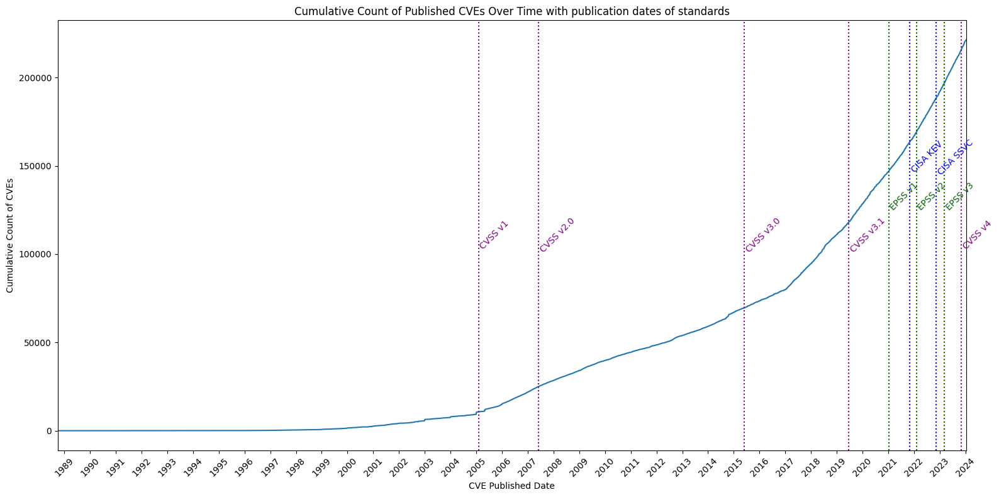
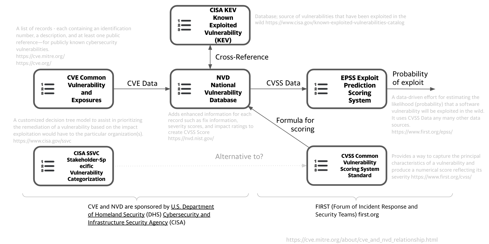
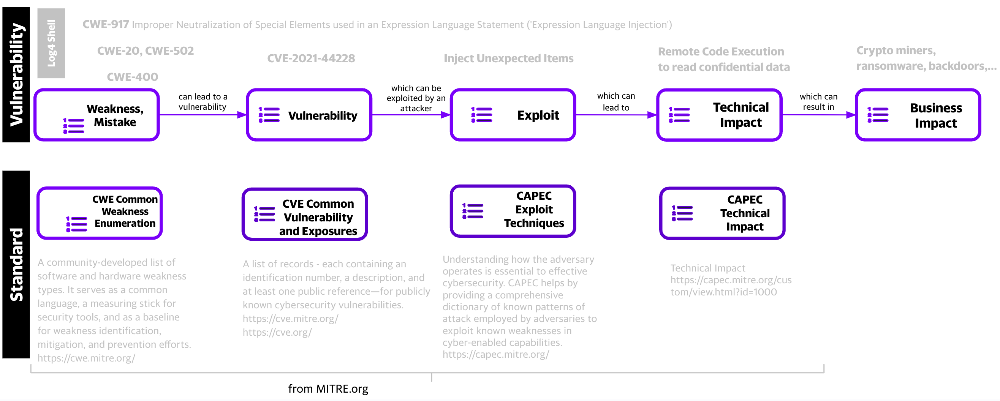

# Vulnerability Landscape 

!!! abstract "Overview"

    A plot of CVE counts per year helps us understand why we need to be able to effectively prioritize CVEs (by Risk).

    To do that we need to understand the building blocks we have to work with.

    This section gives

    1. an overview of how the main relevant vulnerability standards fit together
        1. for recording and ranking vulnerabilities and their exploitation status or likelihood
        1. the characteristics of vulnerabilities
    1. a timeline
        1. with the count, and cumulative count, of CVEs over time (based on the Published date of each CVE)
        1. when different standards were released

    :technologist: [Source Code](https://github.com/epss-sig/epss-interoperability/blob/main/analysis/cisa_kev_epss_cvss.ipynb) 

## Timeline

<figure markdown>
  
  <figcaption>Count of CVEs published per year</figcaption>
</figure>

<figure markdown>
  
  <figcaption>CVEs published per year (cumulative), with publication dates of standards</figcaption>
</figure>

## Vulnerability Standards 
 
<figure markdown>
  
  <figcaption>Vulnerability Landscape Main Efforts</figcaption>
</figure>

## Key Risk Factor Standards

!!! Quote
    [“CWE](https://cwe.mitre.org/) is the root mistake, which can lead to a vulnerability (tracked by [CVE](https://cve.mitre.org/) in some cases when known), which can be exploited by an attacker (using techniques covered by [CAPEC](https://capec.mitre.org/))”, which can lead to a **[Technical Impact](https://capec.mitre.org/custom/view.html?id=1000)** (or consequence), which can result in a **Business Impact**

    * “CWE focuses on a type of mistake that, in conditions where exploits will succeed, could contribute to the introduction of vulnerabilities within that product.”
    
    * “A vulnerability is an occurrence of one or more weaknesses within a product, in which the weakness can be used by a party to cause the product to modify or access unintended data, interrupt proper execution, or perform actions that were not specifically granted to the party who uses the weakness.”
    https://cwe.mitre.org/documents/cwe_usage/guidance.html

<figure markdown>
  
  <figcaption>From weakness to Impact</figcaption>
</figure>

!!! Note

    1. A CVE may have zero or more CWEs associated with it e.g. Log4Shell CVE-2021-44228 has 4 CWEs
    2. A CWE may have zero or more Common Consequences/Technical Impacts associated with it e.g. Log4Shell CVE-2021-44228 has 2
    3. A CWE may be associated with zero or more CVEs.

    To understand MITRE [CAPEC](https://capec.mitre.org/) vs MITRE [ATT&CK](https://attack.mitre.org/), see https://capec.mitre.org/about/attack_comparison.html.
    
!!! Quote
    “NVD is using CWE as a classification mechanism that differentiates CVEs by the type of vulnerability they represent.”

    “The NVD makes use of a subset of the entire CWE List, which is enumerated by the CWE-1003 (Weaknesses for Simplified Mapping of Published Vulnerabilities) view. NVD analysts will associate the most specific CWE value within the CWE-1003 view based on the publicly available information at the time of analysis.”
    https://nvd.nist.gov/vuln/cvmap/How-We-Assess-Acceptance-Levels, https://nvd.nist.gov/vuln/categories

!!! success "Takeaways"
    1. The count of published CVEs per year is increasing at a very significant rate.
       1. Organizations need an effective prioritization method to know what to remediate first.
    2. CISA KEV is a source of vulnerabilities that **have been exploited in the wild**. EPSS gives the **probability a vulnerability will be exploited in the wild** (in the next 30 days).
    3. CISA SSVC is an alternative to CVSS.
    4.  [“CWE](https://cwe.mitre.org/) is the root mistake, which can lead to a vulnerability (tracked by [CVE](https://cve.mitre.org/) in some cases when known), which can be exploited by an attacker (using techniques covered by [CAPEC](https://capec.mitre.org/))”, which can lead to a **[Technical Impact](https://capec.mitre.org/custom/view.html?id=1000)** (or consequence), which can result in a **Business Impact**
    5. NVD uses CWE-1003 (Weaknesses for Simplified Mapping of Published Vulnerabilities)
    6. A CVE may have zero or more CWEs associated with it e.g. Log4Shell has 4 CWEs
    7. A CWE may have zero or more Common Consequences/Technical Impacts associated with it e.g. Log4Shell has 2
    8. A CWE may be associated with zero or more CVEs e.g. CWE-917 is associated with [CVE-2023-22665](https://nvd.nist.gov/vuln/detail/CVE-2023-22665), [CVE-2023-41331](https://nvd.nist.gov/vuln/detail/CVE-2023-27821), [CVE-2023-41331](https://nvd.nist.gov/vuln/detail/CVE-2023-41331), and many more (~150) other CVEs.

