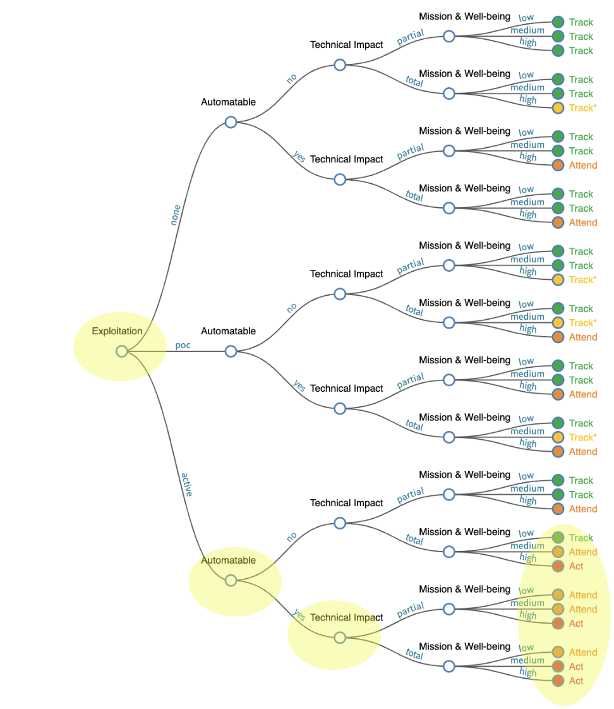
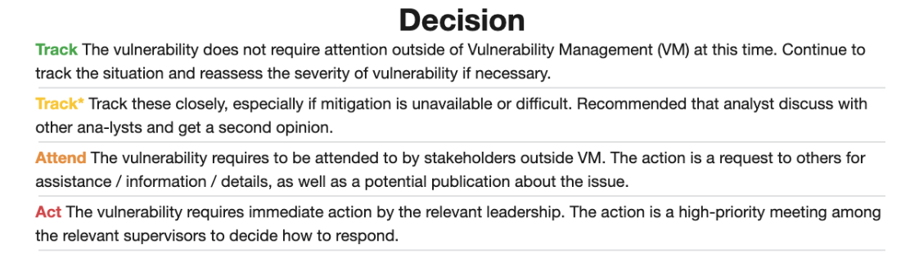

# Stakeholder-Specific Vulnerability Categorization (SSVC)

!!! abstract "Overview"

    This section covers [Stakeholder-Specific Vulnerability Categorization](https://resources.sei.cmu.edu/library/asset-view.cfm?assetid=653459)
    and how EPSS can be used with it.

    :technologist: [Source Code](https://github.com/epss-sig/epss-interoperability/blob/main/analysis/cisa_ssvc_dt/DT_analysis.ipynb) 
  

## SSVC

[Stakeholder-Specific Vulnerability Categorization](https://resources.sei.cmu.edu/library/asset-view.cfm?assetid=653459) is proposed as an alternative to CVSS Base Scores.

It is based on CMU SEI (Carnegie Mellon University Software
Engineering Institute):

-   "<a
    href="https://resources.sei.cmu.edu/library/asset-view.cfm?assetid=653459"
    rel="nofollow">Prioritizing Vulnerability Response: A
    Stakeholder-Specific Vulnerability Categorization (Version 2.0)</a>"
-   <a
    href="https://resources.sei.cmu.edu/library/asset-view.cfm?assetid=886543"
    rel="nofollow">Coordinated Vulnerability Disclosure User Stories</a>

!!! quote

    “CISA encourages every organization to use a vulnerability management
    framework that considers a **vulnerability’s exploitation status**, such
    as SSVC.”

    https://www.cisa.gov/news-events/news/transforming-vulnerability-management-landscape
  
!!! quote

    “The goal of SSVC is to assist in **prioritizing the remediation of a
    vulnerability based on the impact exploitation would have to the
    particular organization(s)**.”

    https://www.cisa.gov/sites/default/files/publications/cisa-ssvc-guide%20508c.pdf

  
<figure markdown>
{ width="700" }
<figcaption>SSVC Decision Tree https://www.cisa.gov/ssvc-calculator</figcaption> 
</figure>
  
<figure markdown>
{ width="700" }
<figcaption>SSVC Decision Tree Decisions https://www.cisa.gov/ssvc-calculator</figcaption> 
</figure>

## Exploitation: Evidence of Active Exploitation of a Vulnerability

!!! quote
    "The intent of this measure is the present state of exploitation of the
    vulnerability. The intent is not to predict future exploitation but only
    to acknowledge the current state of affairs. Predictive systems, such as
    EPSS, could be used to augment this decision or to notify stakeholders
    of likely changes."

    | Value                  | Definition                                                                                                                                                                                                                                                                                                                                                                                                                                                                                                                          |
    |------------------------|-------------------------------------------------------------------------------------------------------------------------------------------------------------------------------------------------------------------------------------------------------------------------------------------------------------------------------------------------------------------------------------------------------------------------------------------------------------------------------------------------------------------------------------|
    | None                   | There is no evidence of active exploitation and no public proof of concept (PoC) of how to exploit the vulnerability.                                                                                                                                                                                                                                                                                                                                                                                                               |
    | PoC (Proof of Concept) | One of the following cases is true: (1) exploit code is sold or traded on underground or restricted fora; (2) a typical public PoC in places such as Metasploit or ExploitDB; or (3) the vulnerability has a well-known method of exploitation. Some examples of condition (3) are open-source web proxies serve as the PoC code for how to exploit any vulnerability in the vein of improper validation of TLS certificates. As another example, Wireshark serves as a PoC for packet replay attacks on ethernet or WiFi networks. |
    | Active                 | Shared, observable, reliable evidence that the exploit is being used in the wild by real attackers; there is credible public reporting.                                             

    Prioritizing Vulnerability Response: A [Stakeholder-Specific Vulnerability Categorization](https://resources.sei.cmu.edu/library/asset-view.cfm?assetid=653459)
                                                                                                                                                                                                                                        

!!! observations
    
    1. The Exploitation Node comes first in the Decision Tree in line with prioritizing by Exploitation.
    2. The order of the Decision Nodes gives the order of importance in making a remediation decision i.e. in this order (see Permutation and Drop Column Importance per Analysis in Source code)
          1. Exploitation
          2. Automatable
          3. Technical Impact
    3. The output is a Decision that is meaningful to the user e.g. "Act" means the "vulnerability requires immediate attention".
    4. Weaponized Exploits are not called out/supported explicitly i.e. per the Risk Taxonomy section, weaponized exploits are much more likely to be exploited than if the exploit just has a PoC (and there's a significant difference in associated count of CVEs for these populations.)
    5. CVSS Base Score Exploitability metrics can be used to inform the "Automatable" Node
    6. CVSS Base Score Impact metrics can be used to inform the "Impact" Node

!!! success "Takeaways"
    1. The order of importance of the risk factors in making a remediation decision is

         1. Exploitation
         2. Automatable
         3. Technical Impact

