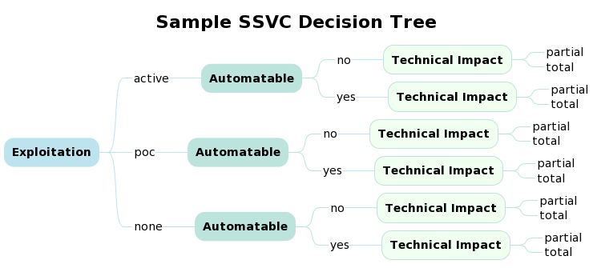
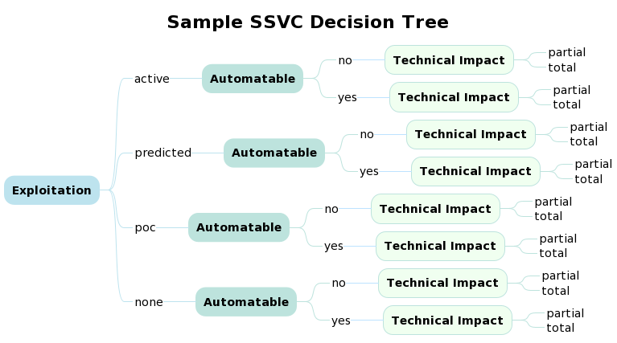
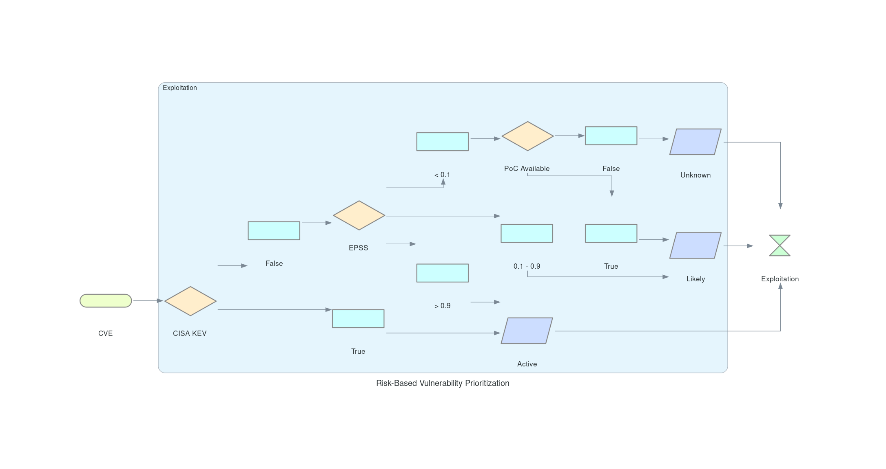

# Decision Trees Example Usage

!!! abstract "Overview"
    Example usage and implementation are provided by different users who
    are using Decision Trees in their organization.

    :technologist: [Source Code](https://github.com/RiskBasedPrioritization/RiskBasedPrioritizationAnalysis/blob/main/analysis/cisa_kev_epss_cvss.ipynb) 

!!! example "User Story"

    As Any User, I want to know how to

    1.  Make decisions with EPSS as an Exploitation decision node input
    2.  Determine what threshold(s) to use when making decisions with EPSS
        scores

    So that I can effectively prioritize which vulnerabilities to remediate given
    my remediation capacity.

## Decision Node: Exploitation

There are several ways to augment the Exploitation node within SSVC to
incorporate EPSS:

1.  Use an EPSS threshold to trigger an "active" decision i.e. a CVE
    with an EPSS score above this threshold is considered to be actively
    exploited
2.  Create a new decision called "predicted" with its own subsequent
    child nodes
3.  Use EPSS as an early-warning system to notify stakeholders of an
    impending decision change.

### EPSS Score Triggers Active Decision

<figure markdown>
  {width="600"}
  <figcaption>Exploitation Node: Active, PoC, None</figcaption>
</figure>

### Create Predicted Decision with EPSS Threshold

<figure markdown>
  {width="600"}
  <figcaption>Add Predicted Exploitation branch to Exploitation Node</figcaption>
</figure>

See cti.py for the associated code showing how a CTI data source can be
used as part of the Exploitation Decision Node.

  

  

### Append Decisions with EPSS Early Warning

  
!!! example "User Story"
    As a **Cyber Defender**, I use EPSS to inform my SSVC decision tree with
    data regarding CVE exploitation in cases where active exploitation has
    not already been confirmed by another source. I define
    EPSS *thresholds* that make sense for my organization's risk appetite
    and capacity to remediate.

<figure markdown>

<figcaption>Example Decisions using EPSS Thresholds</figcaption>
</figure>

!!! example "User Story"

    As a Cyber Defender, I occasionally come across vulnerabilities that do
    not have an assigned CVE, such as a misconfiguration, or manual audit
    finding. I still want to process these vulnerabilities through my SSVC
    decision tree to be consistent, which is why I have a manual triage
    process that fills in the gaps in information, such as Exploitation and
    Vector, and lets the decision tree handle the rest. I store this
    information in a CSV so that I don't have to manually process any given
    vulnerability more than once.

  

  

| Vulnerability ID | Exploitation | Vector                                                                                                                               | Note                                 |
|:-----------------|:-------------|:-------------------------------------------------------------------------------------------------------------------------------------|:-------------------------------------|
| 104188           | Active       | [AV:N/AC:L/PR:L/UI:N/S:U/C:H/I:H/A:N/E:H/RL:O/RC:C ](https://nvd.nist.gov/vuln-metrics/cvss/v3-calculator?vector=AV:N/AC:L/PR:L/UI:N/S:U/C:H/I:H/A:N/E:H/RL:O/RC:C&amp;version=3.1) | SMB Security Signatures Not Required |

  

**Manual Triage**

See manual_triage.py code.

