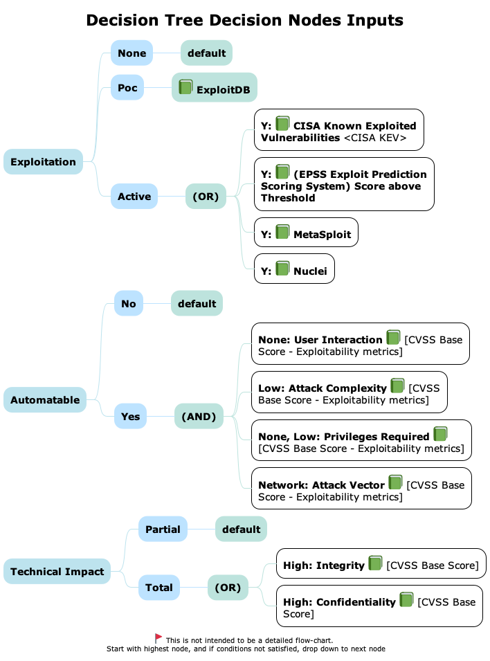
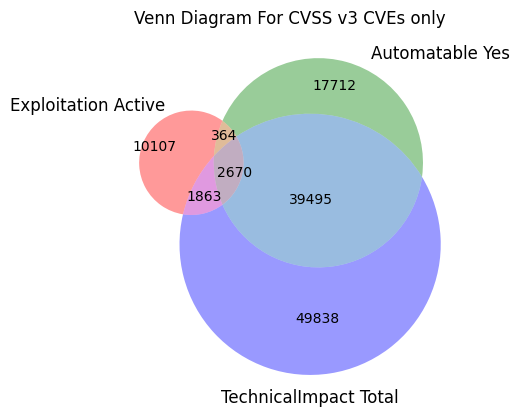
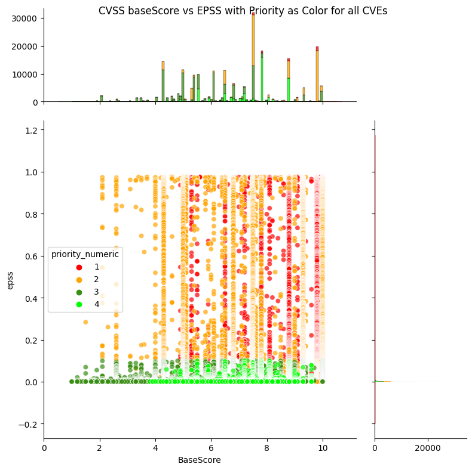
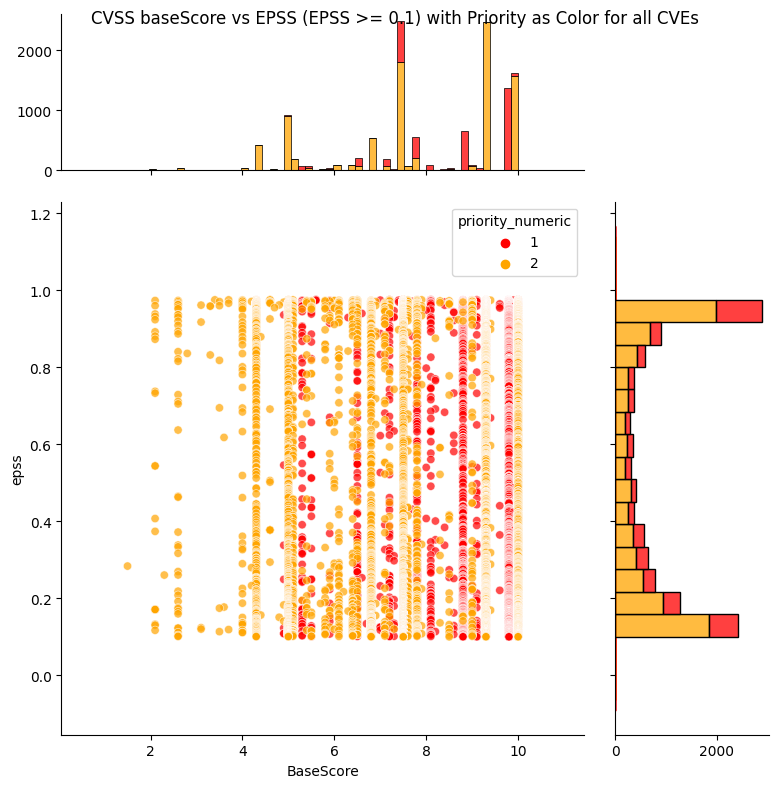
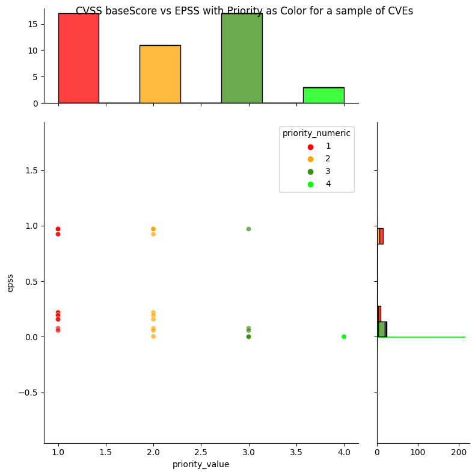

# Decision Tree From Scratch

!!! abstract "Overview"

    In this section, we walk-through building a Risk-Based Prioritization Decision
    Tree for use as a first-pass triage of CVEs based on [Prioritizing Vulnerability Response: A Stakeholder-Specific Vulnerability Categorization (Version 2.0)](https://resources.sei.cmu.edu/asset_files/WhitePaper/2021_019_001_653461.pdf) from scratch, in code.

    The recipe:

    1.  Build a Decision Tree from scratch
    2.  Find the Decisions (Prioritization) for some vulnerabilities with
        CVEs
    3.  Visualize the flow / distribution of vulnerabilities across our
        Decision Tree branches

    :technologist: [Source Code](https://github.com/epss-sig/epss-interoperability/blob/main/analysis/TODO) 

## Why Decision Trees?

1.  Focus on what matters: risk and its constituent factors and what
    action needs to be taken when.
2.  Understandable. 
3.  Modular: e.g. allows change/customization of Mission & Well-being
    Decision Node for an organization. Loose coupling, high cohesion.
4.  Decision Tree Analysis can be applied (see source code).
5.  Trees gives a very clear visual of all the parameters and decision
    nodes e.g. Attack Trees for Threat Modelling. Formulas are opaque,
    single output.

## Overview

Risk is per Asset and depends on Impact of a Vulnerability being
exploited by a Threat per <a
href="https://www.nist.gov/privacy-framework/nist-sp-800-30"
rel="nofollow">NIST Special Publication 800-30 r1 Guide for Conducting
Risk Assessments</a>.

One approach to assess risk is to do multiple passes - starting with a
first pass triage of vulnerabilities

1.  **First pass: Prioritize Vulnerabilities in an automated way
    independent of Asset**
    1.  **Given a list of vulnerabilities, prioritize them given what we
        know about the vulnerability from multiple data sources
        (independent of the assets i.e. assume a generic asset for risk
        purposes for this first pass).**
2.  Second pass: Dependent on Asset
    1.  There can be MANY independent parameters that determine the risk
        associated with an Asset e.g.
        1.  Value
        2.  Exposure e.g. open (to the internet)
        3.  Reachability - is the vulnerable method called
        4.  Compensating controls
        5.  Underlying Stack component versions in place e.g.
            SpringShell Spring Framework exploitability depends on
            certain JDK versions.
    2.  Many of these parameters are generic for the vulnerabilities
        associated with the Asset - and are known in advance and fixed
        e.g. Asset Value, Asset Exposure.
3.  Some of the parameters will depend on the specific vulnerability and
    the pre-conditions it needs to implement the full kill-chain. E.g.
    exploitable depending on the configuration or runtime context of the
    vulnerable software.

This 2 pass approach allows us to first determine the highest priority
vulnerabilities - and then assess these against our highest
value/exposure assets.

  

**We’ll walk through this First Pass triage - using a Decision Tree to
prioritze the vulnerabilities.**

-   **We’ll build this Decision Tree from scratch.**
-   **An extract of the data is shown for each step. So we can see
    what’s happening without needing to understand the code**
-   A key benfit to Decision Trees is that they are understandable. The
    implementation of them should support that too. So the code here
    aims for clarity e.g. laid out inline.

  
## Decision Tree Node Inputs

<figure markdown>

<figcaption>Decisions Tree Node Inputs</figcaption>
</figure>

The data sources used 

1.  Exploitation 
    1.  **Active Exploitation:** CISA KEV 
        1.  Commercial CTI data on what CVEs are actively exploited, was
            not used in this example because all of the data and source
            is provided for the example.
    2.  **Weaponized Exploits**: Metasploit, Nuclei
    3.  **Likelihood of exploit** using EPSS above a threshold
2.  Automatable
    1.  Using **CVSS Base Metric Exploitability** parameters (not the score
        itself)
3.  Impact
    1.  Using **CVSS Base Metric Impact parameters** (not the score itself)
        1.  The Impact parameters Confidentiality, Integrity do not
            offer much granularity as discussed in CVSS section.
            1.  These could be replaced with other impacts if available
                e.g. "Remote Code Execution", "Denial of Service",
                "Arbitrary File Read", "Arbitrary File Write",...

!!! tip "This Exploitation Decision data can be used for any risk prioritization scheme"
    This Exploitation Decision data can be used for any risk prioritization scheme i.e. not specific to SSVC.
    
    * It could be used to inform [CVSS Exploit Maturity (E)](https://www.first.org/cvss/v4.0/specification-document#Exploit-Maturity-E)
  

A venn diagram of these 3 Decision Nodes for all CVSS v3 CVEs shows that
"Exploitation Active" is a relatively small subset compared to
"Automatable - Yes" and "Technical Impact - Total".

This reinforces the guidance to **"prioritize vulnerabilities that are
being exploited in the wild or are likely to be"**

<figure markdown>
{ width="500" }
<figcaption>Decision Node Output CVE Populations</figcaption> 
</figure>
  
## Decision Tree Output

<figure markdown>

<figcaption>Decision Tree Output: All CVEs Priority 1:Act, 2:Attend, 3:Track Closely, 4:Track</figcaption>
</figure>

<figure markdown>

<figcaption>Decision Tree Output: CVEs with EPSS > 0.1: Priority 1:Act, 2:Attend</figcaption>
</figure>

TODO - add priority as text label instead of numeric

!!! observations

    1.  The low priority "Track\*", "Track" CVEs are spread across the CVSS
        Base score, but have low EPSS scores.
    2.  Most CVEs have low EPSS scores i.e. the histogram on the right shows
        a large count near zero EPSS score.
    3.  The most common CVSS scores are around 7.5 and 9.8 (per histogram on
        top).
    4. The top priority "Act", "Attend" CVEs are spread across the CVSS
    Base score, and EPSS scores.

  

  

## CVEs across the Decision Tree

A different way to visualize the Decisions across CVEs is to use a
sankey diagram to show how CVEs flow through the tree Decision Nodes

-   running the source code provided gives an interactive version of the plot

<figure markdown>

<figcaption>Sankey diagram showing the split of All CVEs across the decision tree nodes The vertical size of the band represents the count of CVEs
 The color represents the risk e.g. red is high risk.</figcaption>
</figure>

!!! observations

    1. There's a relatively small subset of CVEs that have
          1. Exploitation - Active
          2. Automatable - Yes
          3. Technical Impact - Total
    2. This fine granularity and clarity is in stark contrast to the coarse granularity of CVSS ratings
    3. The count of CVEs for the highest Decision/Priority is relatively low, and the counts increase as the Decision/Priority decreases i.e. this is very desirable when we want to remediate by higest priority first!

## Triage CVEs by Priority

The source code includes a selected list of CVEs to show how easy it is
to apply the Decision Tree to a list of CVEs.

<figure markdown>

<figcaption>Remediation Decisions/Priority is given for these CVEs</figcaption>
</figure>

!!! observations

    We get

    1.  Static decisions / priority: (1:Act, 2:Attend, 3:Track Closely, 4:Track)
    2.  Temporal likelihood of exploitation via EPSS, where EPSS scores can
        change depend on observed exploitation activity
    3.  A way to prioritize per decision / priority e.g. For CVEs
        with "Act" decision, prioritize based on EPSS score.

    
!!! success "Takeaways"
    1. The Decision Tree gives give an effective prioritization vs population (in stark contrast to CVSS score or ratings)
    1. Applying the Decision Trees to a list of CVEs is a simple 1 liner merge based on CVEs (see source code)
    2. We can get the best of both worlds with
          1. static priority decisions based on our Decision Tree output
          2. temporal EPSS score
