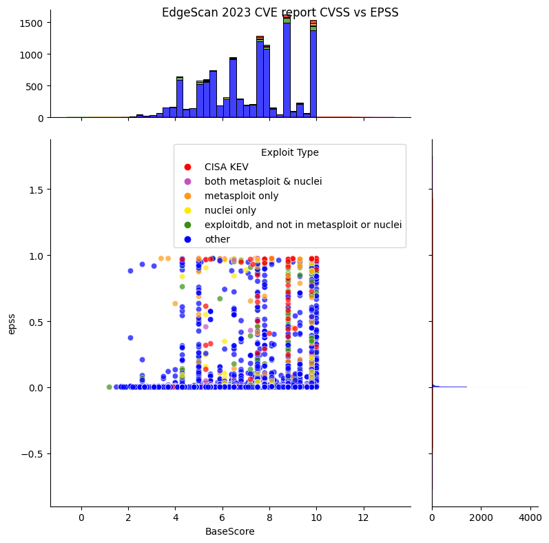
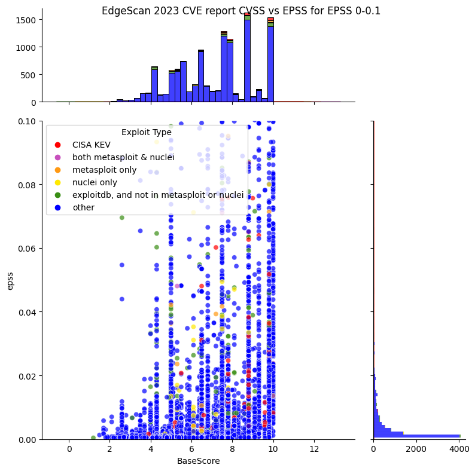
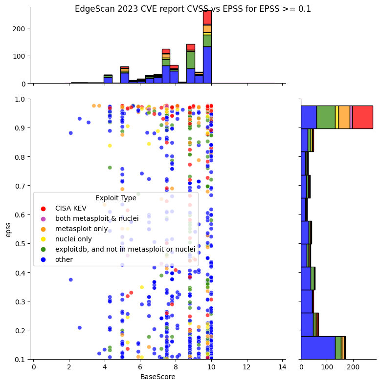

# Edgescan

!!! abstract "Overview"
    
    In this section we look at

    -   how Edgescan uses EPSS, CVSS as part of their scoring
    -   what EPSS, CVSS looks like for CVEs detected by Edgescan scans

## Edgescan

[Edgescan](https://www.edgescan.com/) is a cloud based cybersecurity platform that combines five cybersecurity solutions:

1. Attack Surface Management (ASM)
2. Risk-based Vulnerability Management (RBVM)
3. Application Security Testing (AST)
4. API Security Testing
5. Penetration Testing as a Service (PTaaS)

Edgescan provided anonymized sanitized data for the analysis here:

* This data is the result of continuous testing & vulnerability validation across 30 verticals and 300 organisations globally. 
* The CVEs detected are determined to be exploitable via validation, but not exploited by Edgescan as part of a typical engagement and to be production-safe.

## Edgescan Scoring
EPSS is visible as a floating point score (0.00) alongside CVSS, CISAKEV (boolean) and EVSS (Edgescan Validated Security Score). 

Edgescan has also implemented an overall priority score combining CVSS, EPSS and CISA KEV with some weightings to deliver an overall priority score, called the Edgescan eXposure Factor (EXF). https://www.Edgescan.com/solutions/risk-based-vulnerability-management-rbvm/

## Analysis

<figure markdown>
  { width="700" }
  <figcaption>Edgescan 2023 CVE Report CVSS vs EPSS</figcaption>
</figure>

<figure markdown>
  { width="700" }
  <figcaption>Edgescan 2023 CVE Report CVSS vs EPSS: Lower EPSS Range 0-0.1</figcaption>
</figure>

<figure markdown>
  { width="700" }
  <figcaption>Edgescan 2023 CVE Report CVSS vs EPSS: Higher EPSS Range 0.1-1</figcaption>
</figure>

!!! observations "Observations"
    1. The detected CVEs cover the range of CVSS BaseScores and EPSS Scores.
    2. The vast majority of detected CVEs have a low EPSS score near zero.
    3. Zooming in on the lower EPSS scores below 0.1, there's some CVEs in CISA KEV (Active), Metasploit and Nuclei (Weaponized), ExploitDB (PoC), though the vast majority are not.
    4. Zooming in on the higher EPSS scores above 0.1, there's a concentration of CVEs above EPSS 0.9 that are in CISA KEV (Active), Metasploit and Nuclei (Weaponized), ExploitDB (PoC)

{!includes/plots_cvss_epss.md!}

{!includes/vendor_warning.md!}

!!! success "Takeaways"
    1. Prioritizing by Exploitation (Known evidence or activity in the order below, and high EPSS scores) would be a much more effective method than CVSS in this case in terms of risk vs effort.
    { width="600" }
