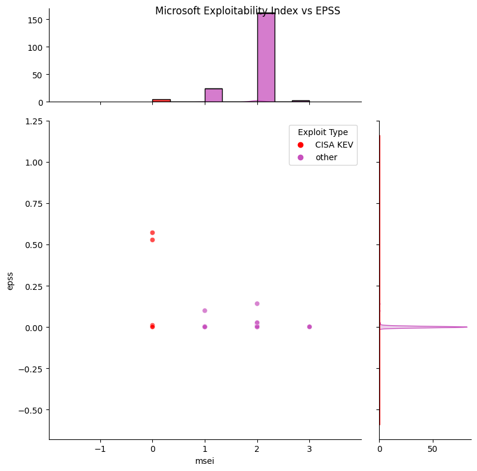
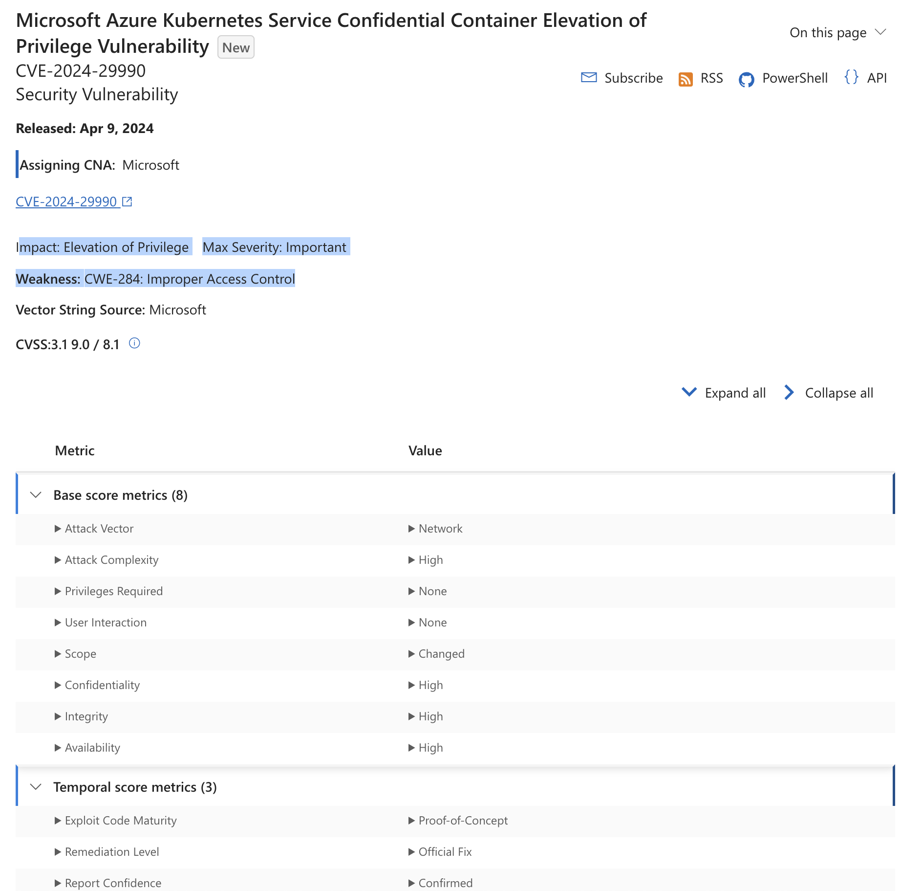

# Microsoft Exploitability Index

!!! abstract "Overview"
    
    In this section we look at

    -   Microsoft Exploitability Index 
    -   what EPSS looks like versus Microsoft Exploitability Index ratings

    :technologist: [Source Code](https://github.com/RiskBasedPrioritization/RiskBasedPrioritizationAnalysis/blob/main/analysis/msrc.ipynb) 

!!! info "Microsoft publishes exploitability information of each vulnerability associated with a Microsoft security update"
    *The [Exploitability Index](https://www.microsoft.com/en-us/msrc/exploitability-index) may help customers evaluate risk for a vulnerability. Microsoft evaluates the potential exploitability of each vulnerability associated with a Microsoft security update and then publishes the exploitability information as part of the monthly Microsoft security update details. If after publishing the details Microsoft determines that the Exploitability Index Assessment warrants a change, it will change the assessment and notify customers through technical security notifications. The company will not update the assessment when exploit code is posted that matches the existing exploitability information.*

    Data is found within each CVE link published on the [Microsoft Security Update Guide](https://msrc.microsoft.com/update-guide) and there is an [official API](https://github.com/microsoft/MSRC-Microsoft-Security-Updates-API) also.

    
## Analysis

<figure markdown>
  { width="700" }
  <figcaption>Microsoft Exploitability Index "msei" CVSS vs EPSS</figcaption>
</figure>

The counts of [Microsoft Exploitability Index Assessment values](https://www.microsoft.com/en-us/msrc/exploitability-index) are as follows:

| Microsoft Exploitability Index Assessment Value | Short definition    | Count |
|---------------------------------|-------------------------------------|-------|
| 0                               | Exploitation detected               |     5 |       
| 1                               | Exploitation more likely            |    24 |
| 2                               | Exploitation less likely            |   163 |
| 3                               | Exploitation unlikely               |     3 |
| -                               | Value not given for CVE             |    38 |

For "Exploitation Detected" the CVE and EPSS scores are:

|  CVE           |  EPSS    | Notes    |
|---------------:|---------:|---------:|
| CVE-2023-36761 |  0.57125 | [Affects Microsoft Word with Network Attack Vector](https://msrc.microsoft.com/update-guide/vulnerability/CVE-2023-36761)|
| CVE-2023-44487 |  0.52748 | [Affects Microsoft HTTP/2 with Network Attack Vector](https://msrc.microsoft.com/update-guide/vulnerability/CVE-2023-36563)|
| CVE-2023-41763 |  [0.1584](https://www.cvedetails.com/epss/CVE-2023-41763/epss-score-history.html) | [Affects Skype for Business with Network Attack Vector](https://msrc.microsoft.com/update-guide/vulnerability/CVE-2023-41763)|
| CVE-2023-36563 |  [0.00332](https://www.cvedetails.com/epss/CVE-2023-36563/epss-score-history.html) | [Affects Microsoft WordPad with Network Attack Vector](https://msrc.microsoft.com/update-guide/vulnerability/CVE-2023-36563)|
| CVE-2023-36802 |  [0.00054](https://www.cvedetails.com/epss/CVE-2023-36802/epss-score-history.html) | [Affects Microsoft Streaming Service Proxy Local Attack Vector](https://msrc.microsoft.com/update-guide/vulnerability/CVE-2023-36802) |

!!! observations "Observations"
    1.  The 5 CVEs with "Exploitation Detected" are in CISA KEV
        1.  2 of these have an EPSS value > 0.5
        2.  2 of these have an EPSS value near 0

    2.  There isn't an exact mapping of MSEI Exploitability Index levels but this would be a loose mapping:
   
        | MSIE Value               | Risk Taxonomy                        |
        |--------------------------|--------------------------------------|
        | Exploitation Detected    | Known Actively Exploited in the wild |
        | Exploitation more likely | Weaponized Exploit                   |
        | Exploitation less likely | Proof Of Concept Exploit             |
        | Exploitation unlikely    | No Known Exploit                     |

{!includes/vendor_warning.md!}

## Adopting the CWE standard for Microsoft CVEs

Per [Toward greater transparency: Adopting the CWE standard for Microsoft CVEs April 8, 2024](https://msrc.microsoft.com/blog/2024/04/toward-greater-transparency-adopting-the-cwe-standard-for-microsoft-cves/), Microsoft is adopting the CWE standard for Microsoft CVEs.

Taking https://msrc.microsoft.com/update-guide/vulnerability/CVE-2024-29990 as an example:

1. CWE is now being used per article above. :clap:
2. Microsoft Exploitability Index "MSEI" already included Exploitability data - but now they're putting it (and other info) in the CVSS Temporal score metrics also. :clap:
      1. "Exploit Code Maturity: Proof Of Concept"
3. The MSEI Impact is more fine grained than CVSS Base Score Confidentiality, Integrity, Availability Impact and co-exists with it. :clap:
      1. "Elevation of Privilege" with an associated "Max Severity: Important"

Unfortunately, the data for 2. and 3. above is not in the NIST NVD: https://nvd.nist.gov/vuln/detail/CVE-2024-2990 😔

<figure markdown>
  { width="700" }
  <figcaption></figcaption>
</figure>

!!! success "Takeaways"
    1. Evidence of exploitation (MSEI Exploitation Detected, CISA KEV in this case) trumps EPSS scores
    2. Depending on your security posture, you may decide to extend this to "Exploitation more likely" 
          1. e.g. MSEI "Exploitation more likely" trumps EPSS. 
          2. In this case, the population of "Exploitation more likely" is relatively small compared to "Exploitation less likely" plus "Exploitation unlikely".
    3. Microsoft is setting a great example by using CWEs, but also publishing the CVSS Temporal data (including Exploit Code Maturity), and more meaningful Impact data than CVSS supports. :clap:
    !!! quote
        "If there is evidence that a vulnerability is being exploited, then that information should supersede anything EPSS has to say, because again, EPSS is pre-threat intel. If there is an absence of exploitation evidence, then 
        EPSS can be used to estimate the probability it will be exploited." https://www.first.org/epss/faq

