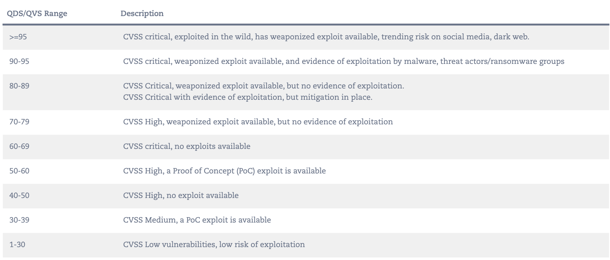
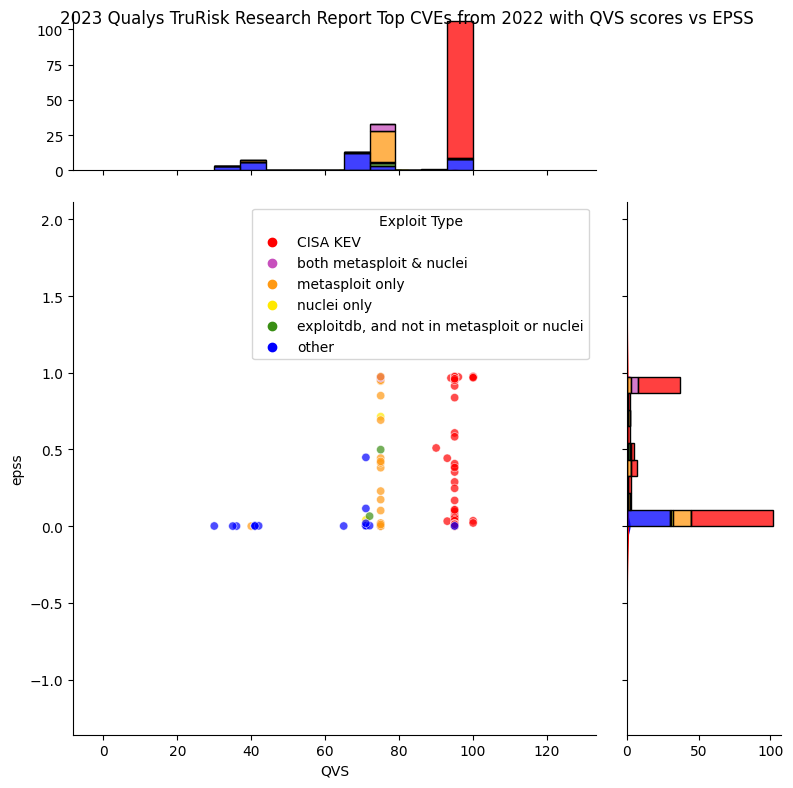
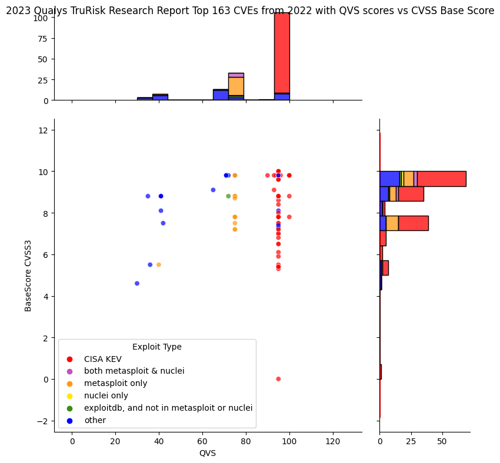
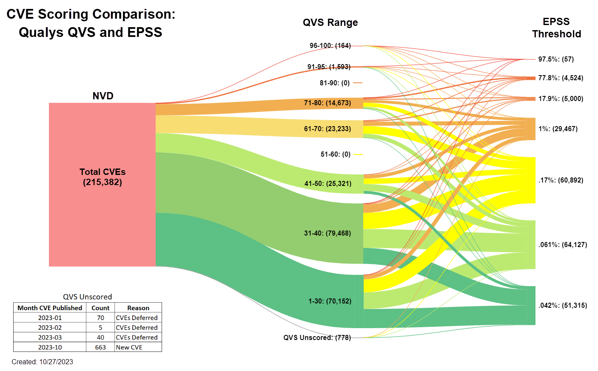

# Qualys

!!! abstract "Overview"
    
    In this section we look at

    -   Qualys scoring based on their public posts
    -   Qualys scores

    :technologist: [Source Code](https://github.com/epss-sig/epss-interoperability/blob/main/analysis/qualys.ipynb) 

## Qualys Articles

These articles are worth reading in full - below are some insightful extracts.

### In-Depth Look Into Data-Driven Science Behind Qualys TruRisk

!!! quote
    Qualys TruRisk is hyper focused on three attributes: **exploit availability, evidence of exploitation in the wild, and likelihood of exploitation**. This helps organizations focus on the highest risk vulnerabilities.

    QVS scores consistently **place vulnerabilities with evidence of exploitation, such as CISA known vulnerabilities, in a higher score range even if the EPSS score is low**

    Qualys TruRisk rates less than 1% of vulnerabilities as critical, and less than 7% of vulnerabilities as high. This drastically reduces the number of vulnerabilities (up to 85% fewer compared to CVSS which ranks 51% of vulnerabilities high or critical) that organizations need to focus on to reduce risk

    The QDS algorithm **rates weaponized exploits higher than PoC exploits.**

    <figure markdown>
    { width="700" }
    <figcaption>Qualys QDS/QVS Range and factors (this predates inclusion of EPSS)</figcaption>
    </figure>

    [In-Depth Look Into Data-Driven Science Behind Qualys TruRisk, October 10, 2022](https://blog.qualys.com/vulnerabilities-threat-research/2022/10/10/in-depth-look-into-data-driven-science-behind-qualys-trurisk)
### An In-Depth Look at the Latest Vulnerability Threat Landscape
    

!!! quote

    **Organizations considering the implementation of risk-based vulnerability management should incorporate EPSS as one of the criteria for prioritization. However, similar to CISA KEV, it would be imprudent to rely solely on EPSS for prioritization as it may overlook high-risk vulnerabilities or those being exploited in the wild.**

    Qualys VMDR, in tandem with TruRisk, utilizes EPSS scores as part of the scoring algorithm to consistently rank CVEs with a high likelihood of exploitation within the critical range.

    Even if a vulnerability has a weaponized exploit available, it is assigned a High level of criticality. The underlying assumption being attackers could use it at any point in time. As more evidence of exploitation becomes available, the score is further increased.

    **The prioritization of vulnerabilities should be a multifaceted approach. The focus should be given to those known to be exploited in the wild (CISA KEV), those with a high likelihood of exploitation (indicated by a high EPSS score), and those with weaponized exploit code available**

    [Part 1: An In-Depth Look at the Latest Vulnerability Threat Landscape, July 11, 2023](https://blog.qualys.com/product-tech/2023/07/11/an-in-depth-look-at-the-latest-vulnerability-threat-landscape-part-1) 

## 2023 Qualys TruRisk Research Report

!!! quote 
    The most exploited vulnerabilities are CVE-2022-30190 (Follina); CVE-2022-26134 (Atlassian); CVE-2022-22954 (VMware); CVE-2022-1040 (Sophos Firewall); and CVE-2022-24521 (Windows). The first four all have a Qualys vulnerability score (QVS) of 100; the last scores 95. All five have been used in ransomware attacks, and all five are included within CISA’s KEV list.
    
    [2023 Qualys TruRisk Research Report](https://www.qualys.com/forms/tru-research-report/)

|  CVE           |  EPSS    | Notes    |
|---------------:|---------:|---------:|
| CVE-2022-30190 |  0.9683 | [Windows Follina vulnerability](https://msrc.microsoft.com/update-guide/vulnerability/CVE-2023-36761)|
| CVE-2022-26134 |  0.9753 | [Atlassian Confluence Remote Code Execution Vulnerability](https://confluence.atlassian.com/doc/confluence-security-advisory-2022-06-02-1130377146.html)|
| CVE-2022-22954 |   0.9735 | [VMware Workspace ONE Access and Identity Manager contain a remote code execution vulnerability due to server-side template injection.](https://nvd.nist.gov/vuln/detail/CVE-2022-22954)|
| CVE-2022-1040  |  0.9707 | [Sophos Firewall Authentication Bypass](https://www.sophos.com/en-us/security-advisories/sophos-sa-20220325-sfos-rce)|
| CVE-2022-24521 |  [**0.05%**](https://www.cvedetails.com/epss/CVE-2022-24521/epss-score-history.html)| [Windows CLFS Driver Privilege Escalation Vulnerability - Local Attack Vector](https://msrc.microsoft.com/update-guide/vulnerability/CVE-2022-24521) |

Several other examples of vulnerabilities with low EPSS scores and high TruRisk scores are given in [In-Depth Look Into Data-Driven Science Behind Qualys TruRisk, October 10, 2022](https://blog.qualys.com/vulnerabilities-threat-research/2022/10/10/in-depth-look-into-data-driven-science-behind-qualys-trurisk#exploit-prediction-scoring-system).

### Analysis: Qualys QVS Scores vs EPSS

<figure markdown>
  { width="700" }
  <figcaption>Qualys 2023 Qualys TruRisk Research Report Top 163 CVEs QVS vs EPSS</figcaption>
</figure>

!!! observations "Observations"

    1.  The higher scoring for "Evidence of exploitation in the wild" per
        CISA KEV is very clear (red)
    2.  The scoring for weaponized exploits (Metasploit, Nuclei) is very clear
        (orange, purple)
    3.  For QVS \> 90, there aren't any cases where EPSS is the only
        determinant of the QVS score i.e. for most of these CVEs, the other
        conditions are met i.e. "Evidence of exploitation in the wild" per
        CISA KEV, and functional exploit code available.
    4.  Most of the CVEs have a low EPSS score.

!!! info "Explanation of the plot"

    1. The dot colors indicate what population the CVE is associated with e.g. if the CVE is red, then it's in CISA KEV:
          1. red: CISA KEV
          2. purple: both metasploit and nuclei
          3. orange: metasploit only
          4. yellow: nuclei only
          5. green: exploitdb only, and not in metasploit or nucle
    2. The histogram on top represents the counts of CVEs (in bins) at that QVS Score.
    3. The histogram on the right represents the counts of CVEs (in bins) at that EPSS Score.

<figure markdown>
  { width="700" }
  <figcaption>Qualys 2023 Qualys TruRisk Research Report Top 163 CVEs QVS vs CVSS Base Score</figcaption>
</figure>

!!! observations "Observations"
    1.  Even Critical CVEs may be scored lower (~70) by Qualys e.g. those that are not known to be exploited in the wild or have weaponized exploit available.
    2.  The CVE with QVS 95 and CVSS score 0 is CVE-2022-28958 which was rejected because [it wasn't actually a vulnerability](https://www.greynoise.io/blog/cve-2022-28958-remote-code-execution-vulnerability-dlink-rejected) and it was [removed from CISA KEV Dec 2023](https://www.cisa.gov/news-events/alerts/2023/12/01/cisa-removes-one-known-exploited-vulnerability-catalog)  

### **Comparison of CVEs with Qualys QVS and EPSS Scores**

The Qualys Vulnerability Score (QVS) is a Qualys-assigned score for a
vulnerability based on multiple factors associated with the CVE such as
CVSS and external threat indicators like active exploitation, exploit
code maturity, CISA known exploitable and many more.  
  
The QVS score was retrieved from Qualys for 215,382 CVE's. Of those,
214,604 had a QVS score assigned to them. This chart shows the
comparison of the Qualys QVS scores and the EPSS scoring for those CVEs
and the reason for the unscored CVEs by Qualys.   

[See Original post](https://www.linkedin.com/posts/buddybergman_epss-qualys-cybersecurity-activity-7123998432674926592-ydQB)

<figure markdown>
{ width="700" }
<figcaption>Qualys QVS vs EPSS  </figcaption> 
</figure>

{!includes/vendor_warning.md!}

!!! success "Takeaways"
    1. "The focus should be given to CVEs known to be exploited in the wild (CISA KEV), those with a high likelihood of exploitation (indicated by a high EPSS score), and those with weaponized exploit code available"
    2. The Qualys scoring / priority for "Likelihood of Exploit" factors is in this order
          1. known to be exploited in the wild 
          2. weaponized exploits 
          3. PoC exploits.
    3.  The Qualys scoring / priority combines CVSS Base Score rating with likelihood of exploitation for all score bands. Even Critical CVEs may be scored lower (~70) by Qualys 
    4. Other evidence of exploitation trumps EPSS in the case of low EPSS scores consistent with [using EPSS When There is No Other Evidence of Exploitation](https://amnesia.first.org/display/EPSS/All+Pages#AllPages-WhenThereisNoOtherEvidenceofExploitation).
       1. Some known exploited CVEs listed in 2023 Qualys TruRisk Research Report (even in the top 5 of the top 163) have low EPSS scores
   
